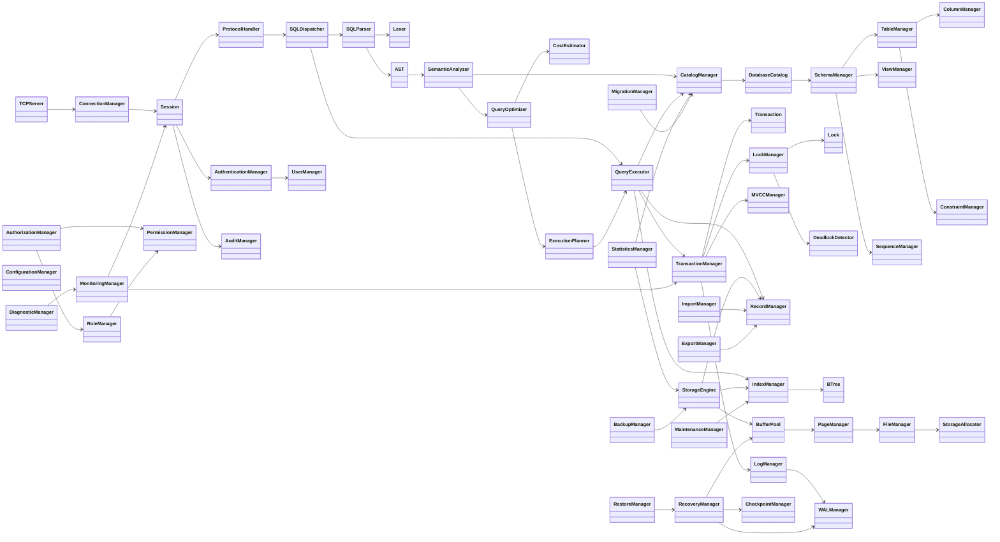

# DBMS Class Diagram

```mermaid
classDiagram
    direction LR

    %% ==========================================
    %% 1. Communication & Network
    %% ==========================================
    class TCPServer
    class ConnectionManager
    class Session
    class ProtocolHandler
    class SQLDispatcher

    %% ==========================================
    %% 2. Security
    %% ==========================================
    class AuthenticationManager
    class AuthorizationManager
    class UserManager
    class RoleManager
    class PermissionManager
    class AuditManager

    %% ==========================================
    %% 3. Query Processing
    %% ==========================================
    class SQLParser
    class Lexer
    class AST
    class SemanticAnalyzer
    class QueryOptimizer
    class CostEstimator
    class ExecutionPlanner
    class QueryExecutor

    %% ==========================================
    %% 4. Database Objects & Catalog
    %% ==========================================
    class CatalogManager
    class DatabaseCatalog
    class SchemaManager
    class TableManager
    class ColumnManager
    class ConstraintManager
    class ViewManager
    class SequenceManager

    %% ==========================================
    %% 5. Transaction Management
    %% ==========================================
    class TransactionManager
    class Transaction
    class LockManager
    class Lock
    class DeadlockDetector
    class MVCCManager

    %% ==========================================
    %% 6. Storage Management
    %% ==========================================
    class StorageEngine
    class RecordManager
    class IndexManager
    class BTree
    class BufferPool
    class PageManager
    class FileManager
    class StorageAllocator

    %% ==========================================
    %% 7. Recovery & Logging
    %% ==========================================
    class LogManager
    class WALManager
    class RecoveryManager
    class CheckpointManager

    %% ==========================================
    %% 8. Administration
    %% ==========================================
    class ConfigurationManager
    class MonitoringManager
    class StatisticsManager
    class BackupManager
    class RestoreManager
    class MaintenanceManager

    %% ==========================================
    %% 9. Utilities
    %% ==========================================
    class ImportManager
    class ExportManager
    class MigrationManager
    class DiagnosticManager

    %% ==========================================
    %% RELATIONSHIPS & CONNECTIONS
    %% ==========================================

    %% Communication Flow
    TCPServer --> ConnectionManager
    ConnectionManager --> Session
    Session --> ProtocolHandler
    Session --> AuthenticationManager
    ProtocolHandler --> SQLDispatcher
    SQLDispatcher --> SQLParser
    SQLDispatcher --> QueryExecutor

    %% Security Flow
    AuthenticationManager --> UserManager
    AuthorizationManager --> RoleManager
    AuthorizationManager --> PermissionManager
    RoleManager --> PermissionManager
    Session --> AuditManager

    %% Query Processing Flow
    SQLParser --> Lexer
    SQLParser --> AST
    AST --> SemanticAnalyzer
    SemanticAnalyzer --> CatalogManager
    SemanticAnalyzer --> QueryOptimizer
    QueryOptimizer --> CostEstimator
    QueryOptimizer --> ExecutionPlanner
    ExecutionPlanner --> QueryExecutor

    %% Query Execution Interactions
    QueryExecutor --> TransactionManager
    QueryExecutor --> RecordManager
    QueryExecutor --> IndexManager
    QueryExecutor --> CatalogManager

    %% Database Catalog & Objects Flow
    CatalogManager --> DatabaseCatalog
    DatabaseCatalog --> SchemaManager
    SchemaManager --> TableManager
    SchemaManager --> ViewManager
    SchemaManager --> SequenceManager
    TableManager --> ColumnManager
    TableManager --> ConstraintManager

    %% Transaction Management Flow
    TransactionManager --> Transaction
    TransactionManager --> LockManager
    TransactionManager --> MVCCManager
    TransactionManager --> LogManager
    LockManager --> Lock
    LockManager --> DeadlockDetector

    %% Storage Engine Flow
    StorageEngine --> RecordManager
    StorageEngine --> IndexManager
    StorageEngine --> BufferPool
    IndexManager --> BTree
    BufferPool --> PageManager
    PageManager --> FileManager
    FileManager --> StorageAllocator

    %% Recovery & Logging Flow
    LogManager --> WALManager
    RecoveryManager --> WALManager
    RecoveryManager --> CheckpointManager
    RecoveryManager --> BufferPool

    %% Administration Interactions
    StatisticsManager --> CatalogManager
    StatisticsManager --> StorageEngine
    MonitoringManager --> Session
    MonitoringManager --> TransactionManager
    BackupManager --> StorageEngine
    RestoreManager --> RecoveryManager
    MaintenanceManager --> IndexManager

    %% Utilities Interactions
    ImportManager --> RecordManager
    ExportManager --> RecordManager
    MigrationManager --> CatalogManager
    DiagnosticManager --> MonitoringManager
```
