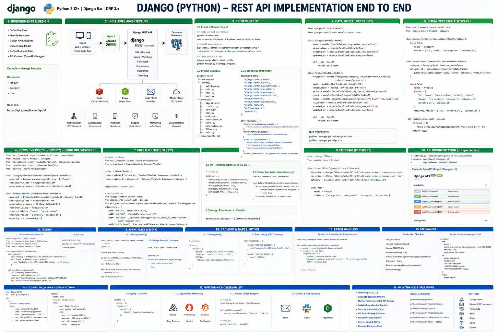
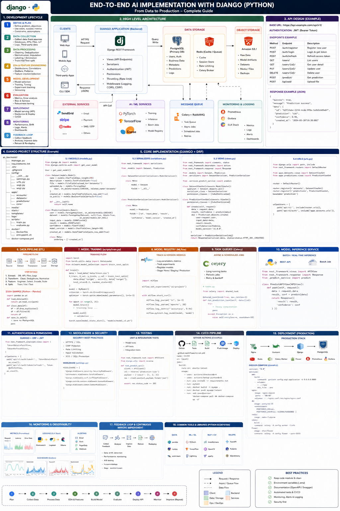

# DBMS API Architecture Documentation

---

## 1. End-to-End (E2E) API Architecture

### E2E Flow Breakdown:
1. **Client Request:** The external client (Web app, CLI, or another server) sends an HTTP Request (REST/GraphQL) over the network.
2. **API Gateway / Router:** The request is intercepted, routed, and structurally validated.
3. **Application Layer:** The request reaches the backend API Server, which parses the intent.
4. **Engine Delegation:** The API Server translates the RESTful intent into a Query Execution Plan natively understood by the DBMS architecture.
5. **Storage Interaction:** The Storage Engine (`BufferPool`, `FileManager`, etc.) retrieves or mutates the physical data.
6. **Response Formulation:** The result rows are serialized back into JSON/XML and returned to the Client with an appropriate HTTP Status Code (e.g., `200 OK`, `404 Not Found`).

---

## 2. API Implementation (Django Framework)

### Django Core Components:
To ensure rapid development, robust security, and out-of-the-box REST capabilities, the API layer is implemented utilizing the **Django / Django REST Framework (DRF)**.

*   **`urls.py` (Router):** Responsible for mapping incoming URI endpoints (e.g., `/api/v1/query`) to the appropriate Controller/View.
*   **`views.py` (Controllers):** Contains the core endpoint logic (ViewSets or APIViews). It handles the HTTP context (GET, POST, etc.) and acts as the bridge invoking the internal `StorageEngine`.
*   **`serializers.py`:** Extremely critical for Data Validation. It sanitizes incoming query payloads and strictly formats the output DataFrames/Rows into clean JSON.
*   **`middleware.py`:** Intercepts requests asynchronously for Authentication (JWT/Tokens), Logging, and Rate-Limiting before they even reach the Views.

> **Note:** The Django layer acts purely as a stateless Presentation/Transport layer. It completely decouples network logic from the hardward-level logic residing in the underlying `StorageEngine`.
