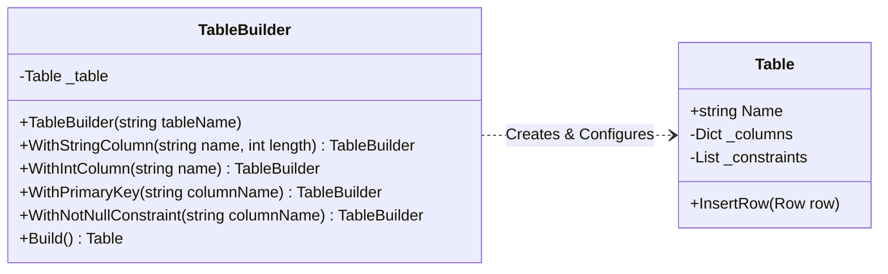
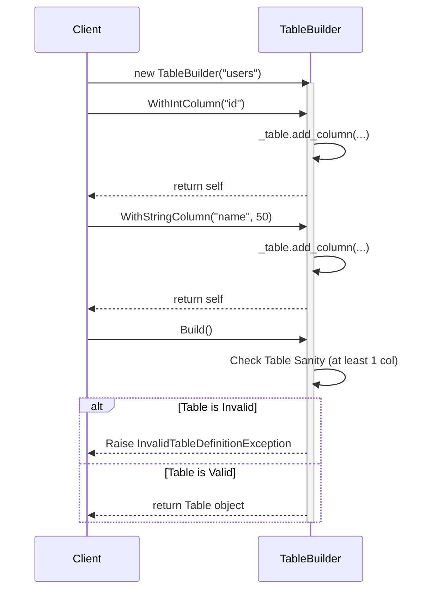
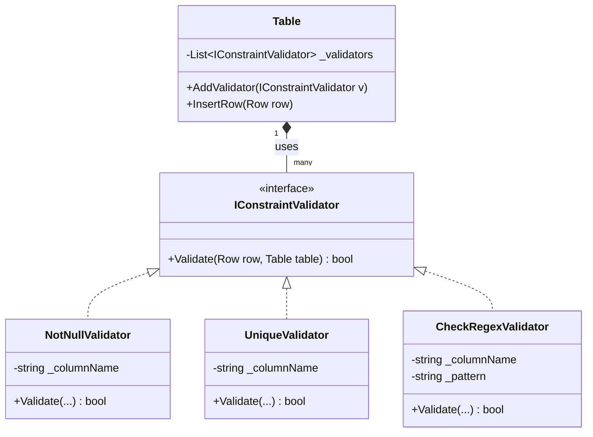

# Advanced Patterns: Database Objects (Core 20%)

This document formalizes the **Top-Down Design** of the advanced 20% core features using robust OOP and SOLID principles.

## 1. TableBuilder (Builder Pattern)

**Problem:** Initializing a `Table` with columns, metadata, and constraints via a massive constructor or procedural `add_xxx` methods violates the Open/Closed Principle and makes client code messy.  
**Solution (OOP):** Implement a Fluent `TableBuilder` that incrementally configures the table and verifies its sanity before returning the final immutable `Table` object.

### A. Detailed Class Diagram



### B. Sequence Diagram (Client Usage)



---

## 2. Constraint Validation (Strategy Pattern)

**Problem:** Putting `if constraint == "NOT_NULL": ... elif constraint == "UNIQUE": ...` inside `Table.InsertRow` violates the Single Responsibility Principle (SRP) and Open/Closed Principle (OCP).  
**Solution (SOLID):** Extract the validation algorithm into an `IConstraintValidator` interface. The `Table` loops through a list of injected strategies.

### A. Detailed Class Diagram



### B. `InsertRow` Internal Flowchart (Applying Strategies)

```mermaid
flowchart TD
    Start([InsertRow(row)]) --> PreCheck{Row match Columns length?}
    
    PreCheck -- No --> Throw1[Raise ColumnMismatchException]
    PreCheck -- Yes --> Loop[Loop through _validators list]
    
    Loop --> HasNext{Has next validator?}
    
    HasNext -- Yes --> ValCheck[validator.Validate(row, self)]
    ValCheck --> CheckResult{Is Valid?}
    
    CheckResult -- No --> Throw2[Raise ConstraintViolationException]
    CheckResult -- Yes --> Loop
    
    HasNext -- No --> Append[self._rows.append(row)]
    Append --> End([Return Success])
```
