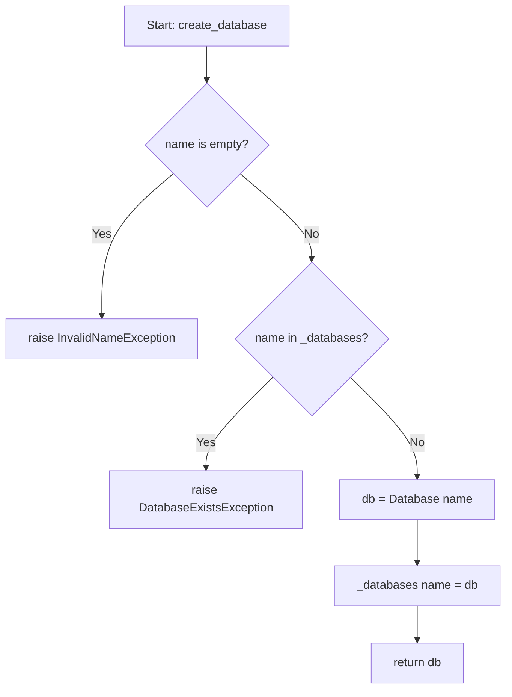
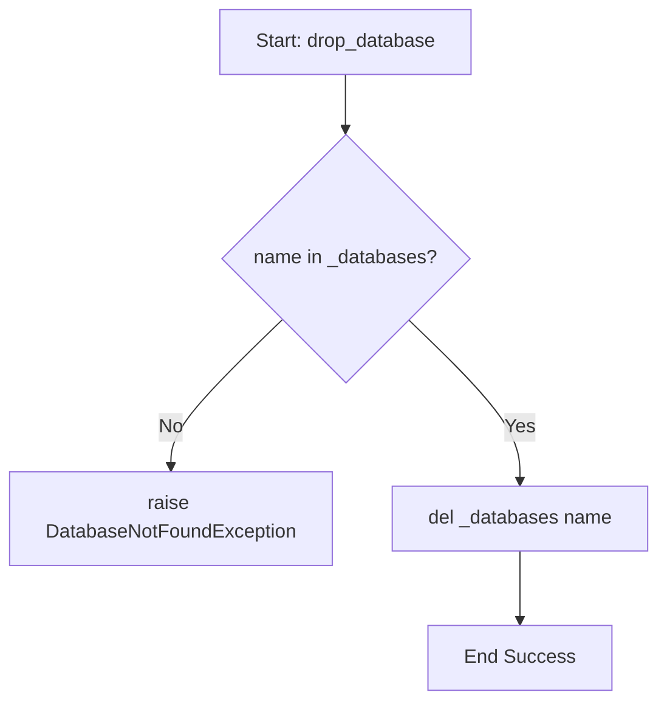
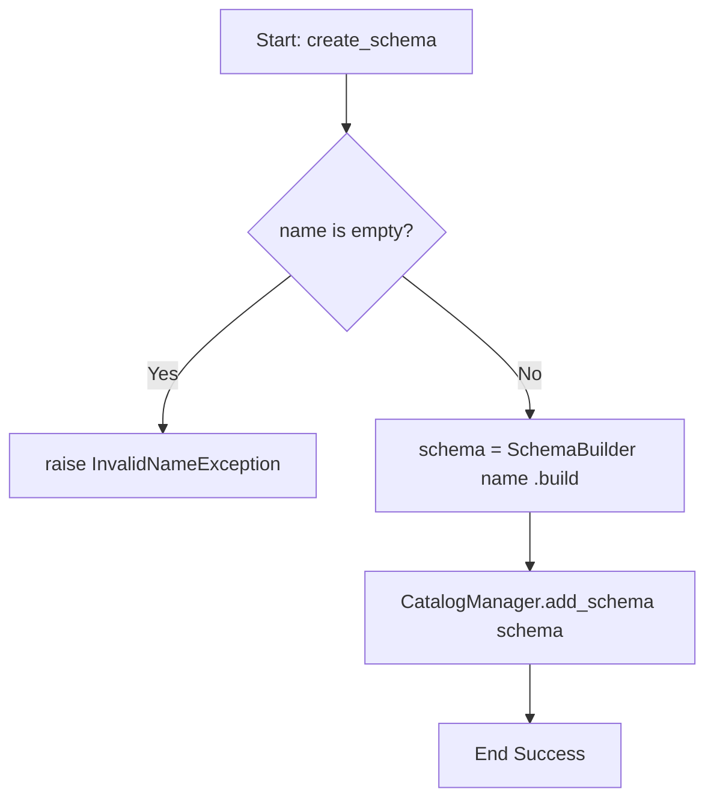

# Step 5: Internal Flowchart

## A. DatabaseCatalog.create_database(name)

```mermaid
graph TD
    A[Start: create_database] --> B{name is empty?}
    B -- Yes --> C[raise InvalidNameException]
    B -- No --> D{name in _databases?}
    D -- Yes --> E[raise DatabaseExistsException]
    D -- No --> F[db = Database name]
    F --> G[_databases name = db]
    G --> H[return db]
```

## B. DatabaseCatalog.drop_database(name)

```mermaid
graph TD
    A[Start: drop_database] --> B{name in _databases?}
    B -- No --> C[raise DatabaseNotFoundException]
    B -- Yes --> D[del _databases name]
    D --> E[End Success]
```

## C. Database.create_schema(name)

```mermaid
graph TD
    A[Start: create_schema] --> B{name is empty?}
    B -- Yes --> C[raise InvalidNameException]
    B -- No --> D[schema = SchemaBuilder name .build]
    D --> E[CatalogManager.add_schema schema]
    E --> F[End Success]
```
