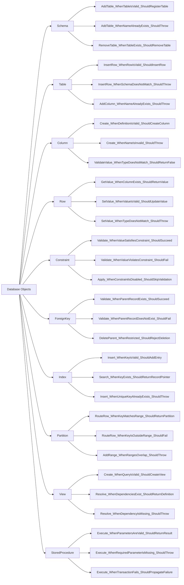
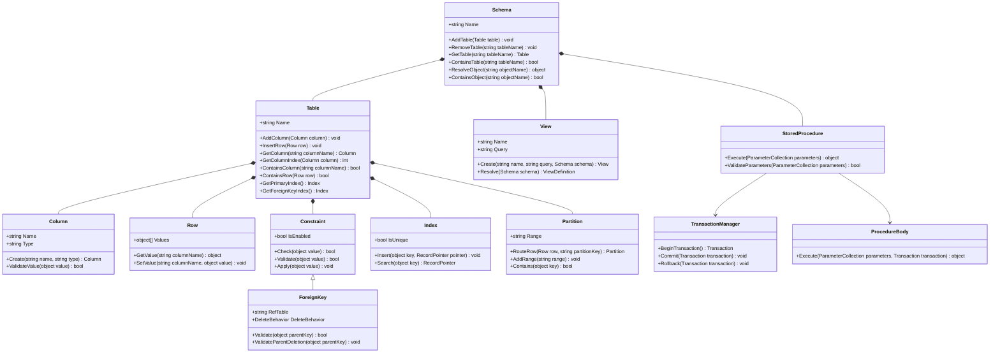

# Database Objects: Test Cases & Contracts

This document outlines the test cases and class contracts for the top-level logical layer (Schema, Table, Column, Row, etc.).

## 1. Unit Test Cases (Flowchart)

## 2. Derived Method Contracts (Detailed Class Diagram)

Based on the test scenarios, the detailed components are structured as follows:

