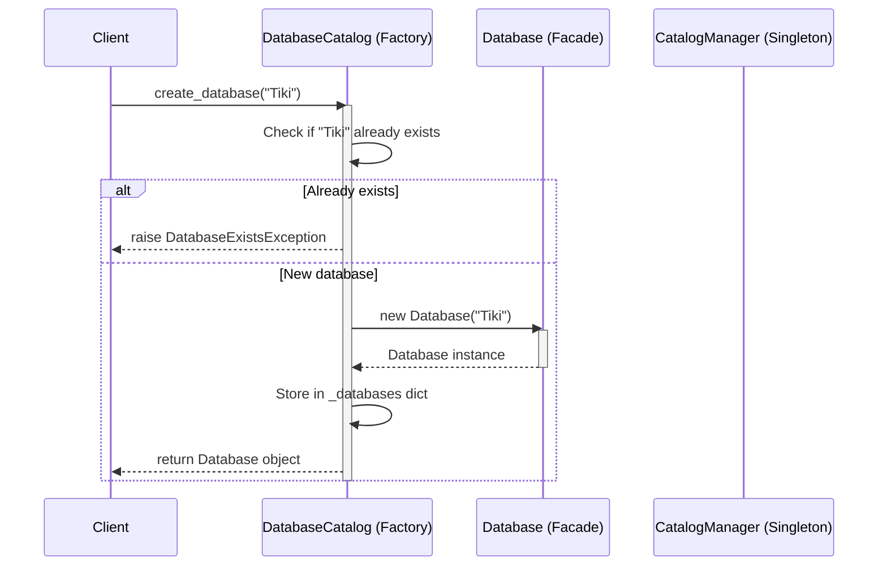
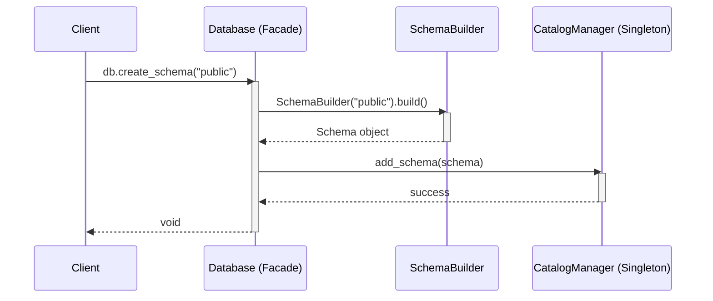

# Design Documents: Database & DatabaseCatalog

## Pattern Assignment
| Class | Pattern | Rationale |
|:---|:---|:---|
| `Database` | **Facade** | Hides `CatalogManager` + `SchemaBuilder` behind a clean, single API |
| `DatabaseCatalog` | **Factory Method** | Controls Database object creation and lifecycle (create / drop / get) |

---

## Step 4: Sequence Diagram — `DatabaseCatalog.create_database`

---

## Step 4: Sequence Diagram — `Database.create_schema`

