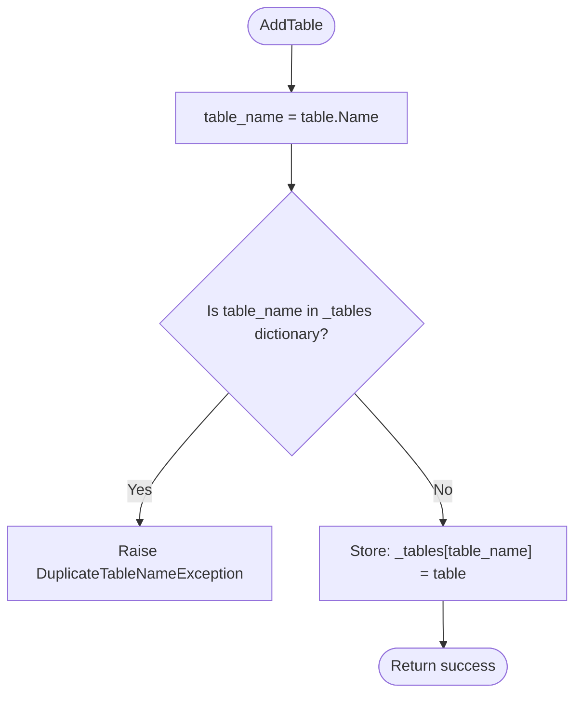
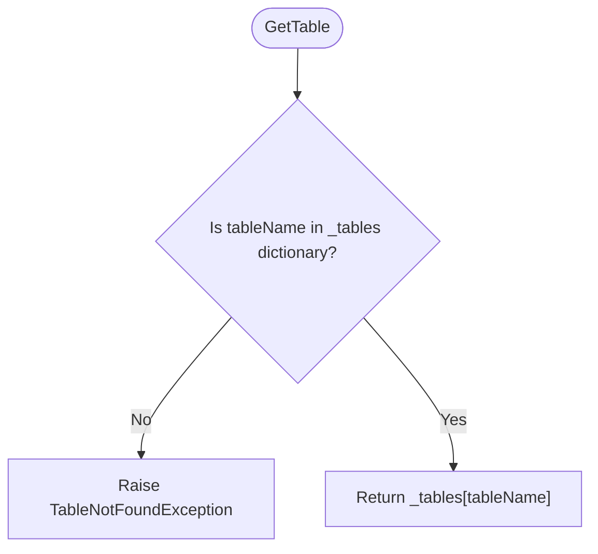

# Schema Object: Internal Flowcharts

These flowcharts follow **Step 5** of our plan, showing the internal decision tree and logic for the core methods of `Schema`.

## 1. `AddTable(table)` Flowchart

## 2. `GetTable(tableName)` Flowchart

