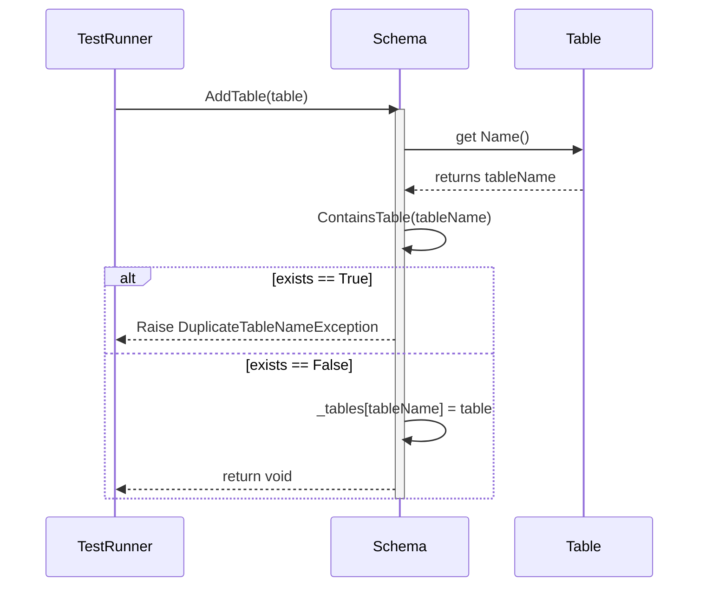
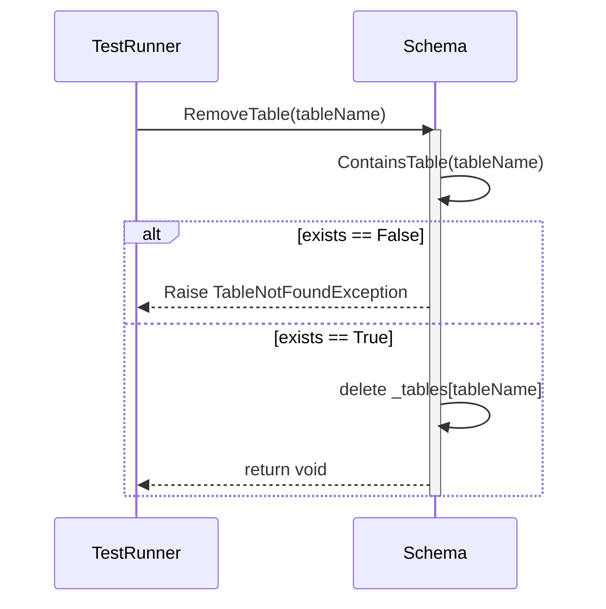

# Schema Object: Sequence Diagrams

These diagrams follow **Step 4** of our plan, mapping out the interactions when manipulating a Schema object. 
In this Top-Down approach, `Schema` acts as an in-memory logical container holding `Table` objects.

## 1. AddTable Sequence

## 2. RemoveTable Sequence

