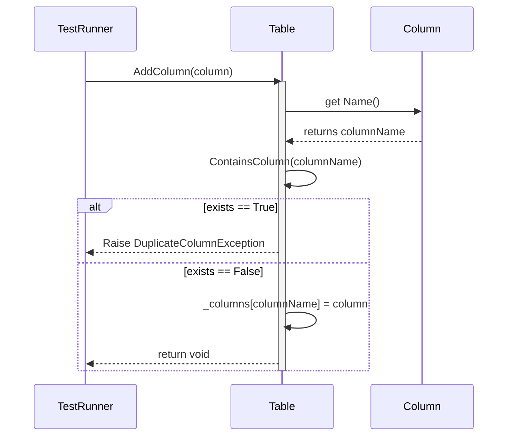
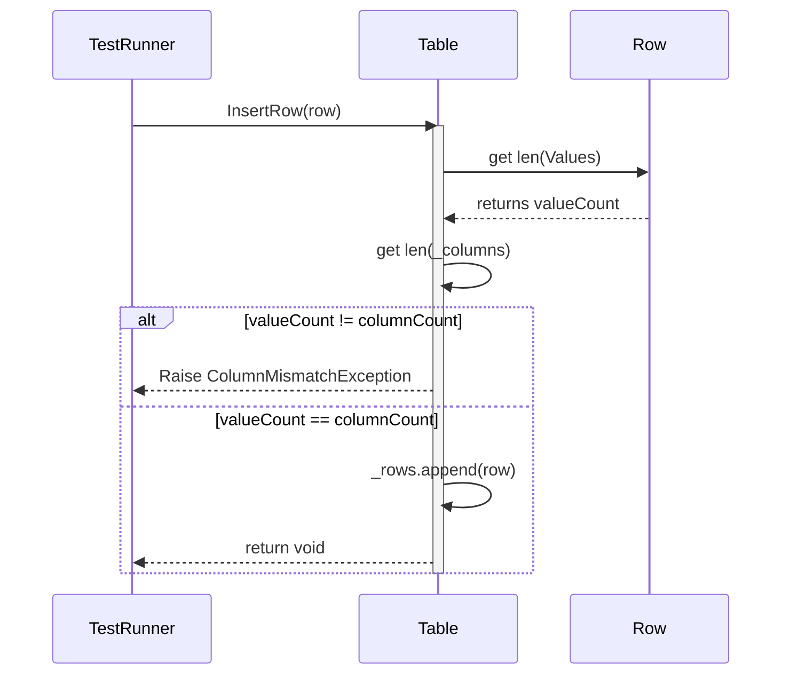

# Table Object: Sequence Diagrams

These diagrams map out operations for the `Table` object, specifically column management and row insertion.

## 1. AddColumn Sequence

```mermaid
sequenceDiagram
    participant User as TestRunner
    participant Table
    participant Column
    
    User->>Table: AddColumn(column)
    activate Table
    
    Table->>Column: get Name()
    Column-->>Table: returns columnName
    
    Table->>Table: ContainsColumn(columnName)
    
    alt exists == True
        Table-->>User: Raise DuplicateColumnException
    else exists == False
        Table->>Table: _columns[columnName] = column
        Table-->>User: return void
    end
    deactivate Table
```

## 2. InsertRow Sequence

```mermaid
sequenceDiagram
    participant User as TestRunner
    participant Table
    participant Row
    
    User->>Table: InsertRow(row)
    activate Table
    
    %% Basic validation: Does the row contain the correct number of values?
    Table->>Row: get len(Values)
    Row-->>Table: returns valueCount
    
    Table->>Table: get len(_columns)
    
    alt valueCount != columnCount
        Table-->>User: Raise ColumnMismatchException
    else valueCount == columnCount
        Table->>Table: _rows.append(row)
        Table-->>User: return void
    end
    deactivate Table
```
