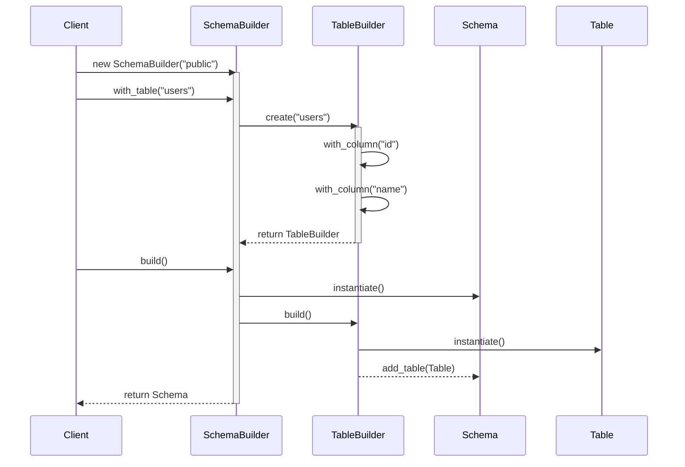
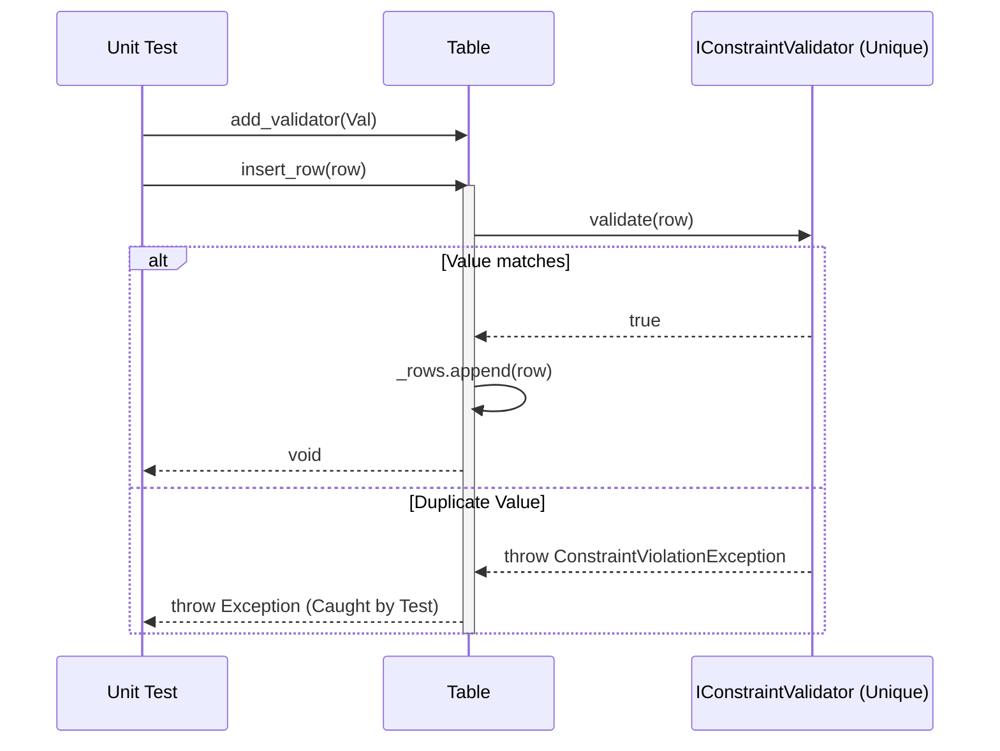
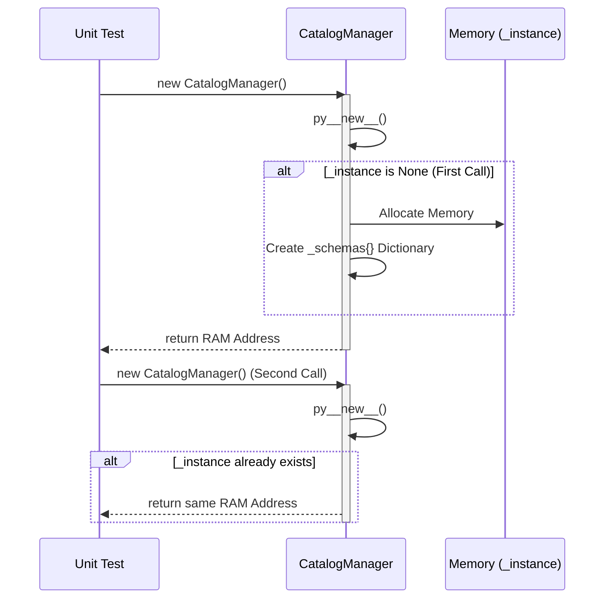
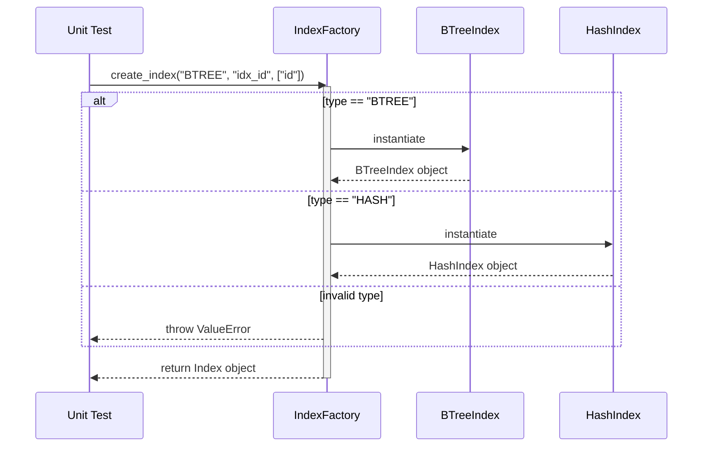
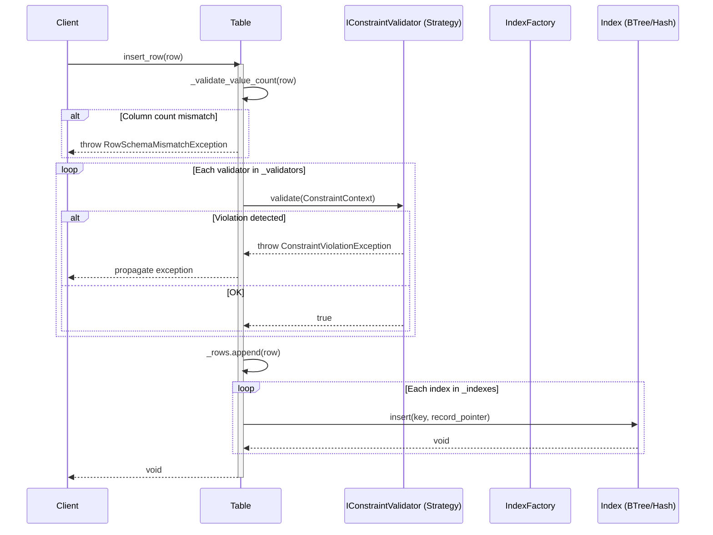
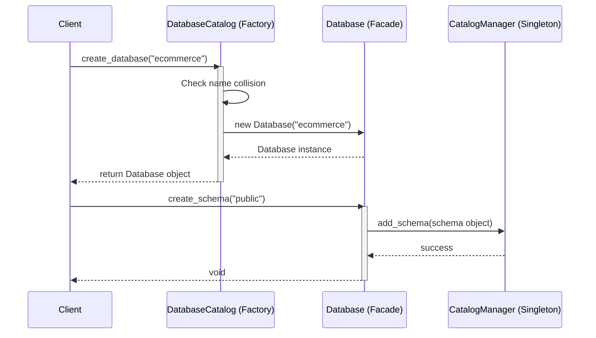
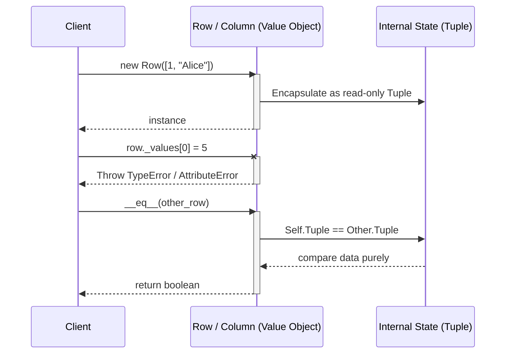
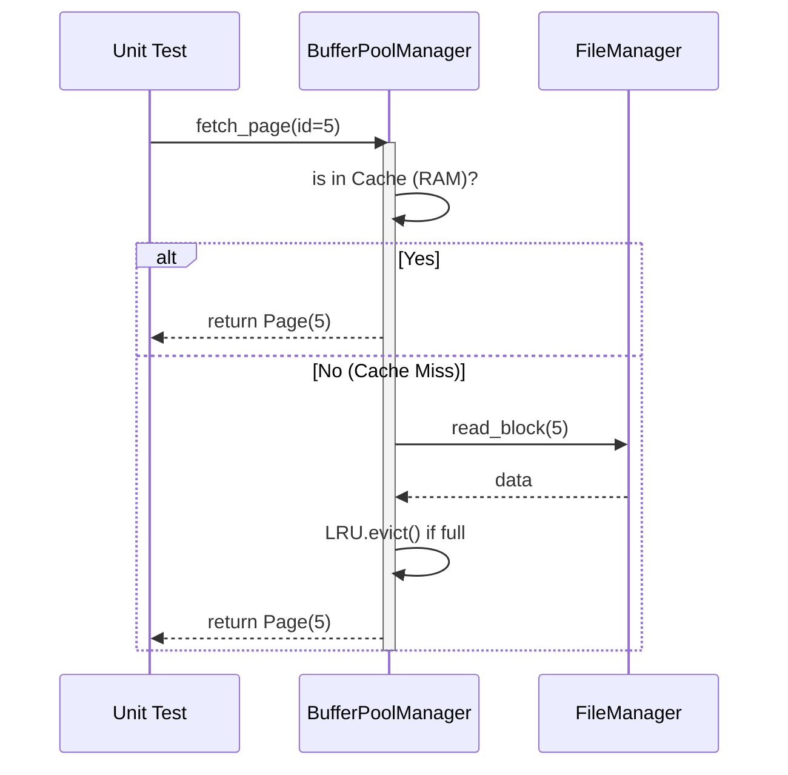
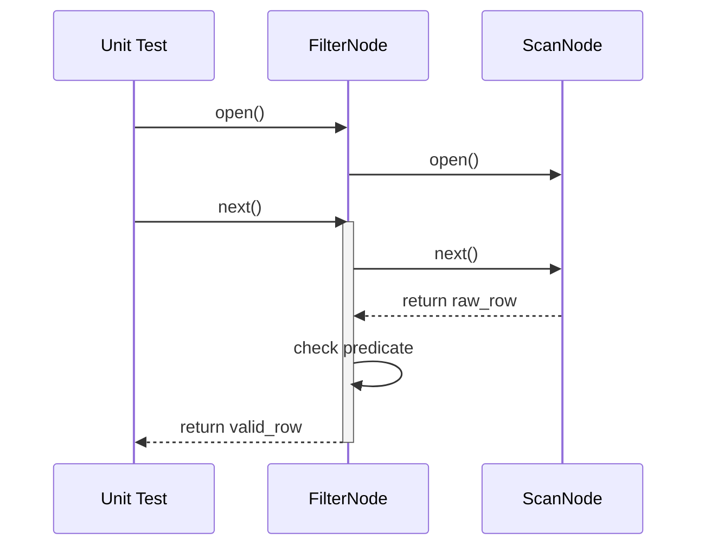

# Design Patterns & Unit Testing Roadmap

This document outlines the core Design Patterns derived from the Feature Mindmap, Class Mindmap, and Test Cases. It defines the rationale for applying these patterns and how they integrate into the Test-Driven Development (TDD) lifecycle.

---

## TABLE 1: DATABASE OBJECTS (Logical Schema Layer)

| Feature / Class | Design Pattern | Problem & Rationale | Unit Test (TDD) Implementation Strategy |
| :--- | :--- | :--- | :--- |
| **Catalog Management** `CatalogManager` | **Singleton** | The database instance must have one centralized, globally accessible registry for all schemas to prevent synchronization conflicts. | Test accessing the instance from multiple parallel threads to ensure only one memory address is generated. |
| **Table Creation** `SchemaBuilder`, `TableBuilder` | **Nested Builder** | Initializing a hierarchy (Schema contains Tables, Tables contain Columns) is bulky. Nested Builders allow cascading fluent configurations. | Test the fluent method chaining (`.with_table().with_column().build()`) to verify it returns a valid composite tree without missing nodes. |
| **Constraint Validation** `Constraint` (Base) | **Strategy** | Extracts validation logic (Check, Unique) away from the `Table` class, preventing the `insert_row` method from bloating with if/else chains. | Test using isolated mock strategies or simulated bad data rows to catch specific `ConstraintViolationException` violations. |
| **Validation Context** `ConstraintContext` | **Parameter Object** | Reduces method signature bloat (avoid passing `row`, `table`, `schema` individually). Packages all validation state into a single immutable context envelope. | Test that the context successfully binds references to the input Table and Row without mutating them. |
| **Referential Integrity** `ForeignKeyConstraint`, `IReferentialAction` | **Strategy** | Hardcoding `CASCADE` vs `RESTRICT` logic inside the Table creates spaghetti code. Exposing them as interchangeable strategies allows dynamic FK behavior. | Create mock actions (`CascadeAction`, `RestrictAction`) and test if the parent deletion successfully triggers the correct child table cascade or exception. |
| **Index Creation** `IndexFactory` | **Factory Method** | The DBMS supports various Index types (Hash, B-Tree). The core system shouldn't hardcode their instantiation. | Call the Factory with a flag (`type="BTREE"`) and test if the inserted Node correctly routes through the B-Tree logic flow. |
| **Column Definition** `Column`, `ColumnBuilder` | **Value Object** | A Column is immutable after creation (name + type fixed). Enforces that structure cannot mutate during runtime. | Test that two Columns with same name/type are equal, and that mutating properties raises an error. |
| **Row Data** `Row` | **Value Object** | A Row represents a snapshot of data at insert time. Immutable values prevent dirty reads and concurrent modification bugs. | Test that Row is constructed with fixed-length values matching Column schema, and equality is value-based not reference-based. |
| **Database Entry Point** `Database` | **Facade** | `Database` wraps the `CatalogManager` + `SchemaBuilder` internals and exposes a clean API: `create_schema`, `drop_schema`, `get_schema`. The caller never touches the subsystems directly. | Test that calling `db.create_schema("public")` correctly persists the schema through `CatalogManager`. |
| **Database Lifecycle** `DatabaseCatalog` | **Factory Method** | Controls the creation and deletion of `Database` objects. Prevents duplicate names and acts as the single source of truth for all active databases, mirroring `IndexFactory`. | Test that `DatabaseCatalog.create_database("Tiki")` returns a `Database` instance, and that creating a duplicate name raises `DatabaseExistsException`. |
| **Data Partitioning** `PartitionStrategy` | **Strategy Pattern** | Routing rows across multiple partition ranges shouldn't clutter the main `Table`'s `insert_row` logic. Delegating the routing handles Overlaps, Boundaries, and Not-Found cleanly. | Test `route_row` on explicit mathematical boundaries. Test that overlapping ranges throw `PartitionRangeOverlapException`. |
| **Schema Management** `Schema`, `DatabaseObject` | **Composite Pattern** | Managing Tables, Views, and Sequences as explicit disparate types makes Schema code messy. Using a Component interface (`DatabaseObject`) allows treating all Leaf objects uniformly. | Test that `Table`, `View`, and `Sequence` can all be added generically to the Schema, and that calling `drop()` cascades correctly. |
| **Virtual Tables** `View` | **Proxy / Adapter Pattern** | A View acts as a virtual table, shielding users from complex joins. It proxies `SELECT` queries to underlying tables without physically storing data. | Test that `resolve(schema)` correctly throws `NotImplementedError` or translates the query using actual Schema objects safely. |
| **Auto Increment ID** `Sequence` | **State Pattern** | Sequences must maintain a thread-safe incrementing state across concurrent inserts across the DBMS system. | Test that traversing `next_value()` incrementally increments the state, and limits are respected. |
| **Executable Logic** `StoredProcedure` | **Command Pattern** | Allows defining and packaging custom procedural SQL/Logic into isolated, executable blocks. The system simply blind-triggers `execute()`. | Test that invoking `execute()` with parameters successfully delegates to the underlying runtime environment. |

### 1.1. Sequence Diagram: Builder Pattern

### 1.2. Sequence Diagram: Strategy Pattern (Constraint)

### 1.3. Sequence Diagram: Singleton Pattern (CatalogManager)

### 1.4. Sequence Diagram: Factory Method (IndexFactory)

### 1.5. Sequence Diagram: Table-Index Integration (insert_row flow)

### 1.6. Sequence Diagram: Factory Method & Facade (Database Lifecycle)

### 1.6. Sequence Diagram: Value Object (Row / Column Immutability)

---

## TABLE 2: STORAGE & TRANSACTION ENGINE (Physical Hardware Layer)

| Feature / Class | Design Pattern | Problem & Rationale | Unit Test (TDD) Implementation Strategy |
| :--- | :--- | :--- | :--- |
| **Memory / Cache Management** `BufferPoolManager` | **Proxy / Object Pool** | Direct Disk I/O is slow. Serves as a gateway to recycle RAM memory and minimize disk hits. | Generate mock Page Requests, testing the LRU Eviction behavior when the RAM buffer pool reaches full capacity. |
| **ACID Recovery** `LogCommand`, `WAL` | **Command / Observer** | Wraps Undo/Redo operations as executable Commands. Triggers the Write-Ahead Log (WAL) to flush to disk upon Commit. | Create a pseudo-array of Commands (Insert, Update), simulate a system crash, and verify the WAL file reconstructs the uncommitted states. |

### 2.1. Sequence Diagram: Buffer Pool (Proxy Pattern)

---

## TABLE 3: QUERY PROCESSING (Execution & Translation Engine)

| Feature / Class | Design Pattern | Problem & Rationale | Unit Test (TDD) Implementation Strategy |
| :--- | :--- | :--- | :--- |
| **SQL Parser** `SqlVisitor`, `ASTNode` | **Visitor** | The Abstract Syntax Tree (AST) structure is highly nested. A Visitor transverses the nodes cleanly to extract meaning. | Supply a simulated AST tree hierarchy (Root -> Node -> Leaf) and verify the Visitor correctly reads and translates specific Node tokens. |
| **Execution Framework** `AbstractPlanNode` | **Template Method** | Base plan nodes share common startup/teardown logic but execute differently. | Test abstract inheritance ensuring `open()` is always called before child-specific `execute()`. |
| **Query Engine** `AbstractPlanNode` | **Iterator (Volcano Model)** | Prevents loading massive tables entirely into RAM. Provides a `Next()` method to yield results row-by-row sequentially. | Chain a `ScanNode` to a `FilterNode`, and perform continuous `next()` calls to verify records are dropped until reaching an EOF/Null. |

### 3.1. Sequence Diagram: Iterator Pattern (Volcano Execution)

