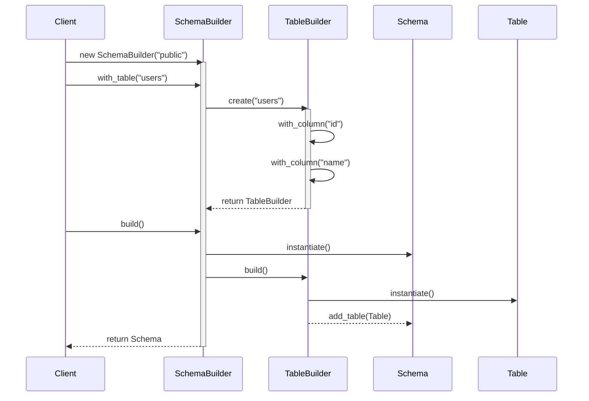
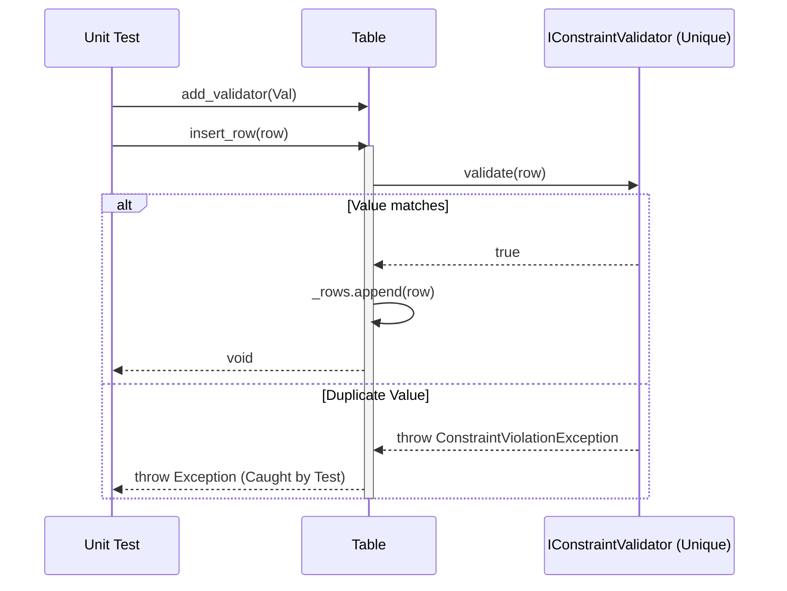
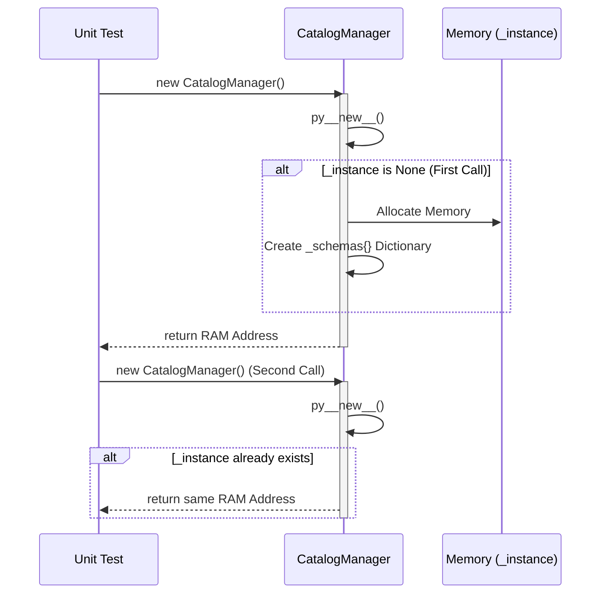
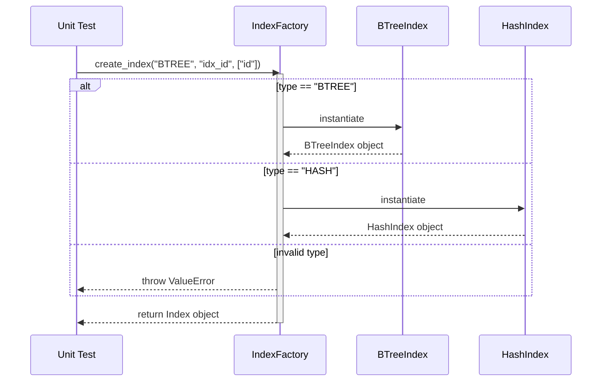
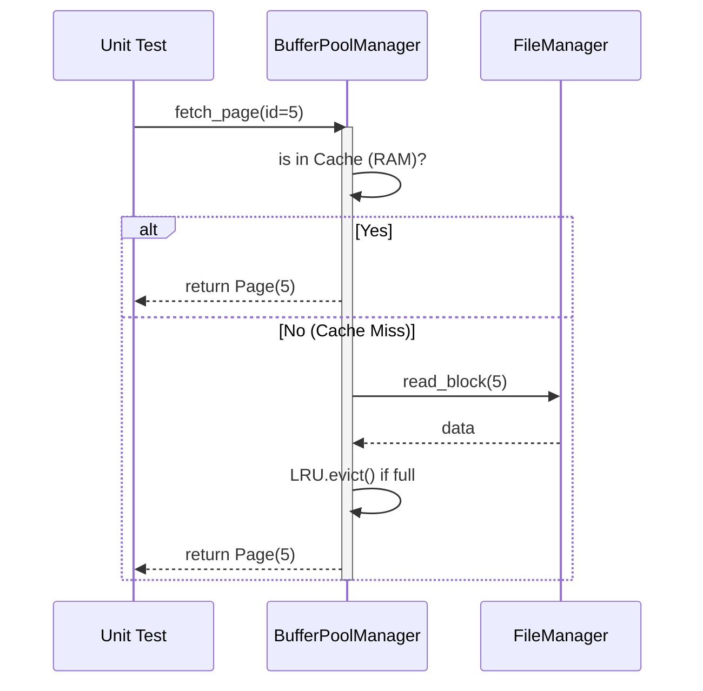
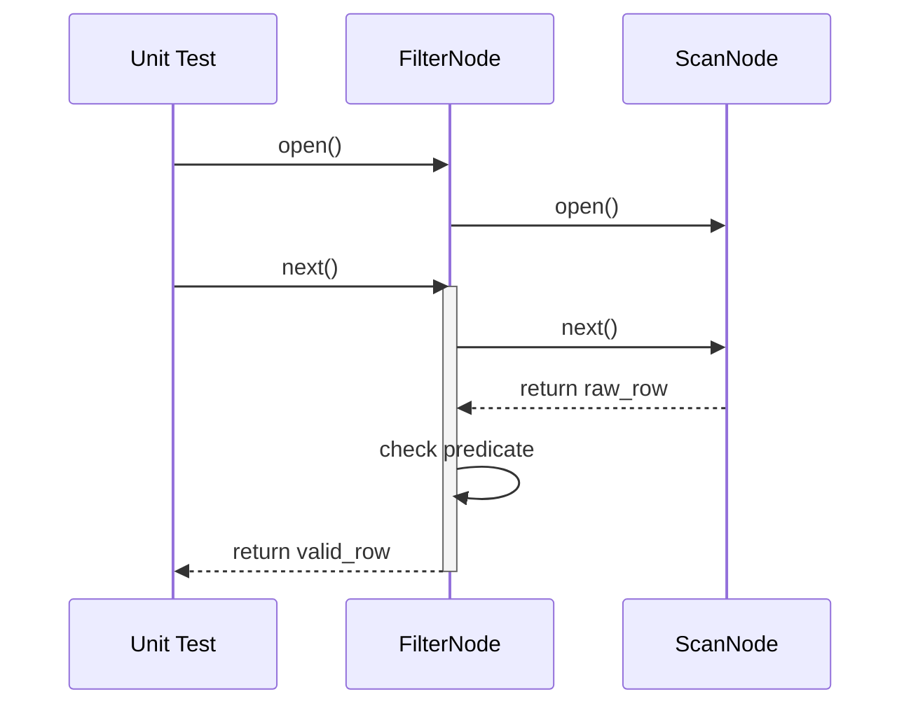

# Advanced Architecture: Design Patterns & Unit Testing Roadmap

This document outlines the core Design Patterns derived from the Feature Mindmap, Class Mindmap, and Test Cases. It defines the rationale for applying these patterns and how they integrate into the Test-Driven Development (TDD) lifecycle.

---

## TABLE 1: DATABASE OBJECTS (Logical Schema Layer)

| Feature / Class | Design Pattern | Problem & Rationale | Unit Test (TDD) Implementation Strategy |
| :--- | :--- | :--- | :--- |
| **Catalog Management** `CatalogManager` | **Singleton** | The database instance must have one centralized, globally accessible registry for all schemas to prevent synchronization conflicts. | Test accessing the instance from multiple parallel threads to ensure only one memory address is generated. |
| **Table Creation** `SchemaBuilder`, `TableBuilder` | **Nested Builder** | Initializing a hierarchy (Schema contains Tables, Tables contain Columns) is bulky. Nested Builders allow cascading fluent configurations. | Test the fluent method chaining (`.with_table().with_column().build()`) to verify it returns a valid composite tree without missing nodes. |
| **Constraint Validation** `IConstraintValidator` | **Strategy** | Extracts validation logic (NotNull, Unique) away from the `Table` class, preventing the `InsertRow` method from bloating with if/else chains. | Test using isolated Mock strategies or simulated bad data rows to catch specific `Exception` violations. |
| **Index Creation** `IndexFactory` | **Factory Method** | The DBMS supports various Index types (Hash, B-Tree). The core system shouldn't hardcode their instantiation. | Call the Factory with a flag (`type="BTREE"`) and test if the inserted Node correctly routes through the B-Tree logic flow. |

### 1.1. Sequence Diagram: Builder Pattern

### 1.2. Sequence Diagram: Strategy Pattern (Constraint)

### 1.3. Sequence Diagram: Singleton Pattern (CatalogManager)

### 1.4. Sequence Diagram: Factory Method (IndexFactory)

---

## TABLE 2: STORAGE & TRANSACTION ENGINE (Physical Hardware Layer)

| Feature / Class | Design Pattern | Problem & Rationale | Unit Test (TDD) Implementation Strategy |
| :--- | :--- | :--- | :--- |
| **Memory / Cache Management** `BufferPoolManager` | **Proxy / Object Pool** | Direct Disk I/O is slow. Serves as a gateway to recycle RAM memory and minimize disk hits. | Generate mock Page Requests, testing the LRU Eviction behavior when the RAM buffer pool reaches full capacity. |
| **ACID Recovery** `LogCommand`, `WAL` | **Command / Observer** | Wraps Undo/Redo operations as executable Commands. Triggers the Write-Ahead Log (WAL) to flush to disk upon Commit. | Create a pseudo-array of Commands (Insert, Update), simulate a system crash, and verify the WAL file reconstructs the uncommitted states. |

### 2.1. Sequence Diagram: Buffer Pool (Proxy Pattern)

---

## TABLE 3: QUERY PROCESSING (Execution & Translation Engine)

| Feature / Class | Design Pattern | Problem & Rationale | Unit Test (TDD) Implementation Strategy |
| :--- | :--- | :--- | :--- |
| **SQL Parser** `SqlVisitor`, `ASTNode` | **Visitor** | The Abstract Syntax Tree (AST) structure is highly nested. A Visitor transverses the nodes cleanly to extract meaning. | Supply a simulated AST tree hierarchy (Root -> Node -> Leaf) and verify the Visitor correctly reads and translates specific Node tokens. |
| **Execution Framework** `AbstractPlanNode` | **Template Method** | Base plan nodes share common startup/teardown logic but execute differently. | Test abstract inheritance ensuring `open()` is always called before child-specific `execute()`. |
| **Query Engine** `AbstractPlanNode` | **Iterator (Volcano Model)** | Prevents loading massive tables entirely into RAM. Provides a `Next()` method to yield results row-by-row sequentially. | Chain a `ScanNode` to a `FilterNode`, and perform continuous `next()` calls to verify records are dropped until reaching an EOF/Null. |

### 3.1. Sequence Diagram: Iterator Pattern (Volcano Execution)

