# Design Patterns & Unit Testing Roadmap

This document outlines the core Design Patterns derived from the Feature Mindmap, Class Mindmap, and Test Cases. It defines the rationale for applying these patterns and how they integrate into the Test-Driven Development (TDD) lifecycle.

---

## TABLE 1: DATABASE OBJECTS (Logical Schema Layer)

| Priority | Feature / Class | Design Pattern | Problem & Architecture Need | Application / Usage | Unit Test (TDD) Implementation Strategy |
| :--- | :--- | :--- | :--- | :--- | :--- |
| **P1** | `CatalogManager` | **Singleton** | A DBMS must have exactly one global registry for all schemas. Multiple instances would lead to split-brain state synchronization bugs. | `cm1 = CatalogManager()`<br>`cm2 = CatalogManager()`<br>`assert cm1 is cm2 # True` | Test that concurrent thread access always returns the same memory address. Verify that `add_schema()` persists across calls. |
| **P1** | `DatabaseCatalog` | **Factory Method** | Centralizes `Database` object creation. Prevents duplicate DB names and keeps the system as the single source of truth for all active databases. | `db = DatabaseCatalog.create_database("Tiki")`<br>`# Duplicate → raise DatabaseExistsException` | Test that `create_database("X")` returns a `Database`, and that calling it again with `"X"` raises `DatabaseExistsException`. |
| **P1** | `Database` | **Facade** | The `Database` class must shield the client from internal complexity (CatalogManager + SchemaBuilder). Client only needs one clean API. | `db.create_schema("public")`<br>`# Client never sees CatalogManager internally` | Test that `create_schema("public")` persists the schema, and `get_schema()` returns the same object. |
| **P1** | `Schema`, `DatabaseObject` | **Composite Pattern** | A Schema contains Tables, Views, Sequences. Drop operations must propagate uniformly without type-checking each child. | `schema.drop()`<br>`# Internally calls .drop() on ALL children,`<br>`# regardless of whether they are Table or View` | Test that `add_table()`, `add_view()`, and `add_sequence()` are accepted uniformly. Test `drop()` cascades without errors. |
| **P1** | `SchemaBuilder` | **Builder Pattern** | Constructing a full Schema requires complex Setup. Fluent Builder abstraction removes structural noise. | `schema = SchemaBuilder("db")`<br>`.with_table("users").build()` | Test fluent chaining builds a valid Schema tree. Test missing fields raise `ValueError`. |
| **P1** | `TableBuilder` | **Builder Pattern** | Initializing a Table with dozens of Columns/Constraints manually causes bloated constructors. | `table = TableBuilder("users")`<br>`.with_column("id", "int").build()` | Test fluent column accumulation. Test duplicate columns raise Exceptions. |
| **P1** | `Column` | **Value Object** | Once a column is defined (name + type), it must not mutate. Immutability prevents inconsistent schema drift at runtime. | `col = Column("id", "int")`<br>`col.name = "x" # Raises AttributeError`<br>`Column("id","int") == Column("id","int") # True` | Test that post-creation mutation raises `AttributeError`. Test that two columns with equal fields are equal via `__eq__`. |
| **P1** | `Row` | **Value Object** | A Row is a snapshot of data at insert-time. Mutable rows cause dirty reads in concurrent environments. | `r1 = Row((1, "Alice"))`<br>`r1.values[0] = 99 # Raises TypeError`<br>`Row((1,"A")) == Row((1,"A")) # True` | Test that all values are wrapped in an immutable tuple. Test equality is value-based, not reference-based. |
| **P1** | `Constraint` | **Strategy Pattern** | Validation logic (Check, Unique, Not Null) embedded inside `Table.insert_row` creates unreadable bloat. Strategy externalizes each rule as a swappable object. | `unique_validator.validate(ctx)`<br>`# Table loops validators without knowing their type` | Test each strategy independently with mock contexts. Test `ConstraintViolationException` for a bad row, and `True` for a valid one. |
| **P1** | `ConstraintContext` | **Parameter Object** | Passing `row, table, schema` as separate arguments to every validator bloats method signatures. One immutable envelope bundles all state. | `ctx = ConstraintContext(row, table)`<br>`validator.validate(ctx) # Single clean argument` | Test that the context binds references to Table and Row without mutating their internal state. |
| **P2** | `ForeignKeyConstraint`, `IReferentialAction` | **Strategy Pattern** | Hardcoding `CASCADE` or `RESTRICT` inside Table classes creates spaghetti. Injecting strategies allows dynamic FK behavior at creation time. | `fk = ForeignKeyConstraint("user_id",`<br>`    on_delete=CascadeAction())`<br>`# Deleting parent → auto cascade to child` | Create mock `CascadeAction` and `RestrictAction`. Test parent deletion correctly triggers child cascade or exception. |
| **P2** | `IndexFactory` | **Factory Method** | DBMS supports different Index types (B-Tree, Hash). Core classes must not hardcode algorithm instantiation. | `idx = IndexFactory.create("BTREE")`<br>`idx.insert("alice", ptr) # Type-specific impl.` | Test `create("BTREE")` returns a B-Tree instance and `create("HASH")` a Hash instance. Test invalid types raise `ValueError`. |
| **P2** | `PartitionStrategy` | **Strategy Pattern** | Row routing to physical partitions (by key range) must not clutter the main `Table.insert_row` logic with boundary conditions. | `partition_name = strategy.route_row(row.key)`<br>`# Table blindly delegates routing to Strategy` | Test exact boundary conditions (in-range returns partition name). Test out-of-range throws `PartitionNotFoundException`. Overlapping ranges throw `PartitionRangeOverlapException`. |
| **P3** | `Sequence` | **State Pattern** | Auto-numbering (e.g. `AUTO_INCREMENT`) must maintain a thread-safe, in-memory counter that advances precisely. | `seq = Sequence("id_seq", start=1, increment=1)`<br>`seq.next_value() # → 1`<br>`seq.next_value() # → 2` | Test that `next_value()` advances by exactly `increment`. Test multiple calls return strictly sequential values with no skips. |
| **P3** | `View` | **Proxy (Virtual Proxy)** | A View hides multi-table JOINs behind a virtual table interface. Client queries `my_view` as if it were a real Table, unaware of the complexity. | `view = View("active_users", "SELECT * FROM users WHERE active=1")`<br>`result = view.resolve(schema) # Proxies query to Engine` | Test `resolve(schema)` returns compiled output. Test that a missing dependency table raises `DependencyViolationException`. |
| **P3** | `StoredProcedure` | **Command Pattern** | Pre-packaged SQL logic must be callable without the client knowing the internals. The system only needs to trigger `execute()`. | `proc = StoredProcedure("clean_logs", body="DELETE...")`<br>`proc.execute(days=30) # Triggers encapsulated logic` | Test `execute(params)` delegates correctly. Test a missing required parameter raises `TypeError`. Test transaction failures propagate upward. |


### 1.1a. Class Diagram: Singleton Pattern (CatalogManager)
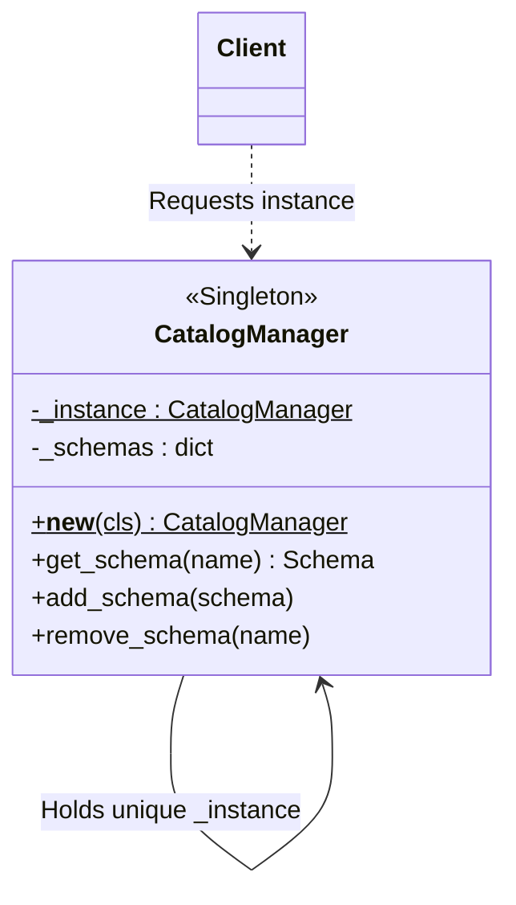
```mermaid
classDiagram
    class Client {
    }
    
    class CatalogManager {
        <<Singleton>>
        -_instance : CatalogManager$
        -_schemas : dict
        +__new__(cls)$ CatalogManager
        +get_schema(name) Schema
        +add_schema(schema)
        +remove_schema(name)
    }
    
    Client ..> CatalogManager : Requests instance
    CatalogManager --> CatalogManager : Holds unique _instance
```

### 1.1b. Sequence Diagram: Singleton Pattern (CatalogManager)
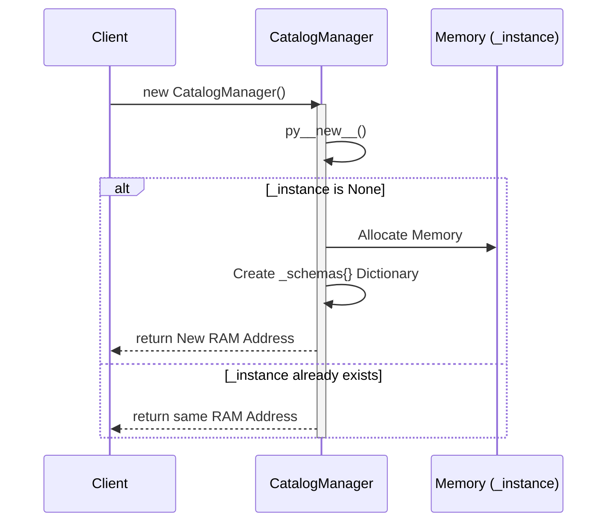
```mermaid
sequenceDiagram
    participant Client
    participant CM as CatalogManager
    participant RAM as Memory (_instance)
    
    Client->>CM: new CatalogManager()
    activate CM
    CM->>CM: py__new__()
    
    alt _instance is None
        CM->>RAM: Allocate Memory
        CM->>CM: Create _schemas{} Dictionary
        CM-->>Client: return New RAM Address
    else _instance already exists
        CM-->>Client: return same RAM Address
    end
    deactivate CM
```

**Implementation Example:**
```python
class CatalogManager:
    _instance = None
    
    def __new__(cls):
        if cls._instance is None:
            cls._instance = super(CatalogManager, cls).__new__(cls)
        return cls._instance
        
obj1 = CatalogManager()
obj2 = CatalogManager()

print(obj1 is obj2) # True
```

### 1.2a. Class Diagram: Factory Method Pattern (DatabaseCatalog)
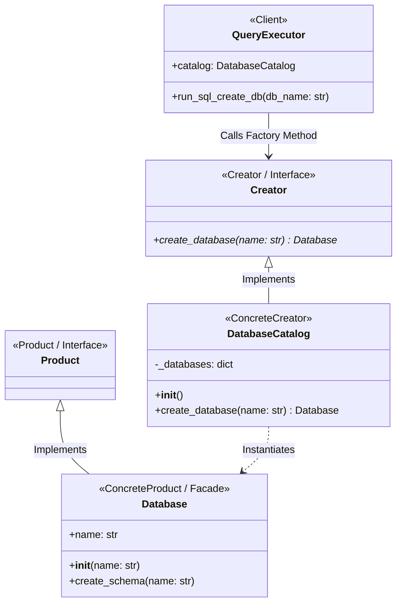
```mermaid
classDiagram
    %% ----------------------------------------------------
    %% FACTORY METHOD PATTERN (Áp dụng cho DatabaseCatalog)
    %% ----------------------------------------------------

    class QueryExecutor {
        <<Client>>
        +catalog: DatabaseCatalog
        +run_sql_create_db(db_name: str)
    }

    class Creator {
        <<Creator / Interface>>
        +create_database(name: str)* Database
    }

    class DatabaseCatalog {
        <<ConcreteCreator>>
        -_databases: dict
        +__init__()
        +create_database(name: str) Database
    }

    class Product {
        <<Product / Interface>>
    }

    class Database {
        <<ConcreteProduct / Facade>>
        +name: str
        +__init__(name: str)
        +create_schema(name: str)
    }

    %% Quan hệ Kế thừa (Realization)
    Creator <|-- DatabaseCatalog : Implements
    Product <|-- Database : Implements

    %% Quan hệ Sinh ra (Dependency)
    DatabaseCatalog ..> Database : Instantiates 
    
    %% Quan hệ Sử dụng (Association)
    QueryExecutor --> Creator : Calls Factory Method
```

### 1.2b. Sequence Diagram: Factory Method (DatabaseCatalog)
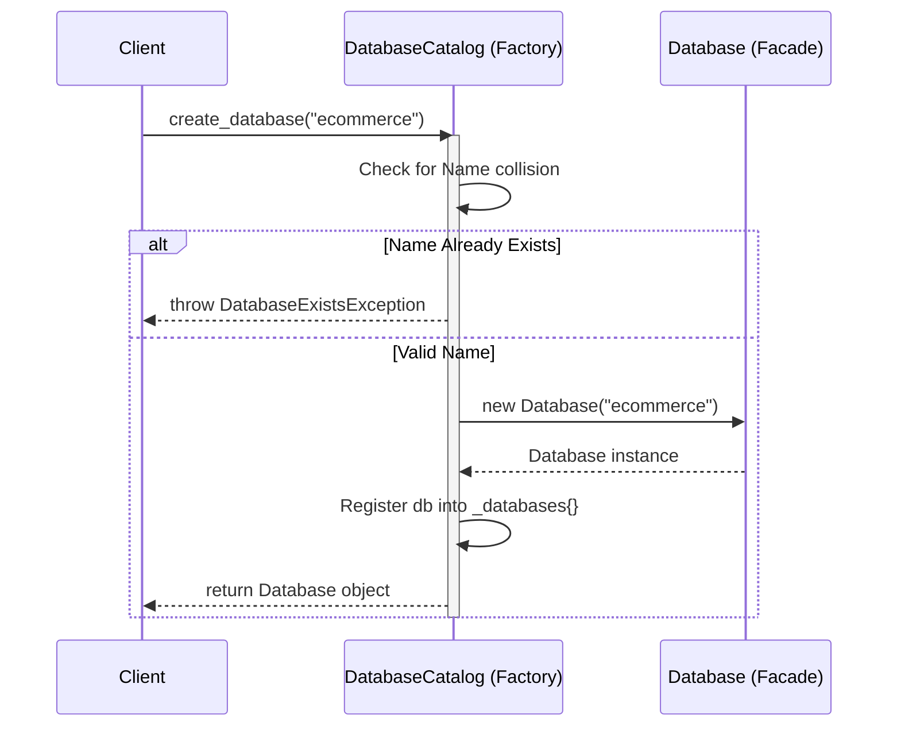
```mermaid
sequenceDiagram
    participant Client
    participant DC as DatabaseCatalog (Factory)
    participant DB as Database (Facade)

    Client->>DC: create_database("ecommerce")
    activate DC
    DC->>DC: Check for Name collision
    alt Name Already Exists
        DC-->>Client: throw DatabaseExistsException
    else Valid Name
        DC->>DB: new Database("ecommerce")
        DB-->>DC: Database instance
        DC->>DC: Register db into _databases{}
        DC-->>Client: return Database object
    end
    deactivate DC
```

**Implementation Example:**
```python
class Database:
    def __init__(self, name:str):
        self.name = name
        
class DatabaseCatalog:
    def __init__(self):
        self._databases = {}
        
    def create_database(self, name:str) -> Database:
        new_db = Database(name)
        self._databases[name] = new_db
        return new_db
        
class QueryExecutor:
    def __init__(self, catalog):
        self.catalog = catalog
    
    def run_sql_create_db(self, db_name):
        db = self.catalog.create_database(db_name)
        print(f"Create database {db.name}")
        
catalog = DatabaseCatalog()
executor = QueryExecutor(catalog)

executor.run_sql_create_db("Shopee")
```

### 1.3. Sequence Diagram: Facade Pattern (Database API)
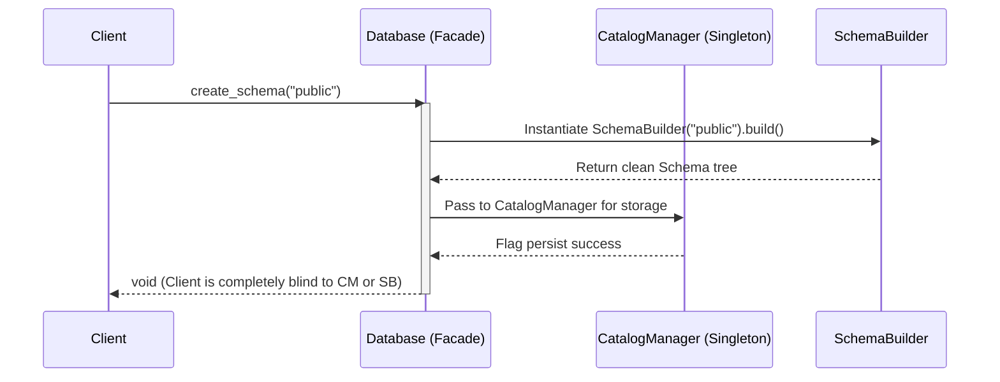
```mermaid
sequenceDiagram
    participant Client
    participant DB as Database (Facade)
    participant CM as CatalogManager (Singleton)
    participant SB as SchemaBuilder

    Client->>DB: create_schema("public")
    activate DB
    DB->>SB: Instantiate SchemaBuilder("public").build()
    SB-->>DB: Return clean Schema tree
    DB->>CM: Pass to CatalogManager for storage
    CM-->>DB: Flag persist success
    DB-->>Client: void (Client is completely blind to CM or SB)
    deactivate DB
```

### 1.3a. Class Diagram: Facade Pattern (Database API)
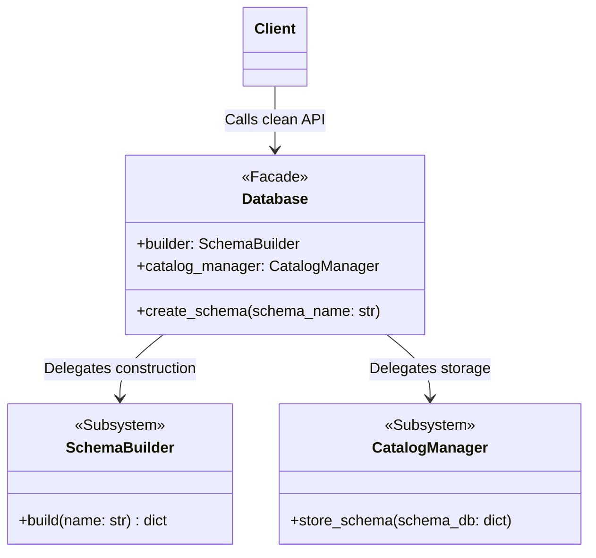
```mermaid
classDiagram
    %% ----------------------------------------------------
    %% FACADE PATTERN (Applied to Database)
    %% ----------------------------------------------------

    class Client {
    }

    class Database {
        <<Facade>>
        +builder: SchemaBuilder
        +catalog_manager: CatalogManager
        +create_schema(schema_name: str)
    }

    class SchemaBuilder {
        <<Subsystem>>
        +build(name: str) dict
    }

    class CatalogManager {
        <<Subsystem>>
        +store_schema(schema_db: dict)
    }

    %% Client only interacts with the Facade
    Client --> Database : Calls clean API

    %% Facade orchestrates complex Subsystems below
    Database --> SchemaBuilder : Delegates construction
    Database --> CatalogManager : Delegates storage
```

**Implementation Example:**
```python
class SchemaBuilder:
    def build(self, name: str):
        return {'name': name, "tables": []}
        
class CatalogManager:
    def store_schema(self, schema_db):
        print(f"CatalogManager write schema '{schema_db['name']}'")

class Database:
    def __init__(self, db_name: str):
        self.name = db_name
        self.catalog_manager = CatalogManager()
    
    def create_schema(self, schema_name: str):
        # Instantiate SchemaBuilder inside the method to match Sequence Diagram 1.3
        new_schema = SchemaBuilder().build(schema_name)
        self.catalog_manager.store_schema(new_schema)
        print("Done")

# --- Client Execution ---
db = Database("ShopeeDB")
db.create_schema("public")
db.create_schema("auth service")
```

### 1.4. Sequence Diagram: Composite Pattern (Schema Drop)
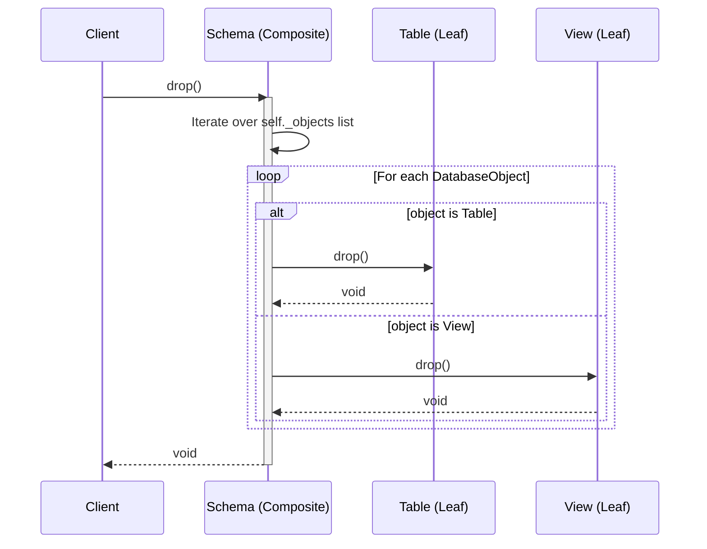
```mermaid
sequenceDiagram
    participant Client
    participant Sch as Schema (Composite)
    participant Tbl as Table (Leaf)
    participant View as View (Leaf)

    Client->>Sch: drop()
    activate Sch
    Sch->>Sch: Iterate over self._objects list
    
    loop For each DatabaseObject
        alt object is Table
            Sch->>Tbl: drop()
            Tbl-->>Sch: void
        else object is View
            Sch->>View: drop()
            View-->>Sch: void
        end
    end
    Sch-->>Client: void
    deactivate Sch
```

### 1.4a. Class Diagram: Composite Pattern (Schema / DatabaseObject)
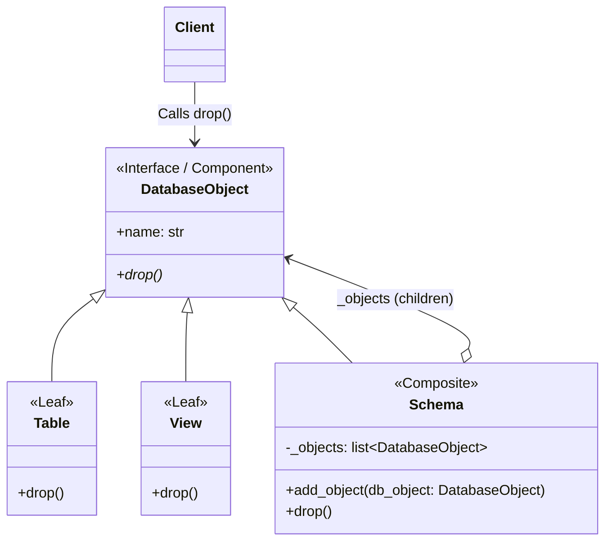
```mermaid
classDiagram
    %% ----------------------------------------------------
    %% COMPOSITE PATTERN (Applied to Schema)
    %% ----------------------------------------------------

    class Client {
    }

    class DatabaseObject {
        <<Interface / Component>>
        +name: str
        +drop()*
    }

    class Table {
        <<Leaf>>
        +drop()
    }

    class View {
        <<Leaf>>
        +drop()
    }

    class Schema {
        <<Composite>>
        -_objects: list~DatabaseObject~
        +add_object(db_object: DatabaseObject)
        +drop()
    }

    %% Inheritance - All are Components
    DatabaseObject <|-- Table
    DatabaseObject <|-- View
    DatabaseObject <|-- Schema

    %% Aggregation - Schema (Composite) holds a list of Components
    DatabaseObject <--o Schema : _objects (children)

    %% Client interacts with the common Interface
    Client --> DatabaseObject : Calls drop()
```

**Implementation Example:**
```python
class DatabaseObject:
    def __init__(self, name):
        self.name = name
        
    def drop(self):
        raise NotImplementedError()

class Table(DatabaseObject):
    def drop(self):
        print(f"Table '{self.name}' drop")

class View(DatabaseObject):
    def drop(self):
        print(f"View '{self.name}' drop")
        
class Schema(DatabaseObject):
    def __init__(self, name):
        super().__init__(name)
        self._objects = []
        
    def add_object(self, db_object: DatabaseObject):
        self._objects.append(db_object)
        
    def drop(self):
        print(f"Schema '{self.name}' drop begin")
        # Delegate all work to child components
        for obj in self._objects:
            obj.drop()
        print(f"Schema '{self.name}' drop done")
        
# --- Client Execution ---
schema_public = Schema("public")
tbl_user = Table("user")
tbl_order = Table("order")
view_active = View("Active")

schema_public.add_object(tbl_user)
schema_public.add_object(tbl_order)
schema_public.add_object(view_active)

# One call cascades to all children seamlessly
schema_public.drop()
```

### 1.5. Sequence Diagram: Builder Pattern (Table Creation)
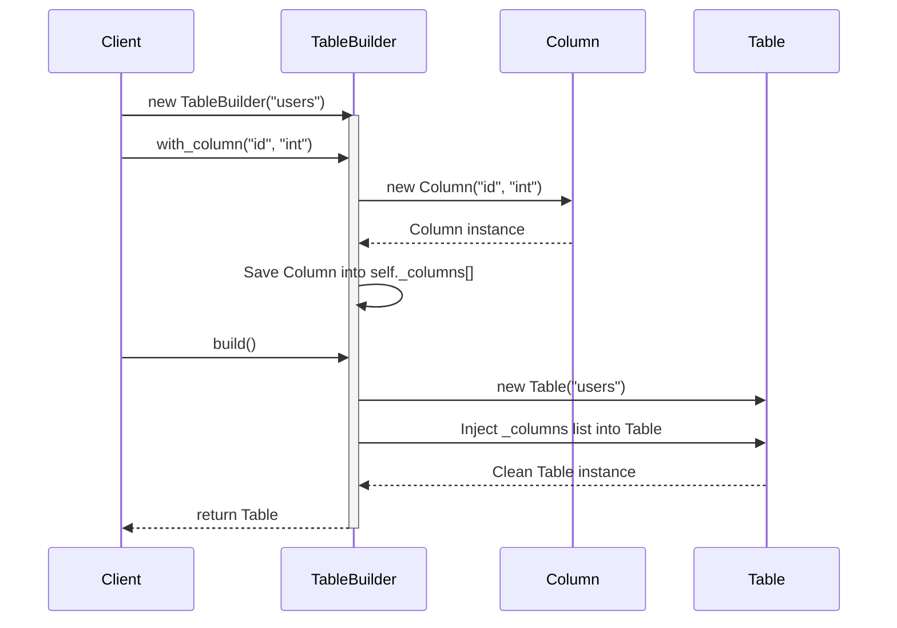
```mermaid
sequenceDiagram
    participant Client
    participant TB as TableBuilder
    participant Col as Column
    participant Tbl as Table
    
    Client->>TB: new TableBuilder("users")
    activate TB
    
    Client->>TB: with_column("id", "int")
    TB->>Col: new Column("id", "int")
    Col-->>TB: Column instance
    TB->>TB: Save Column into self._columns[]
    
    Client->>TB: build()
    TB->>Tbl: new Table("users")
    TB->>Tbl: Inject _columns list into Table
    Tbl-->>TB: Clean Table instance
    TB-->>Client: return Table
    deactivate TB
```

### 1.6. Sequence Diagram: Builder Pattern (SchemaBuilder)
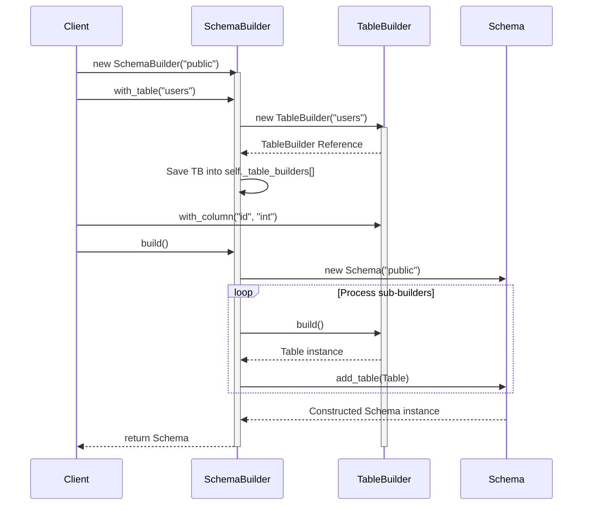
```mermaid
sequenceDiagram
    participant Client
    participant SB as SchemaBuilder
    participant TB as TableBuilder
    participant Sch as Schema
    
    Client->>SB: new SchemaBuilder("public")
    activate SB
    
    Client->>SB: with_table("users")
    SB->>TB: new TableBuilder("users")
    activate TB
    TB-->>SB: TableBuilder Reference
    SB->>SB: Save TB into self._table_builders[]
    
    %% Triggers Fluent Chaining directly on the returned TB
    Client->>TB: with_column("id", "int")
    
    Client->>SB: build()
    SB->>Sch: new Schema("public")
    
    loop Process sub-builders
        SB->>TB: build()
        TB-->>SB: Table instance
        SB->>Sch: add_table(Table)
    end
    
    Sch-->>SB: Constructed Schema instance
    SB-->>Client: return Schema
    deactivate TB
    deactivate SB
```

### 1.7. Sequence Diagram: Value Object (Row / Column Immutability)
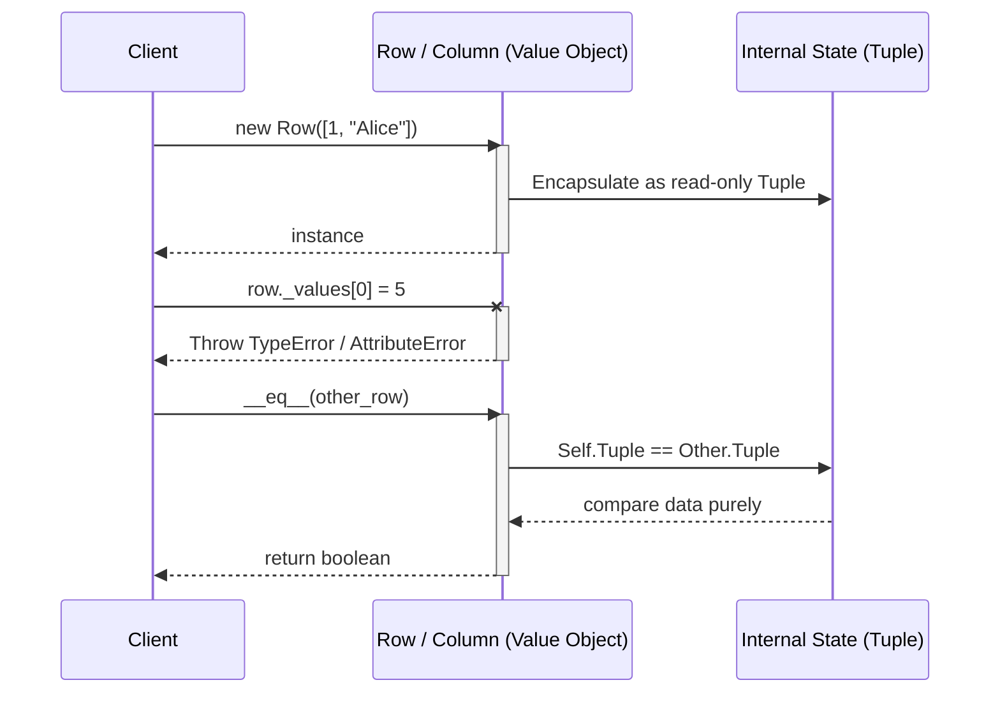
```mermaid
sequenceDiagram
    participant Client
    participant VO as Row / Column (Value Object)
    participant RAM as Internal State (Tuple)

    %% Flow 1: Creation and Type Enforcement 
    Client->>VO: new Row([1, "Alice"])
    activate VO
    VO->>RAM: Encapsulate as read-only Tuple
    VO-->>Client: instance
    deactivate VO
    
    %% Flow 2: Attempting Dirty Write Mutation
    Client-xVO: row._values[0] = 5
    activate VO
    VO-->>Client: Throw TypeError / AttributeError
    deactivate VO
    
    %% Flow 3: Value Equality Comparison
    Client->>VO: __eq__(other_row)
    activate VO
    VO->>RAM: Self.Tuple == Other.Tuple
    RAM-->>VO: compare data purely
    VO-->>Client: return boolean
    deactivate VO
```
### 1.8. Sequence Diagram: Strategy Pattern (Constraint)
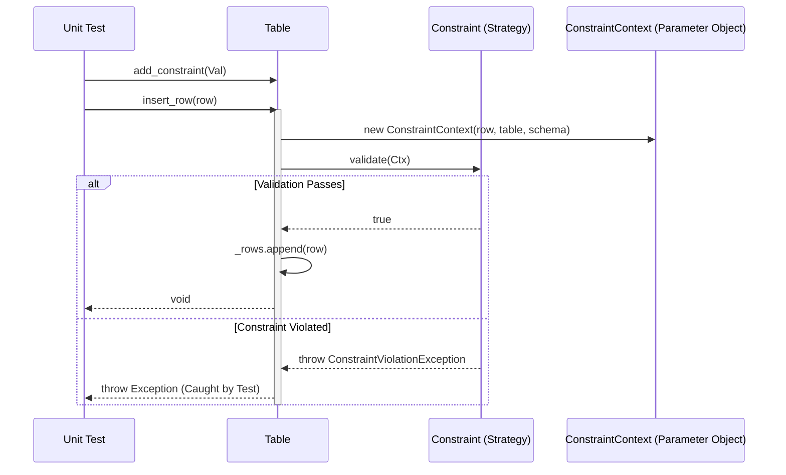
```mermaid
sequenceDiagram
    participant Test as Unit Test
    participant Table
    participant Val as Constraint (Strategy)
    participant Ctx as ConstraintContext (Parameter Object)
    
    Test->>Table: add_constraint(Val)
    Test->>Table: insert_row(row)
    activate Table
    
    %% Create Parameter Object wrapping candidate row, table, and schema
    Table->>Ctx: new ConstraintContext(row, table, schema)
    
    Table->>Val: validate(Ctx)
    alt Validation Passes
        Val-->>Table: true
        Table->>Table: _rows.append(row)
        Table-->>Test: void
    else Constraint Violated
        Val-->>Table: throw ConstraintViolationException
        Table-->>Test: throw Exception (Caught by Test)
    end
    deactivate Table
```

### 1.9. Sequence Diagram: Strategy Pattern (Referential Integrity)
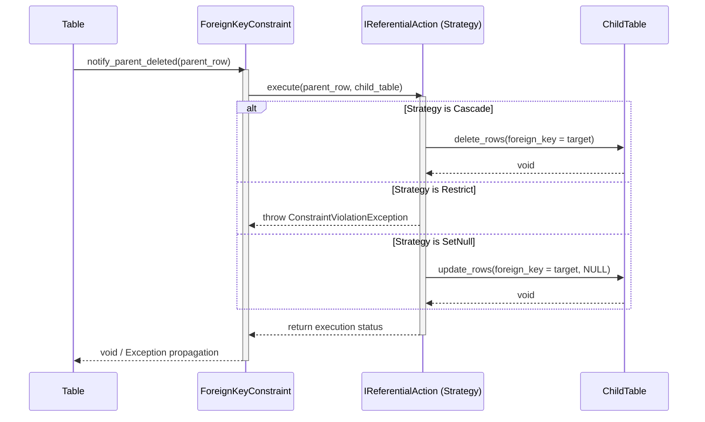
```mermaid
sequenceDiagram
    participant Table
    participant FK as ForeignKeyConstraint
    participant Action as IReferentialAction (Strategy)
    participant ChildTable
    
    %% When a parent row is deleted
    Table->>FK: notify_parent_deleted(parent_row)
    activate FK
    FK->>Action: execute(parent_row, child_table)
    activate Action
    
    %% Execution delegated to Strategy
    alt Strategy is Cascade
        Action->>ChildTable: delete_rows(foreign_key = target)
        ChildTable-->>Action: void
    else Strategy is Restrict
        Action-->>FK: throw ConstraintViolationException
    else Strategy is SetNull
        Action->>ChildTable: update_rows(foreign_key = target, NULL)
        ChildTable-->>Action: void
    end
    
    Action-->>FK: return execution status
    deactivate Action
    FK-->>Table: void / Exception propagation
    deactivate FK
```

### 1.10. Sequence Diagram: Factory Method (IndexFactory)
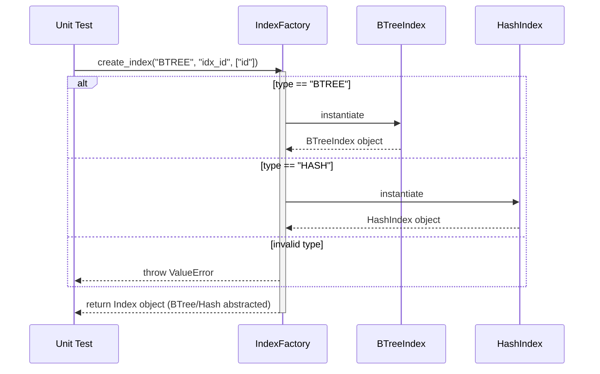
```mermaid
sequenceDiagram
    participant Client as Unit Test
    participant Factory as IndexFactory
    participant BTree as BTreeIndex
    participant Hash as HashIndex
    
    Client->>Factory: create_index("BTREE", "idx_id", ["id"])
    activate Factory
    alt type == "BTREE"
        Factory->>BTree: instantiate
        BTree-->>Factory: BTreeIndex object
    else type == "HASH"
        Factory->>Hash: instantiate
        Hash-->>Factory: HashIndex object
    else invalid type
        Factory-->>Client: throw ValueError
    end
    Factory-->>Client: return Index object (BTree/Hash abstracted)
    deactivate Factory
```

### 1.11. Sequence Diagram: Strategy Pattern (PartitionStrategy)
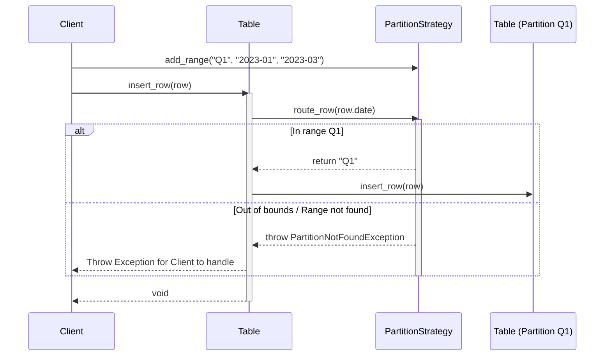
```mermaid
sequenceDiagram
    participant Client
    participant Table
    participant PStrat as PartitionStrategy
    participant PartA as Table (Partition Q1)
    
    %% Setup Range (Admin configures ahead)
    Client->>PStrat: add_range("Q1", "2023-01", "2023-03")
    
    %% Insertion (Pushing actual data)
    Client->>Table: insert_row(row)
    activate Table
    Table->>PStrat: route_row(row.date)
    activate PStrat
    
    alt In range Q1
        PStrat-->>Table: return "Q1"
        Table->>PartA: insert_row(row)
    else Out of bounds / Range not found
        PStrat-->>Table: throw PartitionNotFoundException
        Table-->>Client: Throw Exception for Client to handle
    end
    deactivate PStrat
    
    Table-->>Client: void
    deactivate Table
```

### 1.12. Sequence Diagram: State Pattern (Sequence Generator)
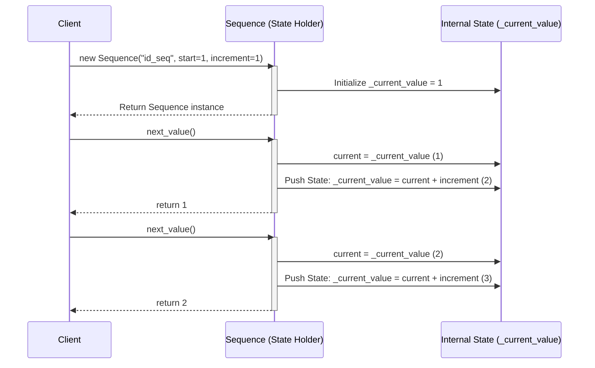
```mermaid
sequenceDiagram
    participant Client
    participant Seq as Sequence (State Holder)
    participant RAM as Internal State (_current_value)
    
    %% Initialize initial state
    Client->>Seq: new Sequence("id_seq", start=1, increment=1)
    activate Seq
    Seq->>RAM: Initialize _current_value = 1
    Seq-->>Client: Return Sequence instance
    deactivate Seq
    
    %% First fetch
    Client->>Seq: next_value()
    activate Seq
    Seq->>RAM: current = _current_value (1)
    Seq->>RAM: Push State: _current_value = current + increment (2)
    Seq-->>Client: return 1
    deactivate Seq
    
    %% Second fetch
    Client->>Seq: next_value()
    activate Seq
    Seq->>RAM: current = _current_value (2)
    Seq->>RAM: Push State: _current_value = current + increment (3)
    Seq-->>Client: return 2
    deactivate Seq
```

### 1.13. Sequence Diagram: Proxy Pattern (View)
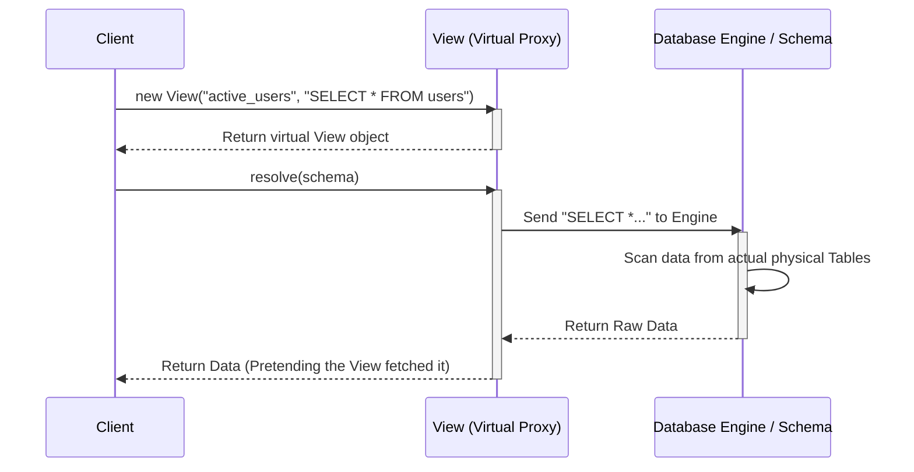
```mermaid
sequenceDiagram
    participant Client
    participant Vw as View (Virtual Proxy)
    participant Engine as Database Engine / Schema
    
    %% Phase 1: Hollow initialization (Store Metadata only, no physical Table access)
    Client->>Vw: new View("active_users", "SELECT * FROM users")
    activate Vw
    Vw-->>Client: Return virtual View object 
    deactivate Vw
    
    %% Phase 2: Trigger query (Proxy acts as Stand-in)
    Client->>Vw: resolve(schema)
    activate Vw
    Vw->>Engine: Send "SELECT *..." to Engine
    activate Engine
    Engine->>Engine: Scan data from actual physical Tables
    Engine-->>Vw: Return Raw Data
    deactivate Engine
    
    Vw-->>Client: Return Data (Pretending the View fetched it)
    deactivate Vw
```

### 1.14. Sequence Diagram: Command Pattern (Stored Procedure)
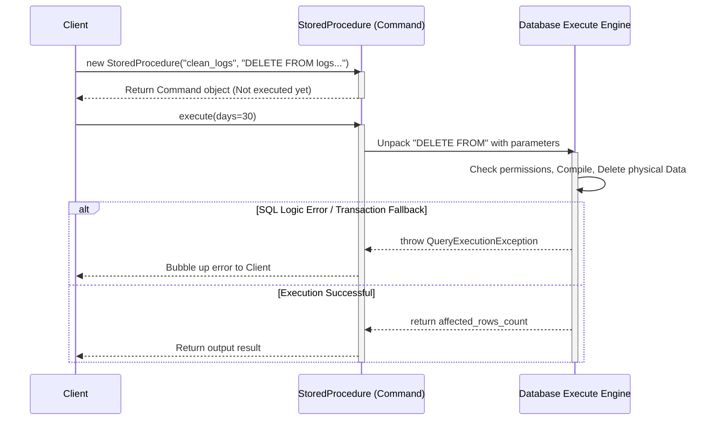
```mermaid
sequenceDiagram
    participant Client
    participant Proc as StoredProcedure (Command)
    participant Engine as Database Execute Engine
    
    %% Encapsulate logic into static form
    Client->>Proc: new StoredProcedure("clean_logs", "DELETE FROM logs...")
    activate Proc
    Proc-->>Client: Return Command object (Not executed yet)
    deactivate Proc
    
    %% Trigger command execution
    Client->>Proc: execute(days=30)
    activate Proc
    Proc->>Engine: Unpack "DELETE FROM" with parameters
    activate Engine
    
    %% Execute Engine handles 100% physical workload
    Engine->>Engine: Check permissions, Compile, Delete physical Data
    
    alt SQL Logic Error / Transaction Fallback
        Engine-->>Proc: throw QueryExecutionException
        Proc-->>Client: Bubble up error to Client
    else Execution Successful
        Engine-->>Proc: return affected_rows_count
        Proc-->>Client: Return output result
    end
    
    deactivate Engine
    deactivate Proc
```

### 1.15. High-Level Class Diagram (Structural View)
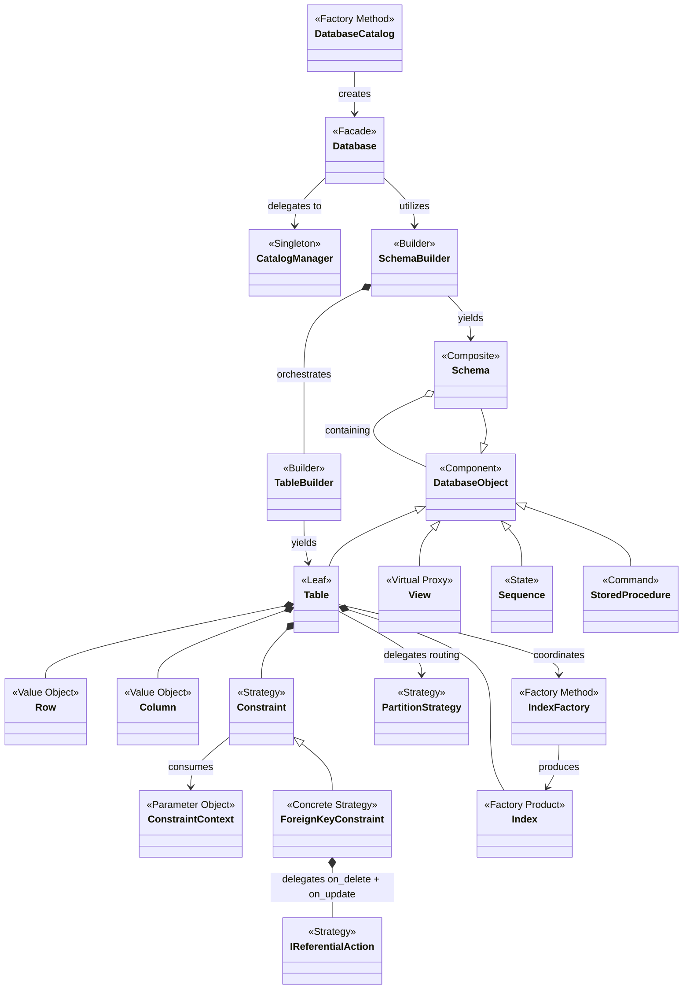
```mermaid
classDiagram
    %% Core Management
    class CatalogManager {<<Singleton>>}
    class DatabaseCatalog {<<Factory Method>>}
    class Database {<<Facade>>}
    
    %% Builders
    class SchemaBuilder {<<Builder>>}
    class TableBuilder {<<Builder>>}
    
    %% Composite Layer
    class DatabaseObject {<<Component>>}
    class Schema {<<Composite>>}
    class Table {<<Leaf>>}
    class View {<<Virtual Proxy>>}
    class Sequence {<<State>>}
    class StoredProcedure {<<Command>>}
    
    %% Table Internals
    class Row {<<Value Object>>}
    class Column {<<Value Object>>}
    class Constraint {<<Strategy>>}
    class ConstraintContext {<<Parameter Object>>}
    class IReferentialAction {<<Strategy>>}
    class ForeignKeyConstraint {<<Concrete Strategy>>}
    
    class PartitionStrategy {<<Strategy>>}
    class IndexFactory {<<Factory Method>>}
    class Index {<<Factory Product>>}

    %% Relationships...
    DatabaseCatalog --> Database : creates
    Database --> CatalogManager : delegates to
    Database --> SchemaBuilder : utilizes

    SchemaBuilder *-- TableBuilder : orchestrates
    SchemaBuilder --> Schema : yields
    TableBuilder --> Table : yields

    DatabaseObject <|-- Schema
    DatabaseObject <|-- Table
    DatabaseObject <|-- View
    DatabaseObject <|-- Sequence
    DatabaseObject <|-- StoredProcedure
    Schema o-- DatabaseObject : containing
    
    Table *-- Column
    Table *-- Row
    Table *-- Constraint
    Table *-- Index
    Table --> PartitionStrategy : delegates routing
    Table --> IndexFactory : coordinates
    
    Constraint --> ConstraintContext : consumes
    Constraint <|-- ForeignKeyConstraint
    ForeignKeyConstraint *-- IReferentialAction : delegates on_delete + on_update
    IndexFactory --> Index : produces
```

### 1.16. Detailed Class Diagram (API & Methods mapped from TDD)
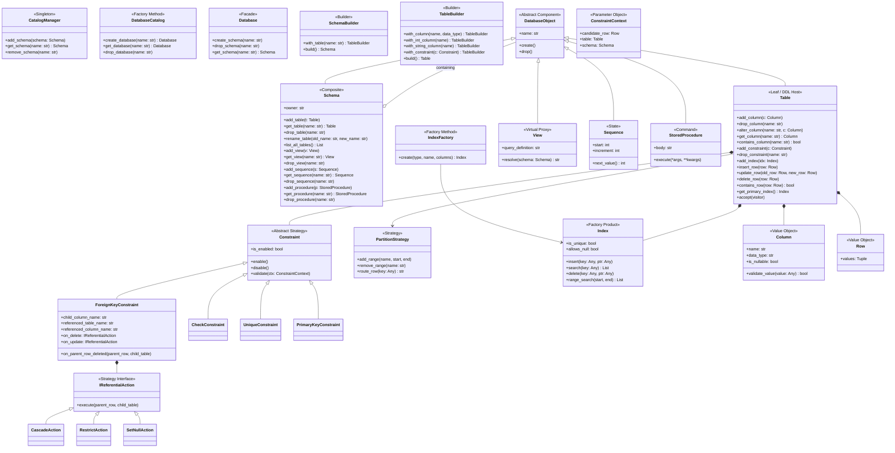
```mermaid
classDiagram
    %% Core Management
    class CatalogManager {
        <<Singleton>>
        +add_schema(schema: Schema)
        +get_schema(name: str) Schema
        +remove_schema(name: str)
    }
    class DatabaseCatalog {
        <<Factory Method>>
        +create_database(name: str) Database
        +get_database(name: str) Database
        +drop_database(name: str)
    }
    class Database {
        <<Facade>>
        +create_schema(name: str)
        +drop_schema(name: str)
        +get_schema(name: str) Schema
    }
    
    %% Builders
    class SchemaBuilder {
        <<Builder>>
        +with_table(name: str) TableBuilder
        +build() Schema
    }
    class TableBuilder {
        <<Builder>>
        +with_column(name, data_type) TableBuilder
        +with_int_column(name) TableBuilder
        +with_string_column(name) TableBuilder
        +with_constraint(c: Constraint) TableBuilder
        +build() Table
    }

    %% Composite Layer
    class DatabaseObject {
        <<Abstract Component>>
        +name: str
        +create()
        +drop()
    }
    class Schema {
        <<Composite>>
        +owner: str
        +add_table(t: Table)
        +get_table(name: str) Table
        +drop_table(name: str)
        +rename_table(old_name: str, new_name: str)
        +list_all_tables() List
        +add_view(v: View)
        +get_view(name: str) View
        +drop_view(name: str)
        +add_sequence(s: Sequence)
        +get_sequence(name: str) Sequence
        +drop_sequence(name: str)
        +add_procedure(p: StoredProcedure)
        +get_procedure(name: str) StoredProcedure
        +drop_procedure(name: str)
    }
    class Table {
        <<Leaf / DDL Host>>
        +add_column(c: Column)
        +drop_column(name: str)
        +alter_column(name: str, c: Column)
        +get_column(name: str) Column
        +contains_column(name: str) bool
        +add_constraint(c: Constraint)
        +drop_constraint(name: str)
        +add_index(idx: Index)
        +insert_row(row: Row)
        +update_row(old_row: Row, new_row: Row)
        +delete_row(row: Row)
        +contains_row(row: Row) bool
        +get_primary_index() Index
        +accept(visitor)
    }
    class View {
        <<Virtual Proxy>>
        +query_definition: str
        +resolve(schema: Schema) str
    }
    class Sequence {
        <<State>>
        +start: int
        +increment: int
        +next_value() int
    }
    class StoredProcedure {
        <<Command>>
        +body: str
        +execute(*args, **kwargs)
    }

    %% Relations (Composite)
    DatabaseObject <|-- Schema
    DatabaseObject <|-- Table
    DatabaseObject <|-- View
    DatabaseObject <|-- Sequence
    DatabaseObject <|-- StoredProcedure
    Schema o-- DatabaseObject : containing

    %% Table Internals
    class ConstraintContext {
        <<Parameter Object>>
        +candidate_row: Row
        +table: Table
        +schema: Schema
    }
    class Constraint {
        <<Abstract Strategy>>
        +is_enabled: bool
        +enable()
        +disable()
        +validate(ctx: ConstraintContext)
    }
    class IReferentialAction {
        <<Strategy Interface>>
        +execute(parent_row, child_table)
    }
    class ForeignKeyConstraint {
        +child_column_name: str
        +referenced_table_name: str
        +referenced_column_name: str
        +on_delete: IReferentialAction
        +on_update: IReferentialAction
        +on_parent_row_deleted(parent_row, child_table)
    }
    class CascadeAction
    class RestrictAction
    class SetNullAction
    
    class PartitionStrategy {
        <<Strategy>>
        +add_range(name, start, end)
        +remove_range(name: str)
        +route_row(key: Any) str
    }
    class IndexFactory {
        <<Factory Method>>
        +create(type, name, columns) Index
    }
    class Index {
        <<Factory Product>>
        +is_unique: bool
        +allows_null: bool
        +insert(key: Any, ptr: Any)
        +search(key: Any) List
        +delete(key: Any, ptr: Any)
        +range_search(start, end) List
    }
    class Column {
        <<Value Object>>
        +name: str
        +data_type: str
        +is_nullable: bool
        +validate_value(value: Any) bool
    }
    class Row {
        <<Value Object>>
        +values: Tuple
    }
    
    %% Relations (Internals)
    Constraint <|-- ForeignKeyConstraint
    Constraint <|-- CheckConstraint
    Constraint <|-- UniqueConstraint
    Constraint <|-- PrimaryKeyConstraint
    ForeignKeyConstraint *-- IReferentialAction
    IReferentialAction <|-- CascadeAction
    IReferentialAction <|-- RestrictAction
    IReferentialAction <|-- SetNullAction
    IndexFactory --> Index
    Table *-- Column
    Table *-- Row
    Table *-- Constraint
    Table *-- Index
    Table --> PartitionStrategy
```

---

## TABLE 2: STORAGE & TRANSACTION ENGINE (Physical Hardware Layer)

| Feature / Class | Design Pattern | Problem & Rationale | Unit Test (TDD) Implementation Strategy |
| :--- | :--- | :--- | :--- |
| **Memory / Cache Management**<br>`BufferPoolManager` | **Proxy / Object Pool** | Direct Disk I/O is slow. Serves as a gateway to recycle RAM memory and minimize disk hits. | Generate mock Page Requests, testing the LRU Eviction behavior when the RAM buffer pool reaches full capacity. |
| **ACID Recovery**<br>`LogCommand`, `WAL` | **Command / Observer** | Wraps Undo/Redo operations as executable Commands. Triggers the Write-Ahead Log (WAL) to flush to disk upon Commit. | Create a pseudo-array of Commands (Insert, Update), simulate a system crash, and verify the WAL file reconstructs the uncommitted states. |

### 2.1. Sequence Diagram: Buffer Pool (Proxy Pattern)
```mermaid
sequenceDiagram
    participant Test as Unit Test
    participant Pool as BufferPoolManager
    participant Disk as FileManager
    
    Test->>Pool: fetch_page(id=5)
    activate Pool
    Pool->>Pool: is in Cache (RAM)?
    alt Yes
        Pool-->>Test: return Page(5)
    else No (Cache Miss)
        Pool->>Disk: read_block(5)
        Disk-->>Pool: data
        Pool->>Pool: LRU.evict() if full
        Pool-->>Test: return Page(5)
    end
    deactivate Pool
```

---

## TABLE 3: QUERY PROCESSING (Execution & Translation Engine)

| Feature / Class | Design Pattern | Problem & Rationale | Unit Test (TDD) Implementation Strategy |
| :--- | :--- | :--- | :--- |
| **SQL Parser**<br>`SqlVisitor`, `ASTNode` | **Visitor** | The Abstract Syntax Tree (AST) structure is highly nested. A Visitor transverses the nodes cleanly to extract meaning. | Supply a simulated AST tree hierarchy (Root -> Node -> Leaf) and verify the Visitor correctly reads and translates specific Node tokens. |
| **Execution Framework**<br>`AbstractPlanNode` | **Template Method** | Base plan nodes share common startup/teardown logic but execute differently. | Test abstract inheritance ensuring `open()` is always called before child-specific `execute()`. |
| **Query Engine**<br>`AbstractPlanNode` | **Iterator (Volcano Model)** | Prevents loading massive tables entirely into RAM. Provides a `Next()` method to yield results row-by-row sequentially. | Chain a `ScanNode` to a `FilterNode`, and perform continuous `next()` calls to verify records are dropped until reaching an EOF/Null. |

### 3.1. Sequence Diagram: Iterator Pattern (Volcano Execution)
```mermaid
sequenceDiagram
    participant Test as Unit Test
    participant Filter as FilterNode
    participant Scan as ScanNode
    
    Test->>Filter: open()
    Filter->>Scan: open()
    
    Test->>Filter: next()
    activate Filter
    Filter->>Scan: next()
    Scan-->>Filter: return raw_row
    Filter->>Filter: check predicate
    Filter-->>Test: return valid_row
    deactivate Filter
```
