# Design Patterns & Unit Testing Roadmap

This document outlines the core Design Patterns derived from the Feature Mindmap, Class Mindmap, and Test Cases. It defines the rationale for applying these patterns and how they integrate into the Test-Driven Development (TDD) lifecycle.

---

## TABLE 1: DATABASE OBJECTS (Logical Schema Layer)

| Priority | Feature / Class | Design Pattern | Problem & Architecture Need | Application / Usage | Unit Test (TDD) Implementation Strategy |
| :--- | :--- | :--- | :--- | :--- | :--- |
| **P1** | `CatalogManager` | **Singleton** | A DBMS must have exactly one global registry for all schemas. Multiple instances would lead to split-brain state synchronization bugs. | `cm1 = CatalogManager()`<br>`cm2 = CatalogManager()`<br>`assert cm1 is cm2 # True` | Test that concurrent thread access always returns the same memory address. Verify that `add_schema()` persists across calls. |
| **P1** | `DatabaseCatalog` | **Factory Method** | Centralizes `Database` object creation. Prevents duplicate DB names and keeps the system as the single source of truth for all active databases. | `db = DatabaseCatalog.create_database("Tiki")`<br>`# Duplicate → raise DatabaseExistsException` | Test that `create_database("X")` returns a `Database`, and that calling it again with `"X"` raises `DatabaseExistsException`. |
| **P1** | `Database` | **Facade** | The `Database` class must shield the client from internal complexity (CatalogManager + SchemaBuilder). Client only needs one clean API. | `db.create_schema("public")`<br>`# Client never sees CatalogManager internally` | Test that `create_schema("public")` persists the schema, and `get_schema()` returns the same object. |
| **P1** | `Schema`, `DatabaseObject` | **Composite Pattern** | A Schema contains Tables, Views, Sequences. Drop operations must propagate uniformly without type-checking each child. | `schema.drop()`<br>`# Internally calls .drop() on ALL children,`<br>`# regardless of whether they are Table or View` | Test that `add_table()`, `add_view()`, and `add_sequence()` are accepted uniformly. Test `drop()` cascades without errors. |
| **P1** | `SchemaBuilder` | **Builder Pattern** | Constructing a full Schema requires complex Setup. Fluent Builder abstraction removes structural noise. | `schema = SchemaBuilder("db")`<br>`.with_table("users").build()` | Test fluent chaining builds a valid Schema tree. Test missing fields raise `ValueError`. |
| **P1** | `TableBuilder` | **Builder Pattern** | Initializing a Table with dozens of Columns/Constraints manually causes bloated constructors. | `table = TableBuilder("users")`<br>`.with_column("id", "int").build()` | Test fluent column accumulation. Test duplicate columns raise Exceptions. |
| **P1** | `Constraint` | **Strategy Pattern** | Validation logic (Check, Unique, Not Null) embedded inside `Table.insert_row` creates unreadable bloat. Strategy externalizes each rule as a swappable object. | `unique_validator.validate(ctx)`<br>`# Table loops validators without knowing their type` | Test each strategy independently with mock contexts. Test `ConstraintViolationException` for a bad row, and `True` for a valid one. |
| **P1** | `ConstraintContext` | **Parameter Object** | Passing `row, table, schema` as separate arguments to every validator bloats method signatures. One immutable envelope bundles all state. | `ctx = ConstraintContext(row, table)`<br>`validator.validate(ctx) # Single clean argument` | Test that the context binds references to Table and Row without mutating their internal state. |
| **P2** | `ForeignKeyConstraint`, `IReferentialAction` | **Strategy Pattern** | Hardcoding `CASCADE` or `RESTRICT` inside Table classes creates spaghetti. Injecting strategies allows dynamic FK behavior at creation time. | `fk = ForeignKeyConstraint("user_id",`<br>`    on_delete=CascadeAction())`<br>`# Deleting parent → auto cascade to child` | Create mock `CascadeAction` and `RestrictAction`. Test parent deletion correctly triggers child cascade or exception. |
| **P2** | `IndexFactory` | **Factory Method** | DBMS supports different Index types (B-Tree, Hash). Core classes must not hardcode algorithm instantiation. | `idx = IndexFactory.create("BTREE")`<br>`idx.insert("alice", ptr) # Type-specific impl.` | Test `create("BTREE")` returns a B-Tree instance and `create("HASH")` a Hash instance. Test invalid types raise `ValueError`. |
| **P2** | `PartitionStrategy` | **Strategy Pattern** | Row routing to physical partitions (by key range) must not clutter the main `Table.insert_row` logic with boundary conditions. | `partition_name = strategy.route_row(row.key)`<br>`# Table blindly delegates routing to Strategy` | Test exact boundary conditions (in-range returns partition name). Test out-of-range throws `PartitionNotFoundException`. Overlapping ranges throw `PartitionRangeOverlapException`. |
| **P3** | `Sequence` | **State Pattern** | Auto-numbering (e.g. `AUTO_INCREMENT`) must maintain a thread-safe, in-memory counter that advances precisely. | `seq = Sequence("id_seq", start=1, increment=1)`<br>`seq.next_value() # → 1`<br>`seq.next_value() # → 2` | Test that `next_value()` advances by exactly `increment`. Test multiple calls return strictly sequential values with no skips. |
| **P3** | `View` | **Proxy (Virtual Proxy)** | A View hides multi-table JOINs behind a virtual table interface. Client queries `my_view` as if it were a real Table, unaware of the complexity. | `view = View("active_users", "SELECT * FROM users WHERE active=1")`<br>`result = view.resolve(schema) # Proxies query to Engine` | Test `resolve(schema)` returns compiled output. Test that a missing dependency table raises `DependencyViolationException`. |
| **P3** | `StoredProcedure` | **Command Pattern** | Pre-packaged SQL logic must be callable without the client knowing the internals. The system only needs to trigger `execute()`. | `proc = StoredProcedure("clean_logs", body="DELETE...")`<br>`proc.execute(days=30) # Triggers encapsulated logic` | Test `execute(params)` delegates correctly. Test a missing required parameter raises `TypeError`. Test transaction failures propagate upward. |


### 1.1a. Class Diagram: Singleton Pattern (CatalogManager)
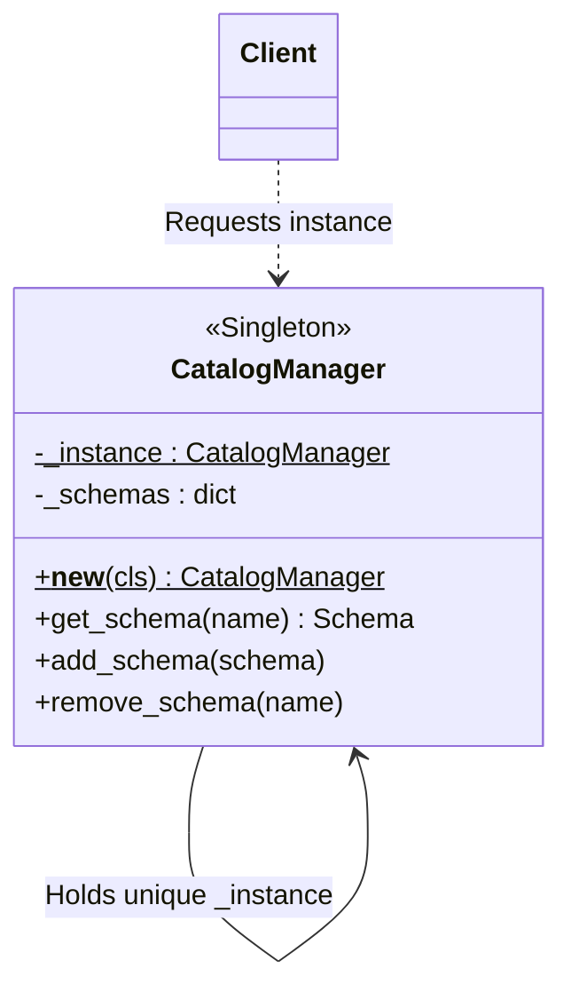
```mermaid
classDiagram
    class Client {
    }
    
    class CatalogManager {
        <<Singleton>>
        -_instance : CatalogManager$
        -_schemas : dict
        +__new__(cls)$ CatalogManager
        +get_schema(name) Schema
        +add_schema(schema)
        +remove_schema(name)
    }
    
    Client ..> CatalogManager : Requests instance
    CatalogManager --> CatalogManager : Holds unique _instance
```

### 1.1b. Sequence Diagram: Singleton Pattern (CatalogManager)
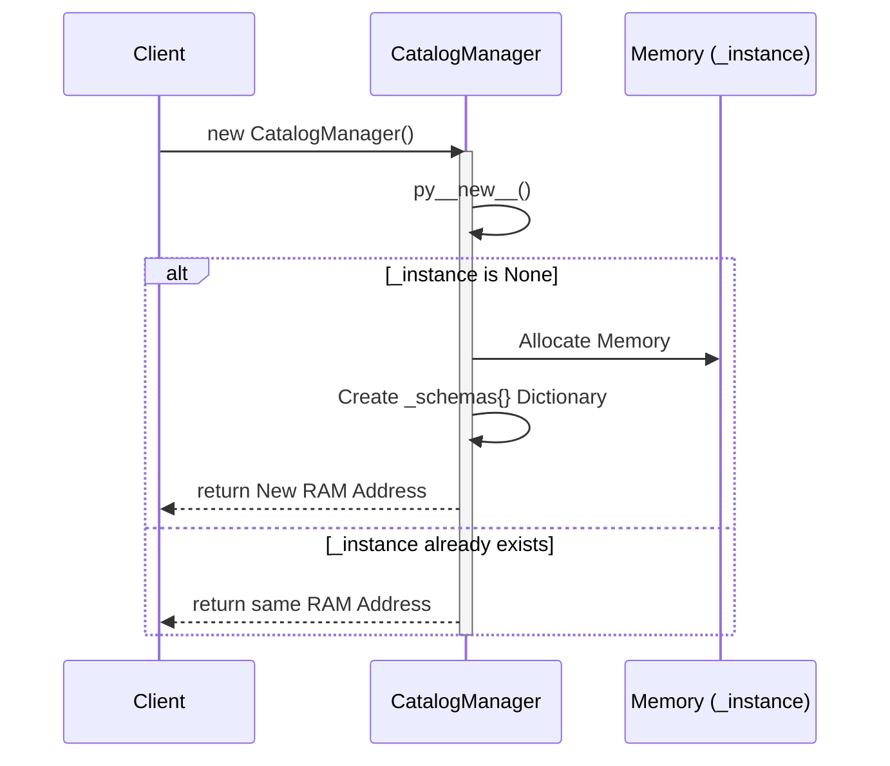
```mermaid
sequenceDiagram
    participant Client
    participant CM as CatalogManager
    participant RAM as Memory (_instance)
    
    Client->>CM: new CatalogManager()
    activate CM
    CM->>CM: py__new__()
    
    alt _instance is None
        CM->>RAM: Allocate Memory
        CM->>CM: Create _schemas{} Dictionary
        CM-->>Client: return New RAM Address
    else _instance already exists
        CM-->>Client: return same RAM Address
    end
    deactivate CM
```

**Implementation Example:**
```python
class CatalogManager:
    _instance = None
    
    def __new__(cls):
        if cls._instance is None:
            cls._instance = super(CatalogManager, cls).__new__(cls)
        return cls._instance
        
obj1 = CatalogManager()
obj2 = CatalogManager()

print(obj1 is obj2) # True
```

### 1.2a. Class Diagram: Factory Method Pattern (DatabaseCatalog)
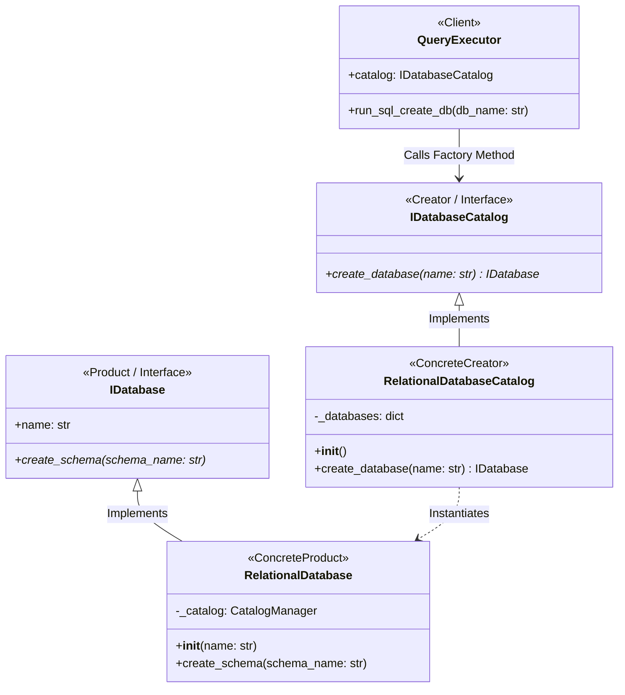
```mermaid
classDiagram
    %% ----------------------------------------------------
    %% FACTORY METHOD PATTERN (Strict GoF version)
    %% ----------------------------------------------------

    class QueryExecutor {
        <<Client>>
        +catalog: IDatabaseCatalog
        +run_sql_create_db(db_name: str)
    }

    class IDatabaseCatalog {
        <<Creator / Interface>>
        +create_database(name: str)* IDatabase
    }

    class RelationalDatabaseCatalog {
        <<ConcreteCreator>>
        -_databases: dict
        +__init__()
        +create_database(name: str) IDatabase
    }

    class IDatabase {
        <<Product / Interface>>
        +name: str
        +create_schema(schema_name: str)*
    }

    class RelationalDatabase {
        <<ConcreteProduct>>
        -_catalog: CatalogManager
        +__init__(name: str)
        +create_schema(schema_name: str)
    }

    %% Kế thừa (Realization)
    IDatabaseCatalog <|-- RelationalDatabaseCatalog : Implements
    IDatabase <|-- RelationalDatabase : Implements

    %% Quan hệ Sinh ra (Dependency)
    RelationalDatabaseCatalog ..> RelationalDatabase : Instantiates 
    
    %% Quan hệ Sử dụng (Association)
    QueryExecutor --> IDatabaseCatalog : Calls Factory Method
```

### 1.2b. Sequence Diagram: Factory Method (DatabaseCatalog)
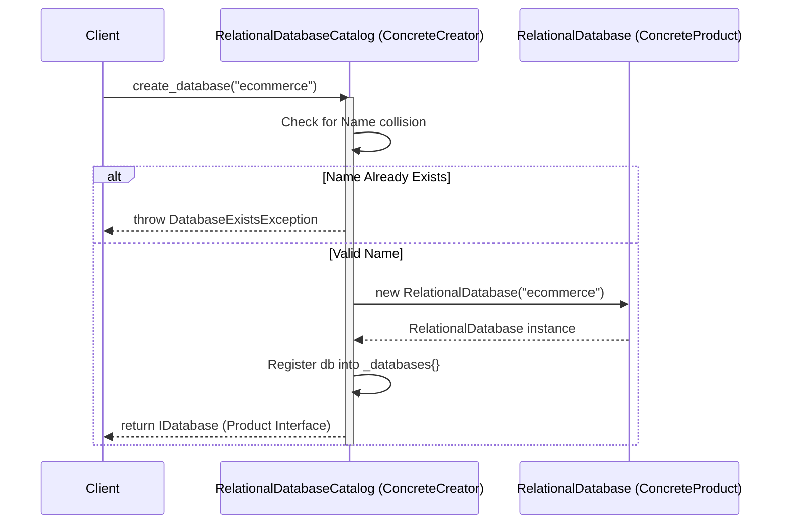
```mermaid
sequenceDiagram
    participant Client
    participant DC as RelationalDatabaseCatalog (ConcreteCreator)
    participant DB as RelationalDatabase (ConcreteProduct)

    Client->>DC: create_database("ecommerce")
    activate DC
    DC->>DC: Check for Name collision
    alt Name Already Exists
        DC-->>Client: throw DatabaseExistsException
    else Valid Name
        DC->>DB: new RelationalDatabase("ecommerce")
        DB-->>DC: RelationalDatabase instance
        DC->>DC: Register db into _databases{}
        DC-->>Client: return IDatabase (Product Interface)
    end
    deactivate DC
```

**Implementation Example:**
```python
from abc import ABC, abstractmethod

class IDatabase(ABC):
    @abstractmethod
    def create_schema(self, schema_name: str) -> None: pass

class RelationalDatabase(IDatabase):
    def __init__(self, name:str):
        self.name = name
    def create_schema(self, schema_name: str) -> None:
        pass
        
class IDatabaseCatalog(ABC):
    @abstractmethod
    def create_database(self, name: str) -> IDatabase: pass

class RelationalDatabaseCatalog(IDatabaseCatalog):
    def __init__(self):
        self._databases = {}
        
    def create_database(self, name:str) -> IDatabase:
        new_db = RelationalDatabase(name)
        self._databases[name] = new_db
        return new_db
        
class QueryExecutor:
    def __init__(self, catalog: IDatabaseCatalog):
        self.catalog = catalog
    
    def run_sql_create_db(self, db_name):
        db: IDatabase = self.catalog.create_database(db_name)
        print(f"Created database instance '{db.name}' successfully")
        
catalog = RelationalDatabaseCatalog()
executor = QueryExecutor(catalog)
executor.run_sql_create_db("Shopee")
```

### 1.3. Sequence Diagram: Facade Pattern (Database API)
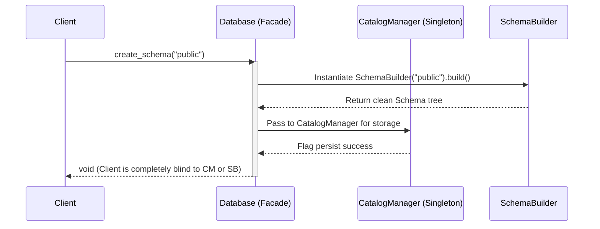
```mermaid
sequenceDiagram
    participant Client
    participant DB as Database (Facade)
    participant CM as CatalogManager (Singleton)
    participant SB as SchemaBuilder

    Client->>DB: create_schema("public")
    activate DB
    DB->>SB: Instantiate SchemaBuilder("public").build()
    SB-->>DB: Return clean Schema tree
    DB->>CM: Pass to CatalogManager for storage
    CM-->>DB: Flag persist success
    DB-->>Client: void (Client is completely blind to CM or SB)
    deactivate DB
```

### 1.3a. Class Diagram: Facade Pattern (Database API)
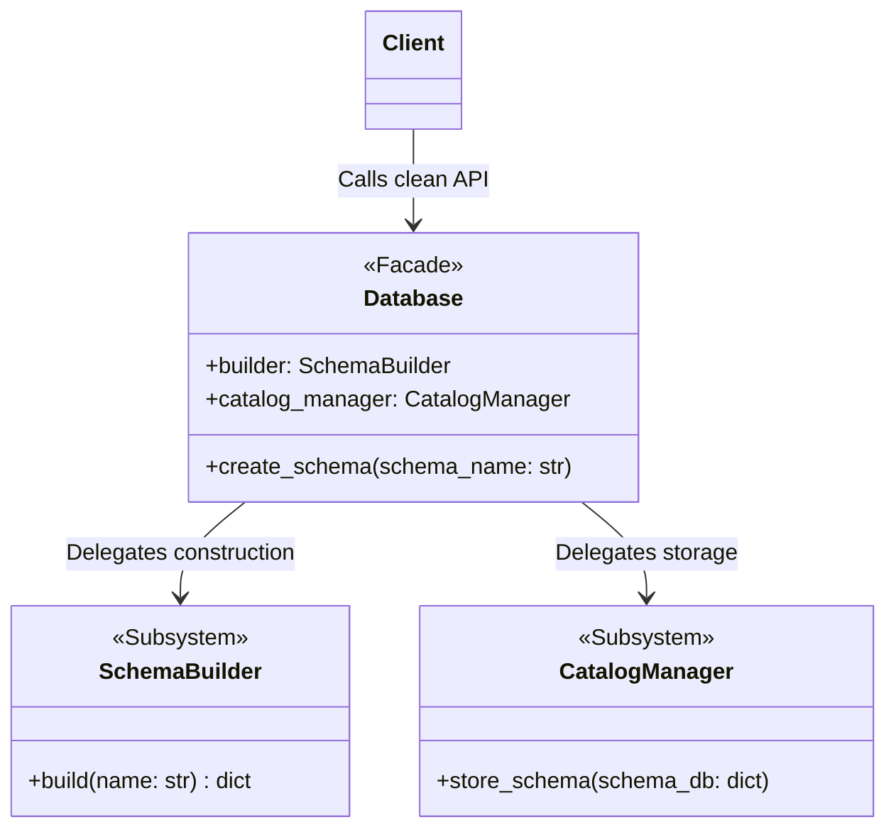
```mermaid
classDiagram
    %% ----------------------------------------------------
    %% FACADE PATTERN (Applied to Database)
    %% ----------------------------------------------------

    class Client {
    }

    class Database {
        <<Facade>>
        +builder: SchemaBuilder
        +catalog_manager: CatalogManager
        +create_schema(schema_name: str)
    }

    class SchemaBuilder {
        <<Subsystem>>
        +build(name: str) dict
    }

    class CatalogManager {
        <<Subsystem>>
        +store_schema(schema_db: dict)
    }

    %% Client only interacts with the Facade
    Client --> Database : Calls clean API

    %% Facade orchestrates complex Subsystems below
    Database --> SchemaBuilder : Delegates construction
    Database --> CatalogManager : Delegates storage
```

**Implementation Example:**
```python
class SchemaBuilder:
    def build(self, name: str):
        return {'name': name, "tables": []}
        
class CatalogManager:
    def store_schema(self, schema_db):
        print(f"CatalogManager write schema '{schema_db['name']}'")

class Database:
    def __init__(self, db_name: str):
        self.name = db_name
        self.catalog_manager = CatalogManager()
        self.schema_builder = SchemaBuilder()
    
    def create_schema(self, schema_name: str):
        schema = self.schema_builder.build(schema_name)
        self.catalog_manager.store_schema(schema)
        print("Done")

# --- Client Execution ---
db = Database("ShopeeDB")
db.create_schema("public")
db.create_schema("auth service")
```

### 1.4. Sequence Diagram: Composite Pattern (Schema Drop)
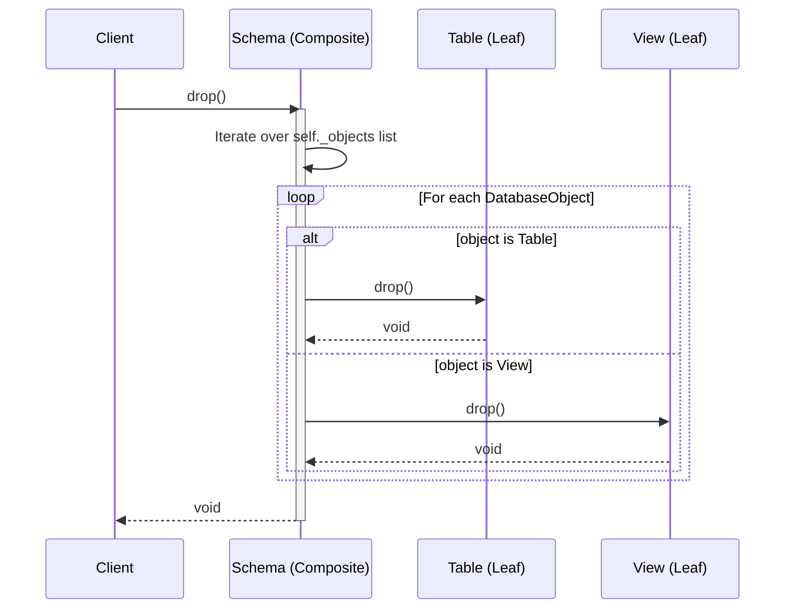
```mermaid
sequenceDiagram
    participant Client
    participant Sch as Schema (Composite)
    participant Tbl as Table (Leaf)
    participant View as View (Leaf)

    Client->>Sch: drop()
    activate Sch
    Sch->>Sch: Iterate over self._objects list
    
    loop For each DatabaseObject
        alt object is Table
            Sch->>Tbl: drop()
            Tbl-->>Sch: void
        else object is View
            Sch->>View: drop()
            View-->>Sch: void
        end
    end
    Sch-->>Client: void
    deactivate Sch
```

### 1.4a. Class Diagram: Composite Pattern (Schema / DatabaseObject)
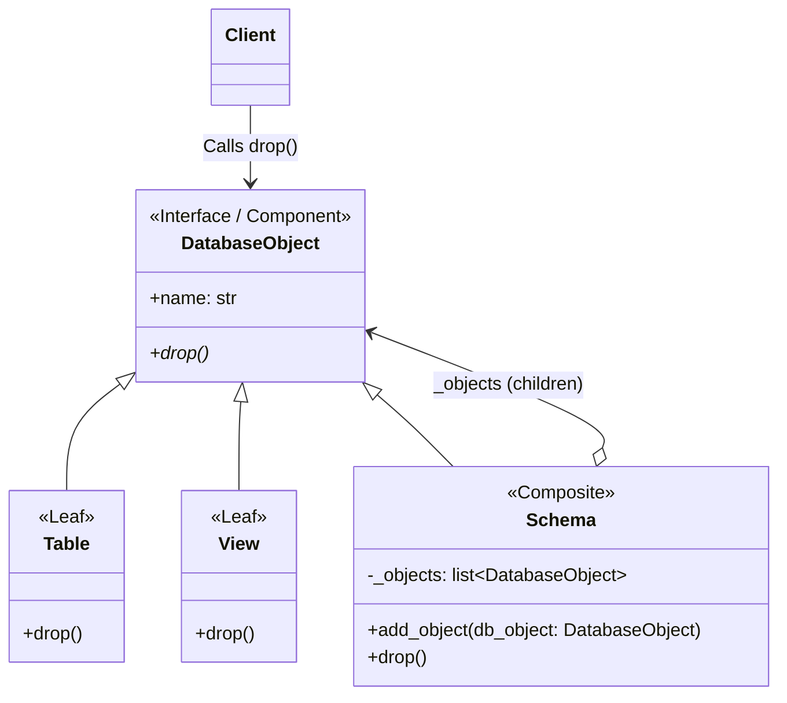
```mermaid
classDiagram
    %% ----------------------------------------------------
    %% COMPOSITE PATTERN (Applied to Schema)
    %% ----------------------------------------------------

    class Client {
    }

    class DatabaseObject {
        <<Interface / Component>>
        +name: str
        +drop()*
    }

    class Table {
        <<Leaf>>
        +drop()
    }

    class View {
        <<Leaf>>
        +drop()
    }

    class Schema {
        <<Composite>>
        -_objects: list~DatabaseObject~
        +add_object(db_object: DatabaseObject)
        +drop()
    }

    %% Inheritance - All are Components
    DatabaseObject <|-- Table
    DatabaseObject <|-- View
    DatabaseObject <|-- Schema

    %% Aggregation - Schema (Composite) holds a list of Components
    DatabaseObject <--o Schema : _objects (children)

    %% Client interacts with the common Interface
    Client --> DatabaseObject : Calls drop()
```

**Implementation Example:**
```python
class DatabaseObject:
    def __init__(self, name):
        self.name = name
        
    def drop(self):
        raise NotImplementedError()

class Table(DatabaseObject):
    def drop(self):
        print(f"Table '{self.name}' drop")

class View(DatabaseObject):
    def drop(self):
        print(f"View '{self.name}' drop")
        
class Schema(DatabaseObject):
    def __init__(self, name):
        super().__init__(name)
        self._objects = []
        
    def add_object(self, db_object: DatabaseObject):
        self._objects.append(db_object)
        
    def drop(self):
        print(f"Schema '{self.name}' drop begin")
        # Delegate all work to child components
        for obj in self._objects:
            obj.drop()
        print(f"Schema '{self.name}' drop done")
        
# --- Client Execution ---
schema_public = Schema("public")
tbl_user = Table("user")
tbl_order = Table("order")
view_active = View("Active")

schema_public.add_object(tbl_user)
schema_public.add_object(tbl_order)
schema_public.add_object(view_active)

# One call cascades to all children seamlessly
schema_public.drop()
```

### 1.5. Sequence Diagram: Builder Pattern (Table Creation)
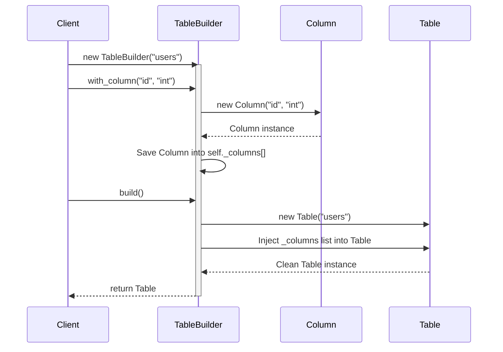
```mermaid
sequenceDiagram
    participant Client
    participant TB as TableBuilder
    participant Col as Column
    participant Tbl as Table
    
    Client->>TB: new TableBuilder("users")
    activate TB
    
    Client->>TB: with_column("id", "int")
    TB->>Col: new Column("id", "int")
    Col-->>TB: Column instance
    TB->>TB: Save Column into self._columns[]
    
    Client->>TB: build()
    TB->>Tbl: new Table("users")
    TB->>Tbl: Inject _columns list into Table
    Tbl-->>TB: Clean Table instance
    TB-->>Client: return Table
    deactivate TB
```

### 1.5a. Class Diagram: Builder Pattern (Table Creation)
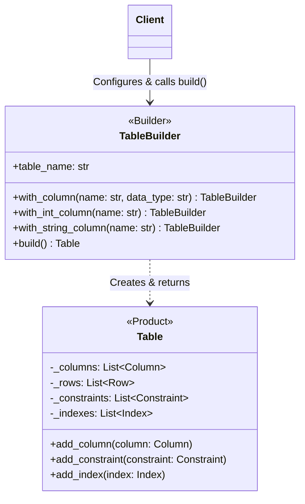
```mermaid
classDiagram
    %% ----------------------------------------------------
    %% BUILDER PATTERN (Applied to Table)
    %% ----------------------------------------------------

    class Client {
    }

    class TableBuilder {
        <<Builder>>
        +table_name: str
        +with_column(name: str, data_type: str) TableBuilder
        +with_int_column(name: str) TableBuilder
        +with_string_column(name: str) TableBuilder
        +build() Table
    }

    class Table {
        <<Product>>
        -_columns: List~Column~
        -_rows: List~Row~
        -_constraints: List~Constraint~
        -_indexes: List~Index~
        +add_column(column: Column)
        +add_constraint(constraint: Constraint)
        +add_index(index: Index)
    }

    %% Client directs the construction process step-by-step
    Client --> TableBuilder : Configures & calls build()

    %% Builder instantiates the complex product
    TableBuilder ..> Table : Creates & returns
```

**Implementation Example:**
```python
class Table:
    def __init__(self, name: str):
        self.name = name
        self._columns = []

class TableBuilder:
    def __init__(self, table_name: str):
        self.table_name = table_name
        self._columns_to_build = []

    def with_column(self, name: str, data_type: str) -> 'TableBuilder':
        self._columns_to_build.append((name, data_type))
        return self 

    def with_int_column(self, name: str) -> 'TableBuilder':
        return self.with_column(name, "int")

    def with_string_column(self, name: str) -> 'TableBuilder':
        return self.with_column(name, "string")

    def build(self) -> Table:
        new_table = Table(self.table_name)
        for col_name, col_type in self._columns_to_build:
            new_table._columns.append({col_name: col_type})
            print(f"  [+] Added '{col_name}' ({col_type}) to Table '{self.table_name}'")
        return new_table

# --- Client Execution ---
builder = TableBuilder("users")
tb_users = (builder
            .with_int_column("id")
            .with_string_column("username")
            .with_string_column("email")
            .build())
```

### 1.5b. Class Diagram: Builder Pattern (Theoretical GoF Structure)
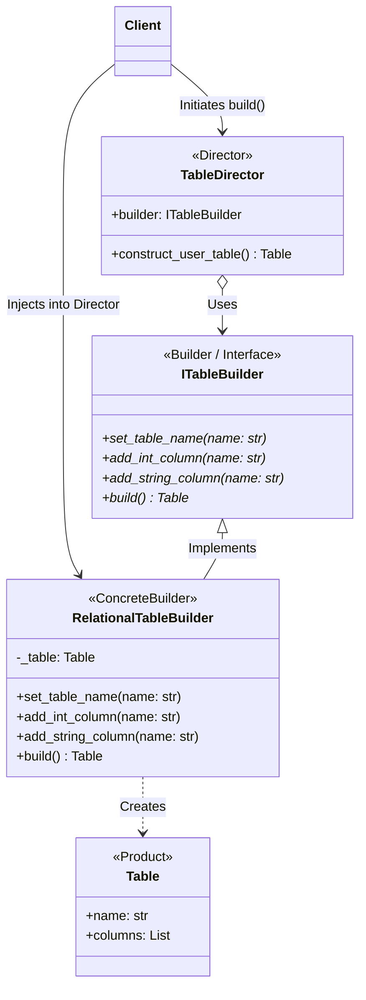
```mermaid
classDiagram
    %% ----------------------------------------------------
    %% BUILDER PATTERN (Strict GoF version for comparison)
    %% ----------------------------------------------------

    class Client {
    }

    class TableDirector {
        <<Director>>
        +builder: ITableBuilder
        +construct_user_table() Table
    }

    class ITableBuilder {
        <<Builder / Interface>>
        +set_table_name(name: str)*
        +add_int_column(name: str)*
        +add_string_column(name: str)*
        +build() Table*
    }

    class RelationalTableBuilder {
        <<ConcreteBuilder>>
        -_table: Table
        +set_table_name(name: str)
        +add_int_column(name: str)
        +add_string_column(name: str)
        +build() Table
    }

    class Table {
        <<Product>>
        +name: str
        +columns: List
    }

    %% Relationships
    TableDirector o--> ITableBuilder : Uses
    Client --> TableDirector : Initiates build()
    Client --> RelationalTableBuilder : Injects into Director
    ITableBuilder <|-- RelationalTableBuilder : Implements
    RelationalTableBuilder ..> Table : Creates
```

**Implementation Example:**
```python
from abc import ABC, abstractmethod

# 1. Product
class Table:
    def __init__(self, name):
        self.name = name
        self.columns = []

# 2. Builder (Interface)
class ITableBuilder(ABC):
    @abstractmethod
    def set_table_name(self, name: str): pass
    @abstractmethod
    def add_int_column(self, name: str): pass
    @abstractmethod
    def add_string_column(self, name: str): pass
    @abstractmethod
    def build(self) -> Table: pass

# 3. ConcreteBuilder
class RelationalTableBuilder(ITableBuilder):
    def __init__(self):
        self._table = None
        
    def set_table_name(self, name: str):
        self._table = Table(name)
        
    def add_int_column(self, name: str):
        self._table.columns.append({name: 'int'})
        
    def add_string_column(self, name: str):
        self._table.columns.append({name: 'string'})
        
    def build(self) -> Table:
        return self._table

# 4. Director
class TableDirector:
    def __init__(self, builder: ITableBuilder):
        self.builder = builder
        
    def construct_user_table(self) -> Table:
        self.builder.set_table_name("users")
        self.builder.add_int_column("id")
        self.builder.add_string_column("username")
        return self.builder.build()

# --- Client Execution ---
builder = RelationalTableBuilder()
director = TableDirector(builder)
tb_users = director.construct_user_table() 
```

### 1.6. Sequence Diagram: Builder Pattern (SchemaBuilder)
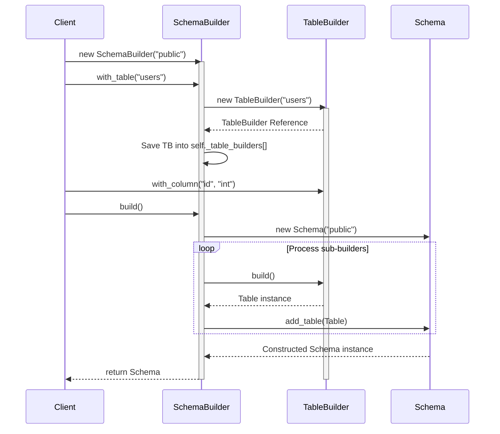
```mermaid
sequenceDiagram
    participant Client
    participant SB as SchemaBuilder
    participant TB as TableBuilder
    participant Sch as Schema
    
    Client->>SB: new SchemaBuilder("public")
    activate SB
    
    Client->>SB: with_table("users")
    SB->>TB: new TableBuilder("users")
    activate TB
    TB-->>SB: TableBuilder Reference
    SB->>SB: Save TB into self._table_builders[]
    
    %% Triggers Fluent Chaining directly on the returned TB
    Client->>TB: with_column("id", "int")
    
    Client->>SB: build()
    SB->>Sch: new Schema("public")
    
    loop Process sub-builders
        SB->>TB: build()
        TB-->>SB: Table instance
        SB->>Sch: add_table(Table)
    end
    
    Sch-->>SB: Constructed Schema instance
    SB-->>Client: return Schema
    deactivate TB
    deactivate SB
```

### 1.6a. Class Diagram: Builder Pattern (SchemaBuilder)
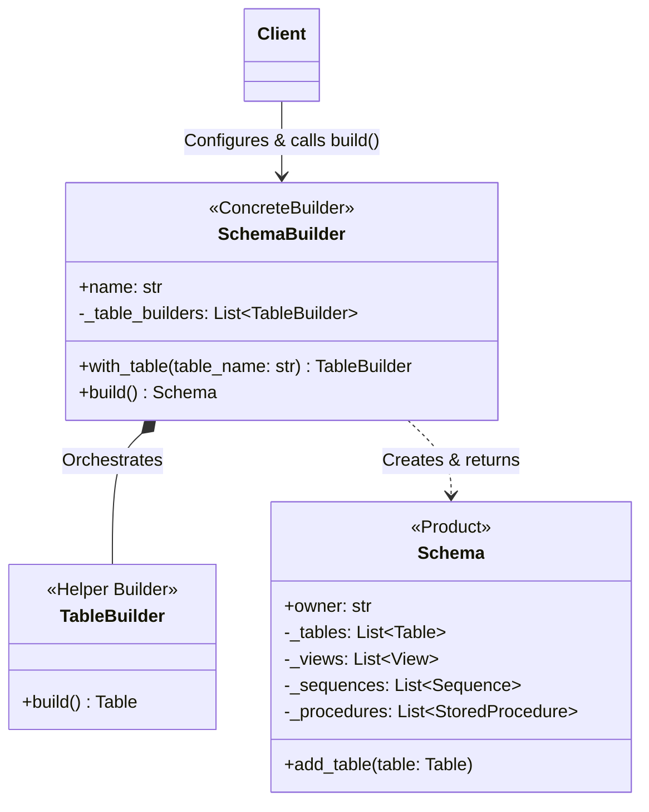
```mermaid
classDiagram
    %% ----------------------------------------------------
    %% BUILDER PATTERN (Applied to Schema)
    %% ----------------------------------------------------

    class Client {
        %% Acts as Director in this context
    }

    class SchemaBuilder {
        <<ConcreteBuilder>>
        +name: str
        -_table_builders: List~TableBuilder~
        +with_table(table_name: str) TableBuilder
        +build() Schema
    }

    class Schema {
        <<Product>>
        +owner: str
        -_tables: List~Table~
        -_views: List~View~
        -_sequences: List~Sequence~
        -_procedures: List~StoredProcedure~
        +add_table(table: Table)
    }

    class TableBuilder {
        <<Helper Builder>>
        +build() Table
    }

    %% Client directs the SchemaBuilder
    Client --> SchemaBuilder : Configures & calls build()

    %% SchemaBuilder manages subordinate TableBuilders
    SchemaBuilder *-- TableBuilder : Orchestrates

    %% SchemaBuilder constructs the final Schema
    SchemaBuilder ..> Schema : Creates & returns
```

**Implementation Example:**
```python
class SchemaBuilder:
    def __init__(self, name: str):
        self.name = name
        self._table_builders = []

    def with_table(self, table_name: str) -> TableBuilder:
        tb = TableBuilder(table_name)
        self._table_builders.append(tb)
        return tb

    def build(self) -> Schema:
        print(f"--- Building Schema '{self.name}' ---")
        new_schema = Schema(self.name)
        
        # Trigger build() on all saved TableBuilders
        for tb in self._table_builders:
            built_table = tb.build()
            new_schema.add_table(built_table)
            
        print(f"--- Schema '{self.name}' built successfully! ---")
        return new_schema

# --- Client Execution (Acts as Director) ---
schema_builder = SchemaBuilder("public")

(schema_builder.with_table("users")
    .with_int_column("id")
    .with_string_column("username"))

(schema_builder.with_table("orders")
    .with_int_column("id")
    .with_string_column("total_amount"))

final_schema = schema_builder.build()
```

### 1.6b. Class Diagram: Builder Pattern (SchemaBuilder) (GoF Structure)
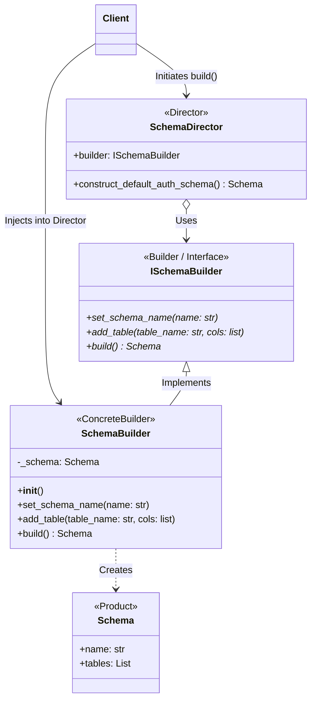
```mermaid
classDiagram
    %% ----------------------------------------------------
    %% BUILDER PATTERN (Strict GoF version for Schema)
    %% ----------------------------------------------------

    class Client {
    }

    class SchemaDirector {
        <<Director>>
        +builder: ISchemaBuilder
        +construct_default_auth_schema() Schema
    }

    class ISchemaBuilder {
        <<Builder / Interface>>
        +set_schema_name(name: str)*
        +add_table(table_name: str, cols: list)*
        +build() Schema*
    }

    class SchemaBuilder {
        <<ConcreteBuilder>>
        -_schema: Schema
        +__init__()
        +set_schema_name(name: str)
        +add_table(table_name: str, cols: list)
        +build() Schema
    }

    class Schema {
        <<Product>>
        +name: str
        +tables: List
    }

    %% Relationships
    SchemaDirector o--> ISchemaBuilder : Uses
    Client --> SchemaDirector : Initiates build()
    Client --> SchemaBuilder : Injects into Director
    ISchemaBuilder <|-- SchemaBuilder : Implements
    SchemaBuilder ..> Schema : Creates
```

**Implementation Example:**
```python
from abc import ABC, abstractmethod

class Schema:
    def __init__(self, name:str):
        self.name = name
        self.tables = []
        
class ISchemaBuilder(ABC):
    @abstractmethod
    def set_schema_name(self, name: str):
        pass
    
    @abstractmethod
    def add_table(self, table_name: str, cols: list):
        pass
    
    @abstractmethod
    def build(self) -> Schema:
        pass
    
class SchemaBuilder(ISchemaBuilder):
    def __init__(self):
        self._schema = None
    
    def set_schema_name(self, name: str):
        self._schema = Schema(name)
        
    def add_table(self, table_name: str, cols: list):
        self._schema.tables.append({"table": table_name, "cols": cols})
        
    def build(self) -> Schema:
        return self._schema
        
class SchemaDirector:
    def __init__(self, builder: ISchemaBuilder):
        self._builder = builder
        
    def construct_default_auth_schema(self) -> Schema:
        self._builder.set_schema_name("auth_service")
        
        self._builder.add_table("user", ["id", "username", "password"])
        self._builder.add_table("roles", ["id", "username", "password"])
        self._builder.add_table("user_roles", ["user_id", "role_id"])
        
        return self._builder.build()
        
    
builder = SchemaBuilder()
director = SchemaDirector(builder)

auth_schema = director.construct_default_auth_schema()

print(f"Finish Schema: {auth_schema.name}")
```

### 1.7. Strategy Pattern (Constraint Validation)
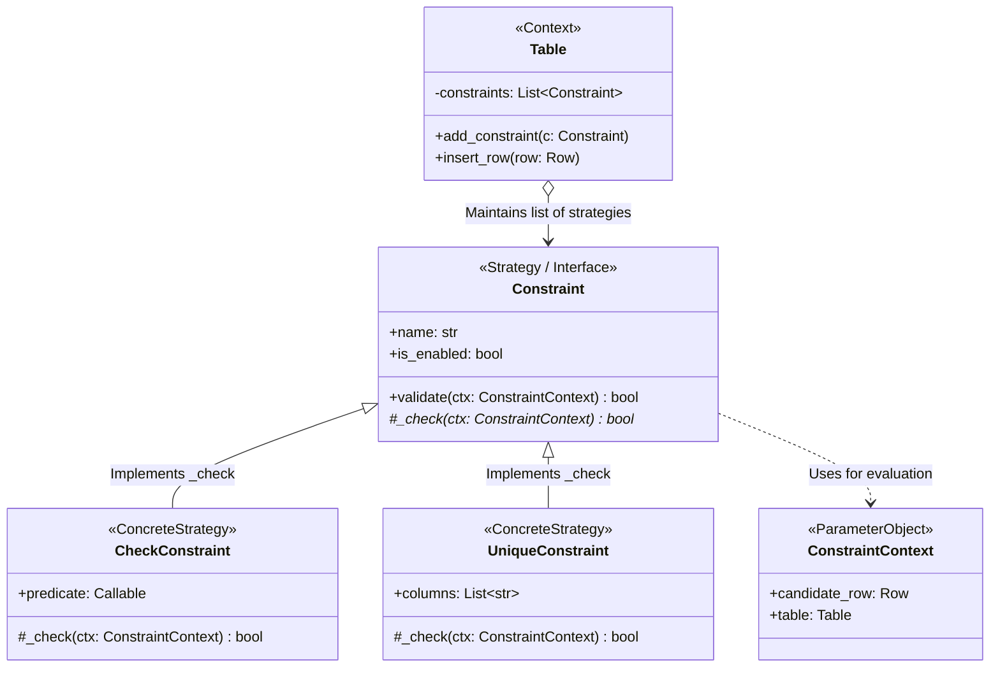
```mermaid
classDiagram
    %% ----------------------------------------------------
    %% STRATEGY PATTERN (Constraint Validation)
    %% ----------------------------------------------------

    class Table {
        <<Context>>
        -constraints: List~Constraint~
        +add_constraint(c: Constraint)
        +insert_row(row: Row)
    }

    class Constraint {
        <<Strategy / Interface>>
        +name: str
        +is_enabled: bool
        +validate(ctx: ConstraintContext) bool
        #_check(ctx: ConstraintContext)* bool
    }

    class CheckConstraint {
        <<ConcreteStrategy>>
        +predicate: Callable
        #_check(ctx: ConstraintContext) bool
    }

    class UniqueConstraint {
        <<ConcreteStrategy>>
        +columns: List~str~
        #_check(ctx: ConstraintContext) bool
    }

    class ConstraintContext {
        <<ParameterObject>>
        +candidate_row: Row
        +table: Table
    }

    %% Relationships
    Table o--> Constraint : Maintains list of strategies
    Constraint <|-- CheckConstraint : Implements _check
    Constraint <|-- UniqueConstraint : Implements _check
    Constraint ..> ConstraintContext : Uses for evaluation
```

**Sequence Diagram:**
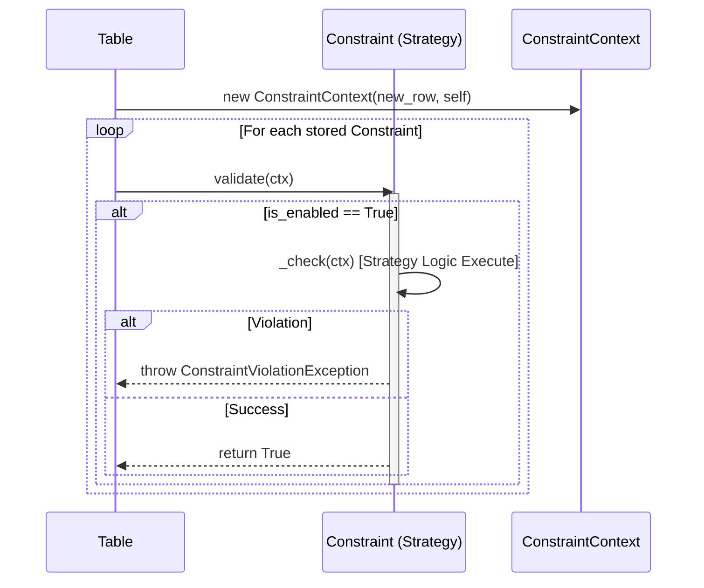
```mermaid
sequenceDiagram
    participant Table
    participant Val as Constraint (Strategy)
    participant Ctx as ConstraintContext
    
    Table->>Ctx: new ConstraintContext(new_row, self)
    loop For each stored Constraint
        Table->>Val: validate(ctx)
        activate Val
        alt is_enabled == True
            Val->>Val: _check(ctx) [Strategy Logic Execute]
            alt Violation
                Val-->>Table: throw ConstraintViolationException
            else Success
                Val-->>Table: return True
            end
        end
        deactivate Val
    end
```

**Implementation Example:**
```python
from abc import ABC, abstractmethod

# 1. Parameter Object
class ConstraintContext:
    def __init__(self, row, table):
        self.row = row
        self.table = table

# 2. Strategy Interface
class Constraint(ABC):
    def __init__(self, name: str):
        self.name = name
        self.is_enabled = True
        
    def validate(self, ctx: ConstraintContext) -> bool:
        if not self.is_enabled: return True
        return self._check(ctx)
        
    @abstractmethod
    def _check(self, ctx: ConstraintContext) -> bool:
        pass

# 3. Concrete Strategies
class CheckConstraint(Constraint):
    def __init__(self, name: str, predicate):
        super().__init__(name)
        self.predicate = predicate
        
    def _check(self, ctx: ConstraintContext) -> bool:
        if not self.predicate(ctx.row):
            raise Exception(f"CheckConstraint '{self.name}' violated!")
        return True

class UniqueConstraint(Constraint):
    def __init__(self, name: str):
        super().__init__(name)
        
    def _check(self, ctx: ConstraintContext) -> bool:
        return True

# 4. Context
class Table:
    def __init__(self):
        self.constraints = []
        
    def add_constraint(self, c: Constraint):
        self.constraints.append(c)
        
    def insert_row(self, row):
        ctx = ConstraintContext(row, self)
        for c in self.constraints:
            c.validate(ctx)  
        print("Row inserted successfully!")

# --- Client Execution ---
t = Table()
t.add_constraint(CheckConstraint("age_over_18", lambda r: r['age'] >= 18))
t.add_constraint(UniqueConstraint("unique_email"))

t.insert_row({'age': 20, 'email': 'test@ok.com'}) 
```

### 1.8. Strategy Pattern (Referential Integrity / Foreign Key Action)
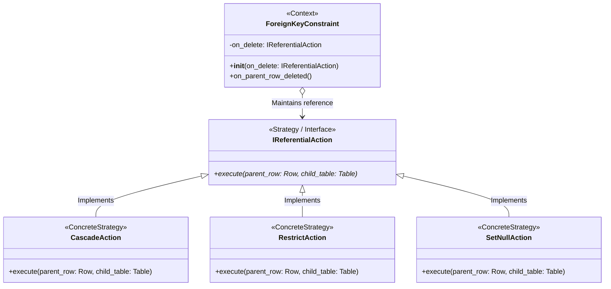
```mermaid
classDiagram
    %% ----------------------------------------------------
    %% STRATEGY PATTERN (Strict GoF version for FK Actions)
    %% ----------------------------------------------------

    class ForeignKeyConstraint {
        <<Context>>
        -on_delete: IReferentialAction
        +__init__(on_delete: IReferentialAction)
        +on_parent_row_deleted()
    }

    class IReferentialAction {
        <<Strategy / Interface>>
        +execute(parent_row: Row, child_table: Table)*
    }

    class CascadeAction {
        <<ConcreteStrategy>>
        +execute(parent_row: Row, child_table: Table)
    }

    class RestrictAction {
        <<ConcreteStrategy>>
        +execute(parent_row: Row, child_table: Table)
    }

    class SetNullAction {
        <<ConcreteStrategy>>
        +execute(parent_row: Row, child_table: Table)
    }

    %% Relationships
    ForeignKeyConstraint o--> IReferentialAction : Maintains reference
    IReferentialAction <|-- CascadeAction : Implements
    IReferentialAction <|-- RestrictAction : Implements
    IReferentialAction <|-- SetNullAction : Implements
```

**Sequence Diagram:**
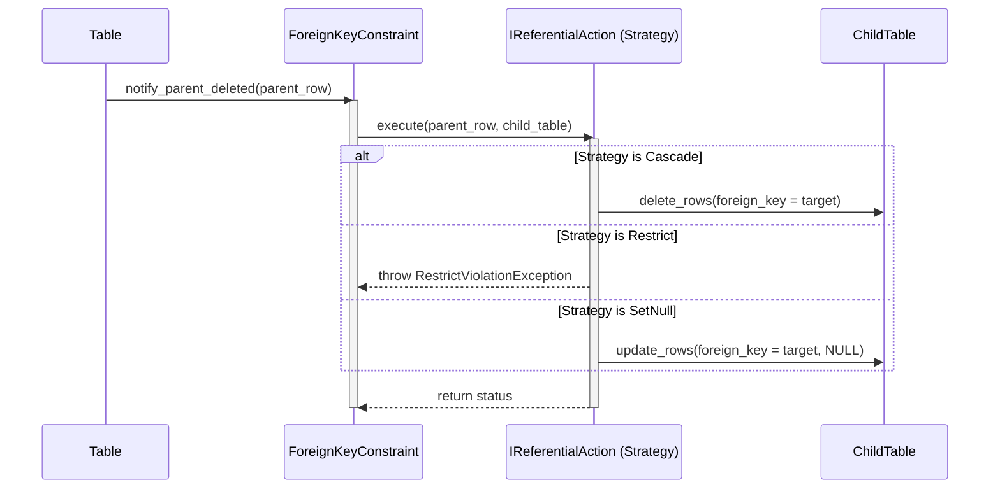
```mermaid
sequenceDiagram
    participant Table
    participant FK as ForeignKeyConstraint
    participant Action as IReferentialAction (Strategy)
    participant ChildTable
    
    Table->>FK: notify_parent_deleted(parent_row)
    activate FK
    FK->>Action: execute(parent_row, child_table)
    activate Action
    
    alt Strategy is Cascade
        Action->>ChildTable: delete_rows(foreign_key = target)
    else Strategy is Restrict
        Action-->>FK: throw RestrictViolationException
    else Strategy is SetNull
        Action->>ChildTable: update_rows(foreign_key = target, NULL)
    end
    
    Action-->>FK: return status
    deactivate Action
    deactivate FK
```

**Implementation Example:**
```python
from abc import ABC, abstractmethod

# Strategy Interface
class IReferentialAction(ABC):
    @abstractmethod
    def execute(self, parent_row, child_table) -> None:
        pass

# Concrete Strategies
class CascadeAction(IReferentialAction):
    def execute(self, parent_row, child_table) -> None:
        print(f"[Cascade] Automatically deleting child rows referencing parent ID: {parent_row['id']}")

class RestrictAction(IReferentialAction):
    def execute(self, parent_row, child_table) -> None:
        print(f"[Restrict] ABORT! Cannot delete parent ID {parent_row['id']} because child records exist.")
        raise Exception("Restrict Violation")

class SetNullAction(IReferentialAction):
    def execute(self, parent_row, child_table) -> None:
        print(f"[SetNull] Updating child rows referencing {parent_row['id']} to NULL.")

# Context
class ForeignKeyConstraint:
    def __init__(self, name: str, on_delete: IReferentialAction):
        self.name = name
        self.on_delete = on_delete 
        
    def on_parent_row_deleted(self, parent_row, child_table):
        self.on_delete.execute(parent_row, child_table)

# CLIENT
parent_data = {"id": 42}
child_table_ref = "orders_table"

print("--- Scenario A: Client configures Cascade ---")
fk_cascade = ForeignKeyConstraint("fk_user_id", on_delete=CascadeAction())
fk_cascade.on_parent_row_deleted(parent_data, child_table_ref)

print("\n--- Scenario B: Client configures Restrict ---")
fk_restrict = ForeignKeyConstraint("fk_user_id", on_delete=RestrictAction())
try:
    fk_restrict.on_parent_row_deleted(parent_data, child_table_ref)
except Exception as e:
    print(f"Caught Exception: {e}")
```

### 1.10. Sequence Diagram: Factory Method (IndexFactory)
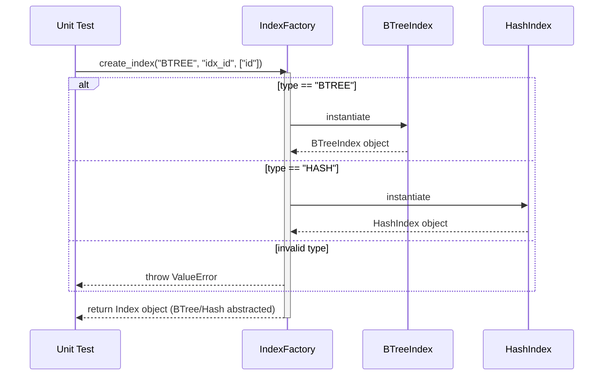
```mermaid
sequenceDiagram
    participant Client as Unit Test
    participant Factory as IndexFactory
    participant BTree as BTreeIndex
    participant Hash as HashIndex
    
    Client->>Factory: create_index("BTREE", "idx_id", ["id"])
    activate Factory
    alt type == "BTREE"
        Factory->>BTree: instantiate
        BTree-->>Factory: BTreeIndex object
    else type == "HASH"
        Factory->>Hash: instantiate
        Hash-->>Factory: HashIndex object
    else invalid type
        Factory-->>Client: throw ValueError
    end
    Factory-->>Client: return Index object (BTree/Hash abstracted)
    deactivate Factory
```

### 1.11. Sequence Diagram: Strategy Pattern (PartitionStrategy)
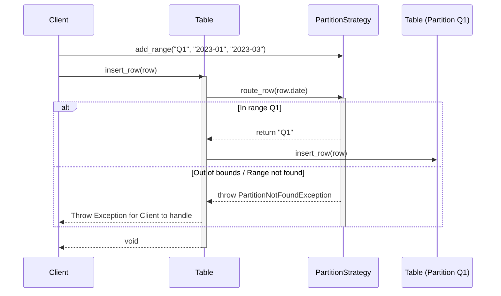
```mermaid
sequenceDiagram
    participant Client
    participant Table
    participant PStrat as PartitionStrategy
    participant PartA as Table (Partition Q1)
    
    %% Setup Range (Admin configures ahead)
    Client->>PStrat: add_range("Q1", "2023-01", "2023-03")
    
    %% Insertion (Pushing actual data)
    Client->>Table: insert_row(row)
    activate Table
    Table->>PStrat: route_row(row.date)
    activate PStrat
    
    alt In range Q1
        PStrat-->>Table: return "Q1"
        Table->>PartA: insert_row(row)
    else Out of bounds / Range not found
        PStrat-->>Table: throw PartitionNotFoundException
        Table-->>Client: Throw Exception for Client to handle
    end
    deactivate PStrat
    
    Table-->>Client: void
    deactivate Table
```

### 1.12. State Pattern (Sequence Generator)
```mermaid
classDiagram
    %% ----------------------------------------------------
    %% STATE PATTERN (Sequence Generator)
    %% ----------------------------------------------------
    class Sequence {
        <<Context>>
        +name: str
        +start: int
        +increment: int
        +max_value: int
        -_current_value: int
        -_state: ISequenceState
        +set_state(state: ISequenceState)
        +next_value() int
    }

    class ISequenceState {
        <<State / Interface>>
        +next_value(seq: Sequence)* int
    }

    class ActiveState {
        <<ConcreteState>>
        +next_value(seq: Sequence) int
    }

    class ExhaustedState {
        <<ConcreteState>>
        +next_value(seq: Sequence) int
    }

    Sequence o--> ISequenceState : Maintains current state
    ISequenceState <|-- ActiveState : Implements 
    ISequenceState <|-- ExhaustedState : Implements
    ActiveState ..> ExhaustedState : Transitions to when max reached
    Sequence --> ActiveState : Initial state
```

**Sequence Diagram:**
```mermaid
sequenceDiagram
    participant Client
    participant Seq as Sequence (Context)
    participant Act as ActiveState
    participant Exh as ExhaustedState
    
    %% First fetch (Active)
    Client->>Seq: next_value()
    activate Seq
    Seq->>Act: next_value(self)
    activate Act
    Act->>Act: Calculate next = current + increment
    Act-->>Seq: return current_value (1)
    deactivate Act
    Seq-->>Client: return 1
    deactivate Seq
    
    %% Next fetch (Transitions to Exhausted)
    Client->>Seq: next_value()
    activate Seq
    Seq->>Act: next_value(self)
    activate Act
    Act->>Act: Calculate next = current + increment
    alt next_val > max_value
        Act->>Seq: set_state(new ExhaustedState())
    end
    Act-->>Seq: return current_value (2)
    deactivate Act
    Seq-->>Client: return 2
    deactivate Seq

    %% Third fetch (Now it's Exhausted!)
    Client->>Seq: next_value()
    activate Seq
    Seq->>Exh: next_value(self)  %% Blindly delegates to current state
    activate Exh
    Exh-->>Seq: throw SequenceExhaustedException
    deactivate Exh
    Seq-->>Client: throw SequenceExhaustedException
    deactivate Seq
```

**Implementation Example:**
```python
from abc import ABC, abstractmethod

# State Interface
class ISequenceState(ABC):
    @abstractmethod
    def next_value(self, sequence: 'Sequence') -> int:
        pass

# Concrete States
class ActiveState(ISequenceState):
    def next_value(self, sequence: 'Sequence') -> int:
        current = sequence._current_value
        next_val = current + sequence.increment
        
        # Transition Logic
        if next_val > sequence.max_value:
            print(">> [State Transition] Active -> Exhausted")
            sequence.set_state(ExhaustedState())
            
        sequence._current_value = next_val
        return current

class ExhaustedState(ISequenceState):
    def next_value(self, sequence: 'Sequence') -> int:
        raise Exception(f"Sequence '{sequence.name}' has exhausted its capacity (Max: {sequence.max_value}).")

# Context
class Sequence:
    def __init__(self, name: str, start: int, increment: int, max_value: int):
        self.name = name
        self.start = start
        self.increment = increment
        self.max_value = max_value
        
        self._current_value = start
        # Initialize default state
        self._state: ISequenceState = ActiveState()
        
    def set_state(self, state: ISequenceState):
        self._state = state
        
    def next_value(self) -> int:
        return self._state.next_value(self)

# --- Client Execution ---
print("--- Creating Sequence (Max Value = 2) ---")
seq = Sequence("user_id_seq", start=1, increment=1, max_value=2)

print(f"Request 1: {seq.next_value()}") 
print(f"Request 2: {seq.next_value()}")
print(f"Request 3: (Expecting Failure)")
try:
    print(seq.next_value())
except Exception as e:
    print(f"Exception: {e}")
```

### 1.13. Proxy Pattern (Virtual Proxy for View)

```mermaid
classDiagram
    %% ----------------------------------------------------
    %% VIRTUAL PROXY PATTERN (View)
    %% ----------------------------------------------------
    
    class ITableSource {
        <<Subject / Interface>>
        +fetch_data() List*
    }

    class PhysicalTable {
        <<RealSubject>>
        -data: List
        +fetch_data() List
    }

    class View {
        <<Proxy>>
        +name: str
        +query: str
        -_engine: DatabaseEngine
        -_cached_result: List
        +__init__(query: str, engine: DatabaseEngine)
        +fetch_data() List
    }
    
    class DatabaseEngine {
        <<Locator>>
        +execute_query(query: str) List
    }

    ITableSource <|-- PhysicalTable : Implements
    ITableSource <|-- View : Implements
    View o--> DatabaseEngine : Asks to resolve complex queries
    View ..> PhysicalTable : Structurally identical behavior
```

**Sequence Diagram:**
```mermaid
sequenceDiagram
    participant Client
    participant Vw as View (Proxy)
    participant Engine as DatabaseEngine
    
    %% Phase 1: Hollow initialization
    Client->>Vw: new View("active_users", query, Engine)
    activate Vw
    Vw-->>Client: return lightweight Proxy object
    deactivate Vw
    
    %% Phase 2: First Time Access (Heavy Evaluation)
    Client->>Vw: fetch_data()
    activate Vw
    alt _cached_result is None
        Vw->>Engine: execute_query(query)
        activate Engine
        Engine->>Engine: Scan physical Tables (RealSubjects)
        Engine-->>Vw: Heavy Raw Data
        deactivate Engine
        Vw->>Vw: _cached_result = Raw Data
    end
    Vw-->>Client: Return Data
    deactivate Vw

    %% Phase 3: Immediate Subsequent Access
    Client->>Vw: fetch_data()
    activate Vw
    Vw-->>Client: Return _cached_result (Instant!)
    deactivate Vw
```

**Implementation Example:**
```python
from abc import ABC, abstractmethod

# Subject Interface
class ITableSource(ABC):
    @abstractmethod
    def fetch_data(self) -> list:
        pass

# Real Subject
class PhysicalTable(ITableSource):
    def __init__(self, name: str, data: list):
        self.name = name
        self.data = data
        
    def fetch_data(self) -> list:
        return self.data

# Database Engine to simulate heavy SQL execution
class DatabaseEngine:
    def execute_query(self, query: str) -> list:
        print(f"   [Engine] Executing heavy SQL Scan across physical tables...")
        # Simulate long-running query fetch
        return [{"id": 1, "username": "Alice"}, {"id": 2, "username": "Bob"}]

# Virtual Proxy
class View(ITableSource):
    def __init__(self, name: str, query: str, engine: DatabaseEngine):
        self.name = name
        self.query = query
        self._engine = engine
        self._cached_result = None
        
    def fetch_data(self) -> list:
        if self._cached_result is None:
            print(f"[Proxy] Cache miss for '{self.name}'. Offloading to RealSubject...")
            self._cached_result = self._engine.execute_query(self.query)
        else:
            print(f"[Proxy] Cache hit for '{self.name}'. Returning instantly!")
            
        return self._cached_result

# Client Execution
engine = DatabaseEngine()

print("--- 1. Declaring the View ---")
active_users = View("active_users", "SELECT * FROM users WHERE active=1", engine)

print("\\n--- 2. Client queries the View (First Run) ---")
data = active_users.fetch_data()
print(f"Data: {data}")

print("\\n--- 3. Client queries the View (Second Run) ---")
data2 = active_users.fetch_data()
print(f"Data: {data2}")
```

### 1.14. Command Pattern (Stored Procedure)

```mermaid
classDiagram
    %% ----------------------------------------------------
    %% COMMAND PATTERN (Stored Procedure)
    %% ----------------------------------------------------
    
    class ICommand {
        <<Command / Interface>>
        +execute()* Any
    }

    class StoredProcedure {
        <<ConcreteCommand>>
        +name: str
        +body: str
        -_engine: DatabaseEngine
        -_params: dict
        +__init__(name: str, body: str, engine: DatabaseEngine)
        +bind_params(params: dict)
        +execute() Any
    }

    class DatabaseEngine {
        <<Receiver>>
        +execute_sql(sql: str, params: dict) Any
    }

    class Invoker {
        <<Invoker>>
        -_commands: List~ICommand~
        +add_command(cmd: ICommand)
        +run_all()
    }

    ICommand <|-- StoredProcedure : Implements
    StoredProcedure o--> DatabaseEngine : Knows the Receiver
    Invoker o--> ICommand : Holds and triggers
```

**Sequence Diagram:**
```mermaid
sequenceDiagram
    participant Client
    participant Invoker as TaskQueue (Invoker)
    participant Proc as StoredProcedure (Command)
    participant Engine as DatabaseEngine (Receiver)
    
    %% Phase 1: Setup and Parameter Binding
    Client->>Proc: new StoredProcedure("clean_logs", "DELETE FROM logs", Engine)
    activate Proc
    Proc-->>Client: Proc instance
    deactivate Proc
    
    Client->>Proc: bind_params({"days": 30})
    
    %% Phase 2: Deferred Execution via Invoker
    Client->>Invoker: add_command(Proc)
    Client->>Invoker: run_all()
    activate Invoker
    
    Invoker->>Proc: execute()
    activate Proc
    
    %% Phase 3: Receiver Execution
    Proc->>Engine: execute_sql("DELETE FROM logs", {"days": 30})
    activate Engine
    Engine->>Engine: Perform physical deletion
    Engine-->>Proc: return affected_rows (100)
    deactivate Engine
    
    Proc-->>Invoker: return 100
    deactivate Proc
    Invoker-->>Client: Log Success
    deactivate Invoker
```

**Implementation Example:**
```python
from abc import ABC, abstractmethod
from typing import Any

# Command Interface
class ICommand(ABC):
    @abstractmethod
    def execute(self) -> Any:
        pass

# Receiver
class DatabaseEngine:
    def execute_sql(self, sql: str, params: dict) -> Any:
        print(f"   [Engine] Executing SQL: {sql} | With Params: {params}")
        # Physical disk operations happen here
        return {"status": "SUCCESS", "rows_affected": 100}

# Concrete Command
class StoredProcedure(ICommand):
    def __init__(self, name: str, body: str, engine: DatabaseEngine):
        self.name = name
        self.body = body
        self._engine = engine
        self._params = {}
        
    def bind_params(self, params: dict):
        self._params.update(params)
        
    def execute(self) -> Any:
        print(f"[Command] Triggering '{self.name}'...")
        # Delegates execution to the Receiver
        return self._engine.execute_sql(self.body, self._params)

# Invoker
class TaskQueue:
    def __init__(self):
        self.commands = []
        
    def add_command(self, cmd: ICommand):
        self.commands.append(cmd)
        
    def run_all(self):
        for cmd in self.commands:
            result = cmd.execute()
            print(f"[Invoker] Result: {result}")

# Client Execution
engine = DatabaseEngine()

# Encapsulating the request as an object
clean_logs_proc = StoredProcedure("clean_old_logs", "DELETE FROM logs WHERE age > :days", engine)
clean_logs_proc.bind_params({"days": 30})

update_stats_proc = StoredProcedure("refresh_stats", "UPDATE stats SET val = 0", engine)

# The Invoker knows nothing about SQL, it just triggers commands
queue = TaskQueue()
queue.add_command(clean_logs_proc)
queue.add_command(update_stats_proc)

print("--- Invoker running batch jobs ---")
queue.run_all()
```

### 1.15. High-Level Class Diagram (Structural View)
```mermaid
classDiagram
    %% Core Management
    class CatalogManager {<<Singleton>>}
    class DatabaseCatalog {<<Factory Method>>}
    class Database {<<Facade>>}
    
    %% Builders
    class SchemaBuilder {<<Builder>>}
    class TableBuilder {<<Builder>>}
    
    %% Composite Layer
    class DatabaseObject {<<Component>>}
    class Schema {<<Composite>>}
    class Table {<<Leaf>>}
    class View {<<Virtual Proxy>>}
    class Sequence {<<State>>}
    class StoredProcedure {<<Command>>}
    
    %% Table Internals
    class Row {<<Value Object>>}
    class Column {<<Value Object>>}
    class Constraint {<<Strategy>>}
    class ConstraintContext {<<Parameter Object>>}
    class IReferentialAction {<<Strategy>>}
    class ForeignKeyConstraint {<<Concrete Strategy>>}
    
    class PartitionStrategy {<<Strategy>>}
    class IndexFactory {<<Factory Method>>}
    class Index {<<Factory Product>>}

    %% Relationships...
    DatabaseCatalog --> Database : creates
    Database --> CatalogManager : delegates to
    Database --> SchemaBuilder : utilizes

    SchemaBuilder *-- TableBuilder : orchestrates
    SchemaBuilder --> Schema : yields
    TableBuilder --> Table : yields

    DatabaseObject <|-- Schema
    DatabaseObject <|-- Table
    DatabaseObject <|-- View
    DatabaseObject <|-- Sequence
    DatabaseObject <|-- StoredProcedure
    Schema o-- DatabaseObject : containing
    
    Table *-- Column
    Table *-- Row
    Table *-- Constraint
    Table *-- Index
    Table --> PartitionStrategy : delegates routing
    Table --> IndexFactory : coordinates
    
    Constraint --> ConstraintContext : consumes
    Constraint <|-- ForeignKeyConstraint
    ForeignKeyConstraint *-- IReferentialAction : delegates on_delete + on_update
    IndexFactory --> Index : produces
```

### 1.16. Detailed Class Diagram (API & Methods mapped from TDD)
```mermaid
classDiagram
    %% Core Management
    class CatalogManager {
        <<Singleton>>
        +add_schema(schema: Schema)
        +get_schema(name: str) Schema
        +remove_schema(name: str)
    }
    class DatabaseCatalog {
        <<Factory Method>>
        +create_database(name: str) Database
        +get_database(name: str) Database
        +drop_database(name: str)
    }
    class Database {
        <<Facade>>
        +create_schema(name: str)
        +drop_schema(name: str)
        +get_schema(name: str) Schema
    }
    
    %% Builders
    class SchemaBuilder {
        <<Builder>>
        +with_table(name: str) TableBuilder
        +build() Schema
    }
    class TableBuilder {
        <<Builder>>
        +with_column(name, data_type) TableBuilder
        +with_int_column(name) TableBuilder
        +with_string_column(name) TableBuilder
        +with_constraint(c: Constraint) TableBuilder
        +build() Table
    }

    %% Composite Layer
    class DatabaseObject {
        <<Abstract Component>>
        +name: str
        +create()
        +drop()
    }
    class Schema {
        <<Composite>>
        +owner: str
        +add_table(t: Table)
        +get_table(name: str) Table
        +drop_table(name: str)
        +rename_table(old_name: str, new_name: str)
        +list_all_tables() List
        +add_view(v: View)
        +get_view(name: str) View
        +drop_view(name: str)
        +add_sequence(s: Sequence)
        +get_sequence(name: str) Sequence
        +drop_sequence(name: str)
        +add_procedure(p: StoredProcedure)
        +get_procedure(name: str) StoredProcedure
        +drop_procedure(name: str)
    }
    class Table {
        <<Leaf / DDL Host>>
        +add_column(c: Column)
        +drop_column(name: str)
        +alter_column(name: str, c: Column)
        +get_column(name: str) Column
        +contains_column(name: str) bool
        +add_constraint(c: Constraint)
        +drop_constraint(name: str)
        +add_index(idx: Index)
        +insert_row(row: Row)
        +update_row(old_row: Row, new_row: Row)
        +delete_row(row: Row)
        +contains_row(row: Row) bool
        +get_primary_index() Index
        +accept(visitor)
    }
    class View {
        <<Virtual Proxy>>
        +query_definition: str
        +resolve(schema: Schema) str
    }
    class Sequence {
        <<State>>
        +start: int
        +increment: int
        +next_value() int
    }
    class StoredProcedure {
        <<Command>>
        +body: str
        +execute(*args, **kwargs)
    }

    %% Relations (Composite)
    DatabaseObject <|-- Schema
    DatabaseObject <|-- Table
    DatabaseObject <|-- View
    DatabaseObject <|-- Sequence
    DatabaseObject <|-- StoredProcedure
    Schema o-- DatabaseObject : containing

    %% Table Internals
    class ConstraintContext {
        <<Parameter Object>>
        +candidate_row: Row
        +table: Table
        +schema: Schema
    }
    class Constraint {
        <<Abstract Strategy>>
        +is_enabled: bool
        +enable()
        +disable()
        +validate(ctx: ConstraintContext)
    }
    class IReferentialAction {
        <<Strategy Interface>>
        +execute(parent_row, child_table)
    }
    class ForeignKeyConstraint {
        +child_column_name: str
        +referenced_table_name: str
        +referenced_column_name: str
        +on_delete: IReferentialAction
        +on_update: IReferentialAction
        +on_parent_row_deleted(parent_row, child_table)
    }
    class CascadeAction
    class RestrictAction
    class SetNullAction
    
    class PartitionStrategy {
        <<Strategy>>
        +add_range(name, start, end)
        +remove_range(name: str)
        +route_row(key: Any) str
    }
    class IndexFactory {
        <<Factory Method>>
        +create(type, name, columns) Index
    }
    class Index {
        <<Factory Product>>
        +is_unique: bool
        +allows_null: bool
        +insert(key: Any, ptr: Any)
        +search(key: Any) List
        +delete(key: Any, ptr: Any)
        +range_search(start, end) List
    }
    class Column {
        <<Value Object>>
        +name: str
        +data_type: str
        +is_nullable: bool
        +validate_value(value: Any) bool
    }
    class Row {
        <<Value Object>>
        +values: Tuple
    }
    
    %% Relations (Internals)
    Constraint <|-- ForeignKeyConstraint
    Constraint <|-- CheckConstraint
    Constraint <|-- UniqueConstraint
    Constraint <|-- PrimaryKeyConstraint
    ForeignKeyConstraint *-- IReferentialAction
    IReferentialAction <|-- CascadeAction
    IReferentialAction <|-- RestrictAction
    IReferentialAction <|-- SetNullAction
    IndexFactory --> Index
    Table *-- Column
    Table *-- Row
    Table *-- Constraint
    Table *-- Index
    Table --> PartitionStrategy
```

---

## TABLE 2: STORAGE & TRANSACTION ENGINE (Physical Hardware Layer)

| Feature / Class | Design Pattern | Problem & Rationale | Unit Test (TDD) Implementation Strategy |
| :--- | :--- | :--- | :--- |
| **Memory / Cache Management**<br>`BufferPoolManager` | **Proxy / Object Pool** | Direct Disk I/O is slow. Serves as a gateway to recycle RAM memory and minimize disk hits. | Generate mock Page Requests, testing the LRU Eviction behavior when the RAM buffer pool reaches full capacity. |
| **ACID Recovery**<br>`LogCommand`, `WAL` | **Command / Observer** | Wraps Undo/Redo operations as executable Commands. Triggers the Write-Ahead Log (WAL) to flush to disk upon Commit. | Create a pseudo-array of Commands (Insert, Update), simulate a system crash, and verify the WAL file reconstructs the uncommitted states. |

### 2.1. Sequence Diagram: Buffer Pool (Proxy Pattern)
```mermaid
sequenceDiagram
    participant Test as Unit Test
    participant Pool as BufferPoolManager
    participant Disk as FileManager
    
    Test->>Pool: fetch_page(id=5)
    activate Pool
    Pool->>Pool: is in Cache (RAM)?
    alt Yes
        Pool-->>Test: return Page(5)
    else No (Cache Miss)
        Pool->>Disk: read_block(5)
        Disk-->>Pool: data
        Pool->>Pool: LRU.evict() if full
        Pool-->>Test: return Page(5)
    end
    deactivate Pool
```

---

## TABLE 3: QUERY PROCESSING (Execution & Translation Engine)

| Feature / Class | Design Pattern | Problem & Rationale | Unit Test (TDD) Implementation Strategy |
| :--- | :--- | :--- | :--- |
| **SQL Parser**<br>`SqlVisitor`, `ASTNode` | **Visitor** | The Abstract Syntax Tree (AST) structure is highly nested. A Visitor transverses the nodes cleanly to extract meaning. | Supply a simulated AST tree hierarchy (Root -> Node -> Leaf) and verify the Visitor correctly reads and translates specific Node tokens. |
| **Execution Framework**<br>`AbstractPlanNode` | **Template Method** | Base plan nodes share common startup/teardown logic but execute differently. | Test abstract inheritance ensuring `open()` is always called before child-specific `execute()`. |
| **Query Engine**<br>`AbstractPlanNode` | **Iterator (Volcano Model)** | Prevents loading massive tables entirely into RAM. Provides a `Next()` method to yield results row-by-row sequentially. | Chain a `ScanNode` to a `FilterNode`, and perform continuous `next()` calls to verify records are dropped until reaching an EOF/Null. |

### 3.1. Sequence Diagram: Iterator Pattern (Volcano Execution)
```mermaid
sequenceDiagram
    participant Test as Unit Test
    participant Filter as FilterNode
    participant Scan as ScanNode
    
    Test->>Filter: open()
    Filter->>Scan: open()
    
    Test->>Filter: next()
    activate Filter
    Filter->>Scan: next()
    Scan-->>Filter: return raw_row
    Filter->>Filter: check predicate
    Filter-->>Test: return valid_row
    deactivate Filter
```
