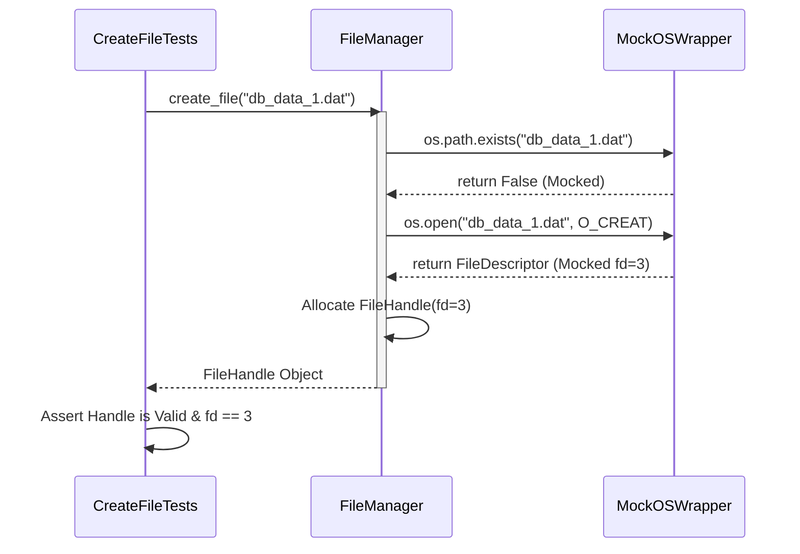
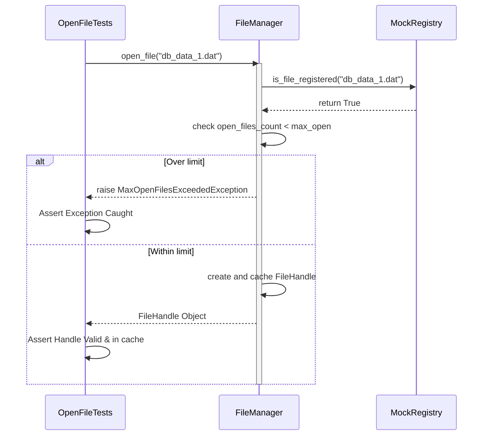
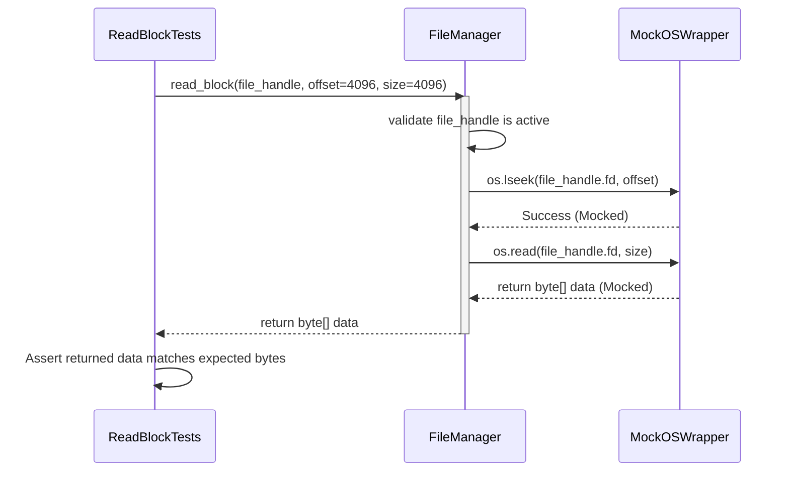
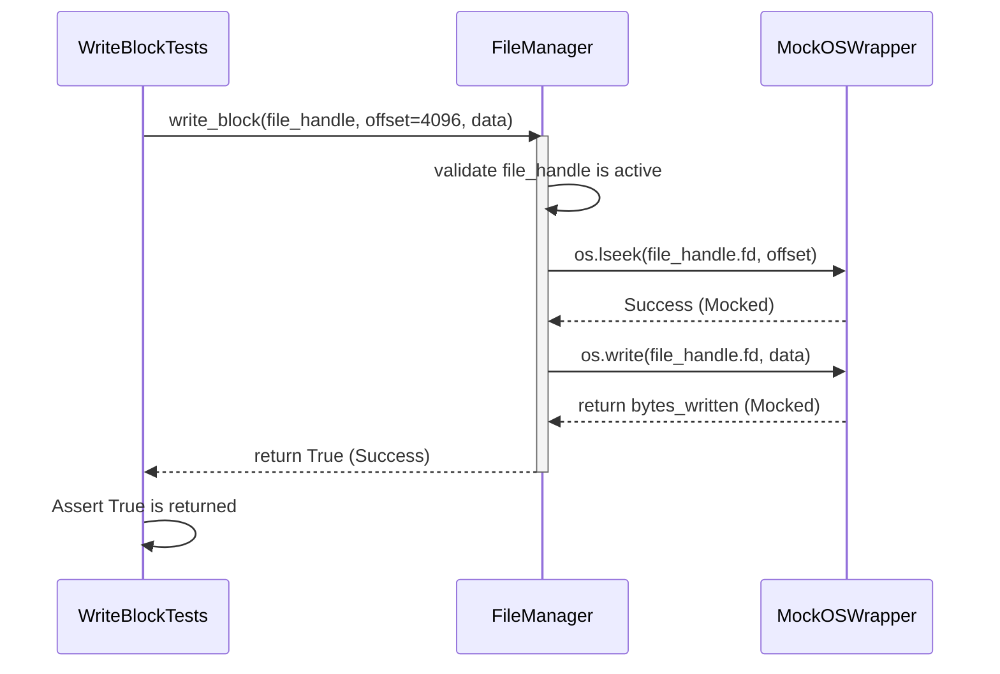
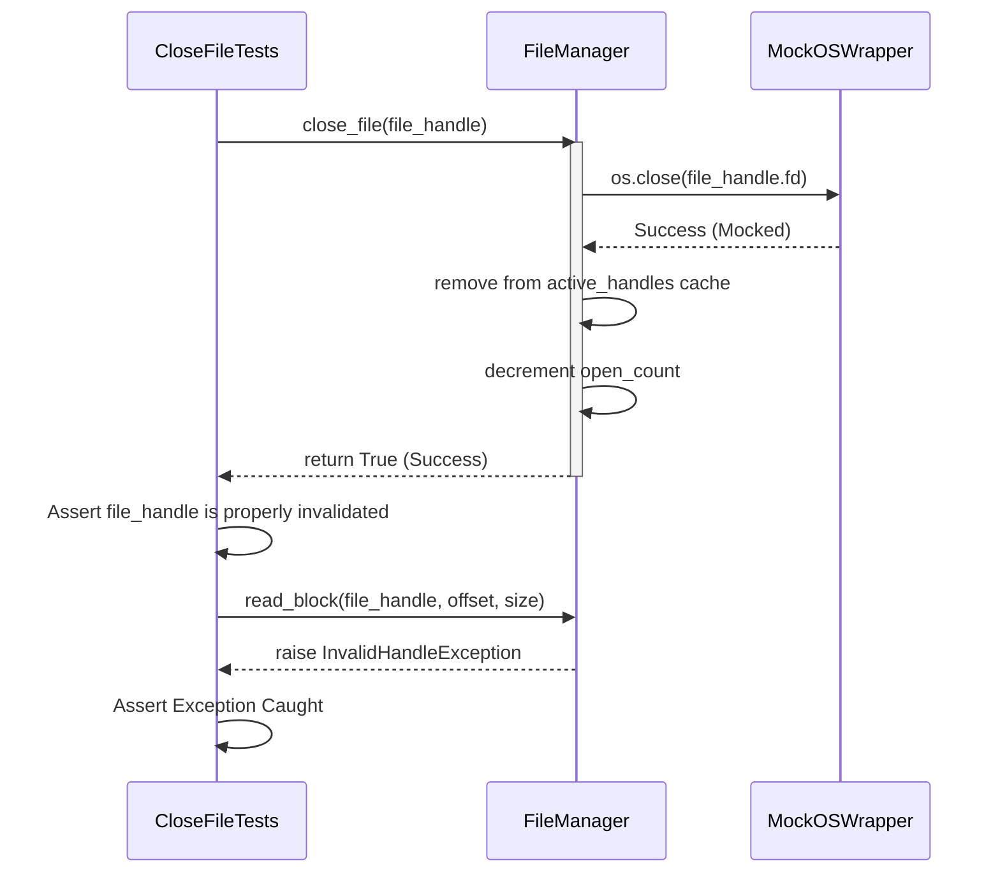
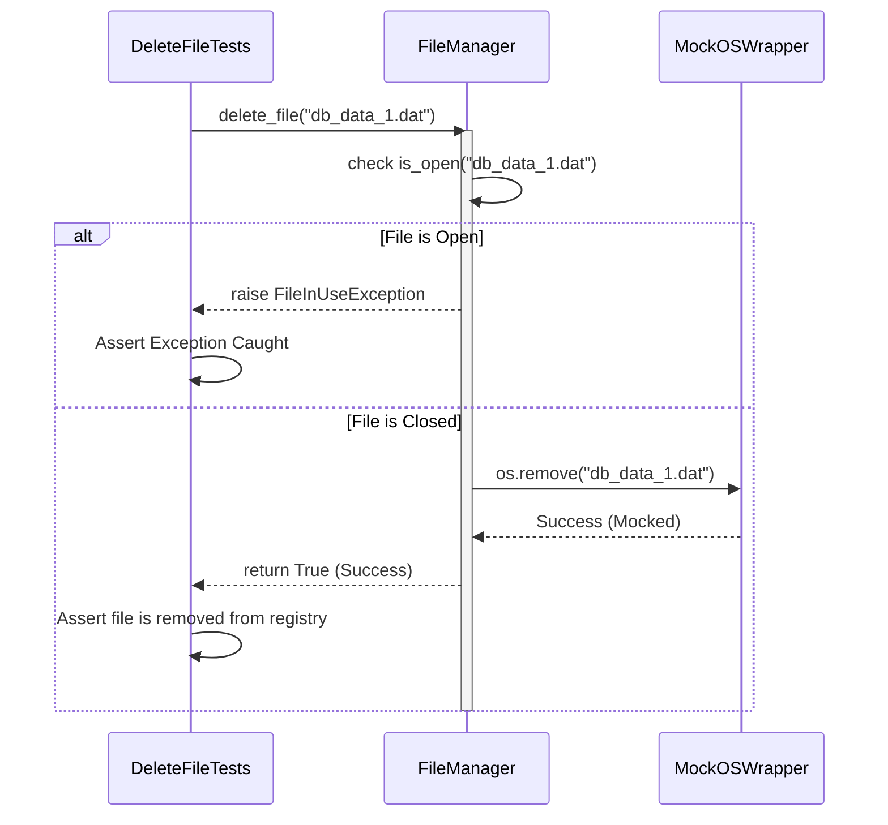

# FileManager Unit Test Sequences

These sequence diagrams illustrate the execution flow during Unit Testing for the `FileManager` class. By following a Test-Driven Development (TDD) approach, these diagrams show how the `TestRunner` asserts behavior and how `FileManager` interacts with mocked dependencies (like `MockOSWrapper` or `MockRegistry`).

## 1. CreateFileTests Sequence
This tests creating a new database file.

## 2. OpenFileTests Sequence
This tests opening an existing file and enforcing a `max_open_files` limit.

## 3. ReadBlockTests Sequence
This tests reading a specific block of data (page) from an open file.

## 4. WriteBlockTests Sequence
This tests writing a block of bytes (a page) to an open file.

## 5. CloseFileTests Sequence
This tests releasing a handle and ensuring the file can no longer be read.

## 6. DeleteFileTests Sequence
This tests deleting a file, ensuring it fails if the file is currently active/open.

