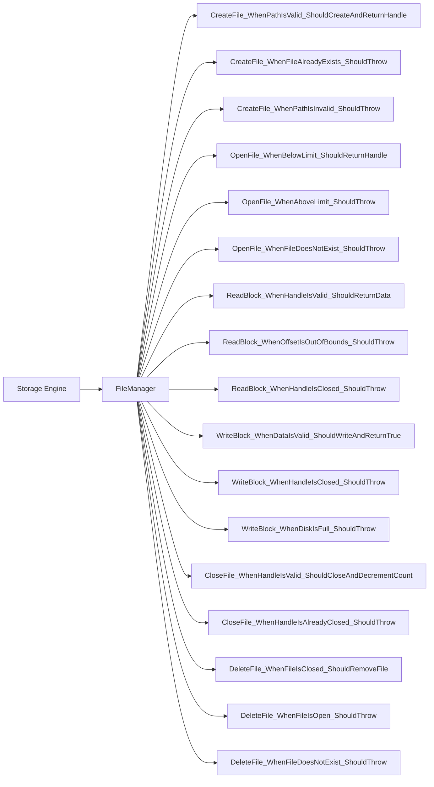
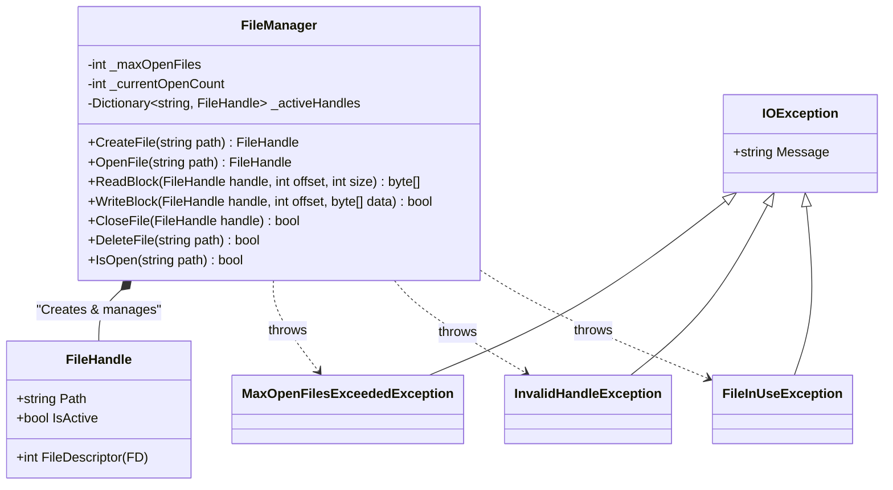

# FileManager Test Cases & Detailed Contracts

This document combines **Step 6 (Test Case Flowchart)** and **Step 8 (Detailed Class Diagram)** for the `FileManager` class. It uses the `Method_Condition_Result` naming convention adapted from Behavior-Driven Development (BDD).

## 1. Unit Test Cases (Flowchart)

This diagram acts as a visual checklist for all the scenarios that the `FileManager` Unit Tests must cover.

## 2. Derived Method Contracts (Detail Class Diagram)

Based on the test scenarios derived above, we can firmly establish the Interface and Data Types (Contracts) needed for `FileManager` and its associated objects (like exceptions and models).

