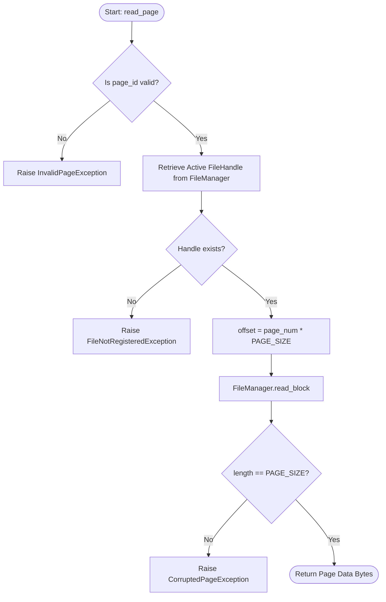

# PageManager Internal Flowcharts

These flowcharts outline the internal branching logic inside `PageManager`.

## 1. `read_page(page_id)` Flowchart



## 2. `write_page(page_id, data)` Flowchart

```mermaid
flowchart TD
    Start([Start: write_page]) --> ValidateLen{len(data) == PAGE_SIZE?}
    ValidateLen -- No --> Err1[Raise InvalidPageSizeException]
    ValidateLen -- Yes --> GetHandle[Retrieve Active FileHandle]
    
    GetHandle --> CheckHandle{Handle exists?}
    CheckHandle -- No --> Err2[Raise Exception]
    CheckHandle -- Yes --> Calc[offset = page_num * PAGE_SIZE]
    
    Calc --> CallWrite[FileManager.write_block]
    CallWrite --> Return([Return True])
```
