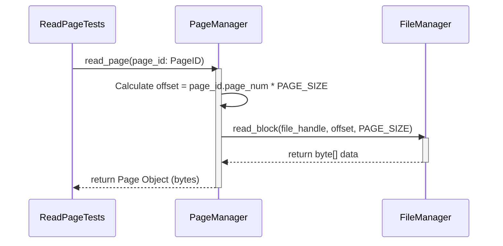
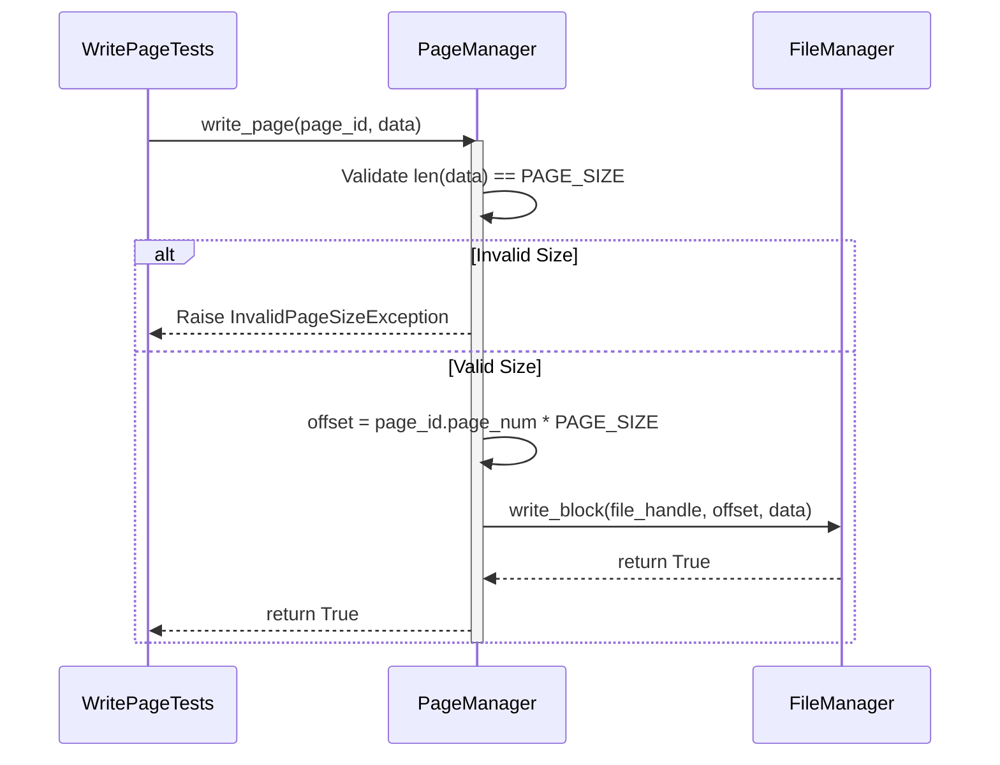
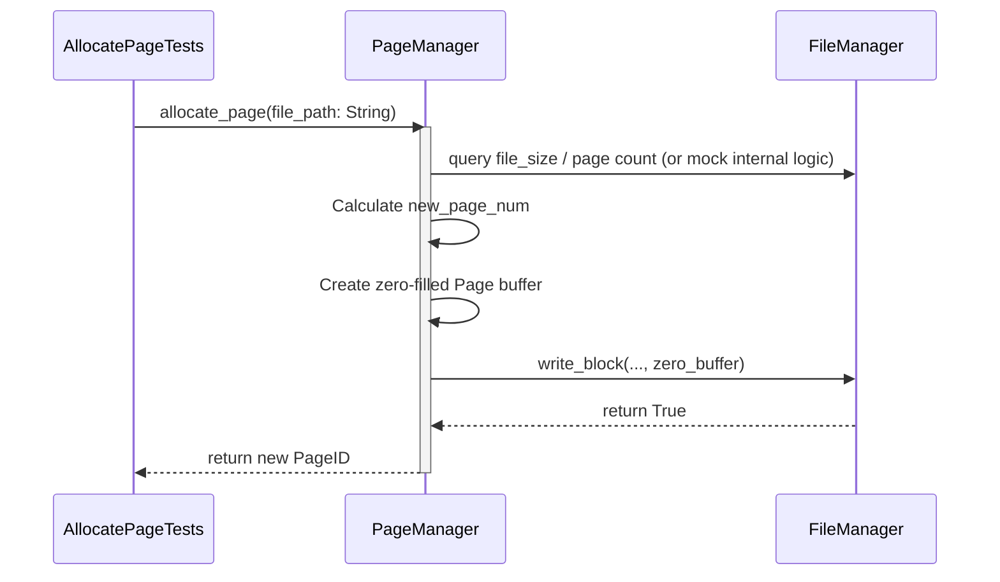

# PageManager Unit Test Sequences

These sequence diagrams define how `PageManager` interacts with the `FileManager` class during various page operations.

## 1. ReadPage Sequence
Illustrates how the system calculates the correct byte offset based on `PageID` and delegates to `FileManager`.

## 2. WritePage Sequence
Illustrates delegating page data to the correct file block.

## 3. AllocatePage Sequence
Finding a page index and assigning it. (A simplistic append allocation approach).

