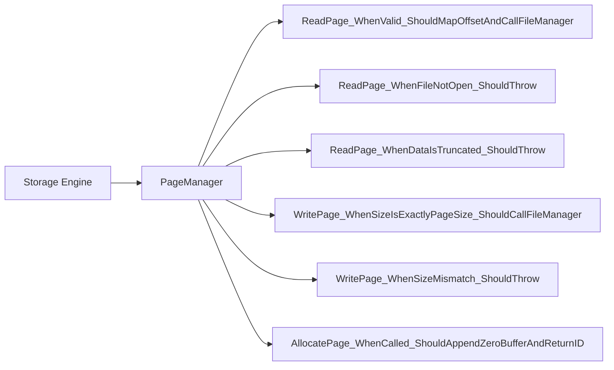
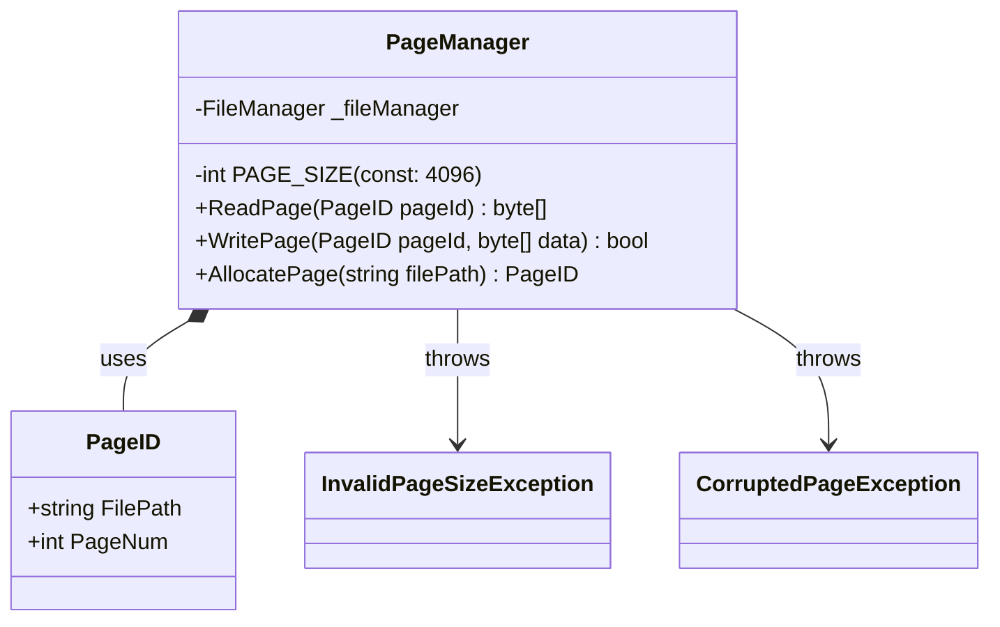

# PageManager Test Cases & Detailed Contracts

Based on the Sequence logic, these are the test cases driving our TDD.

## 1. Unit Test Cases (Flowchart)

## 2. Derived Method Contracts (Detail Class Diagram)

