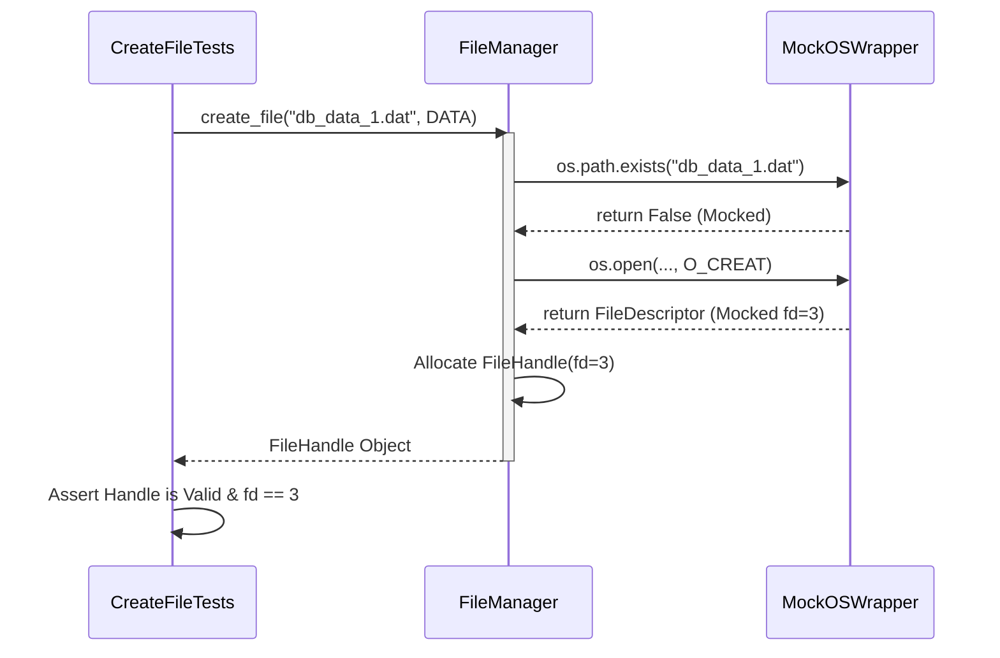
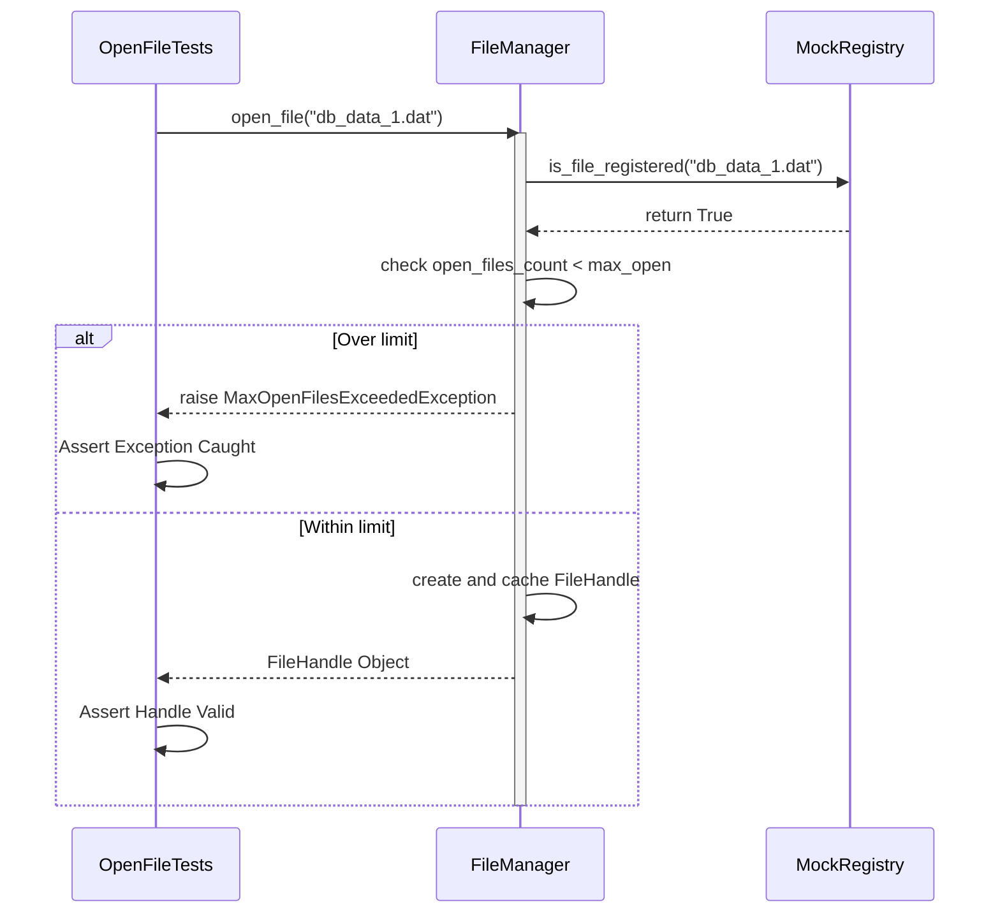
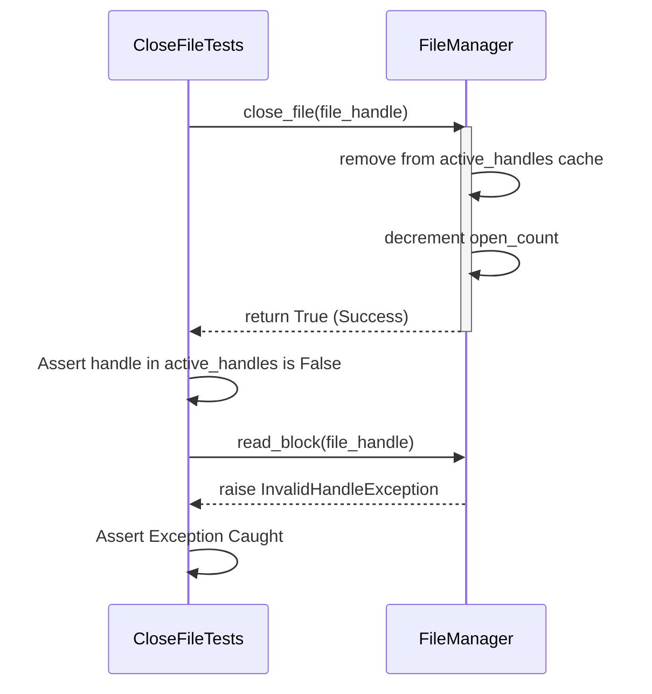
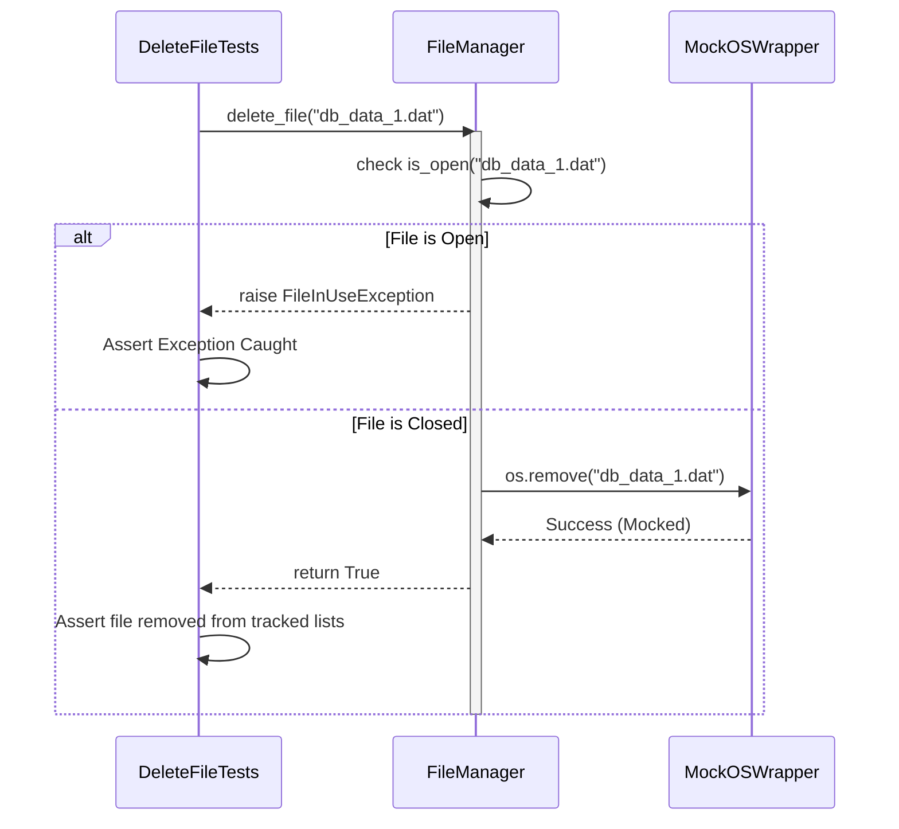

# FileManager Unit Test Sequences

These sequence diagrams illustrate the execution flow during Unit Testing. They start from the Test Class (`CreateFileTests`, `OpenFileTests`, etc.), call the actual `FileManager` component, and show how `FileManager` interacts with Mocked dependencies (like the OS Layer or Mock Data Registry).

## 1. CreateFileTests Sequence
This tests the scenario where a new file is created successfully.

## 2. OpenFileTests Sequence
This tests the scenario where an existing file is opened, enforcing the `max_open` limit.

## 3. CloseFileTests Sequence
This tests releasing a handle and decrementing the open count.

## 4. DeleteFileTests Sequence
This tests deleting a file when it's closed, and failing to delete if it's currently open.

