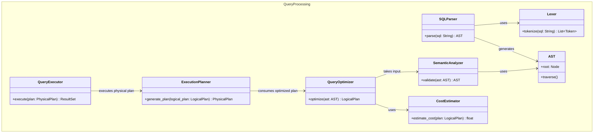

# High-Level Class Diagram: Query Processing

This diagram illustrates the internal components of the **Query Processing** subsystem.

```mermaid
classDiagram
    direction TB

    %% ==========================================
    %% QUERY PROCESSING SUBSYSTEM
    %% ==========================================
    namespace QueryProcessing {
        class SQLParser {
            +parse(sql: String) AST
        }
        class Lexer {
            +tokenize(sql: String) List~Token~
        }
        class AST {
            +root: Node
            +traverse()
        }
        class SemanticAnalyzer {
            +validate(ast: AST) AST
        }
        class QueryOptimizer {
            +optimize(ast: AST) LogicalPlan
        }
        class CostEstimator {
            +estimate_cost(plan: LogicalPlan) float
        }
        class ExecutionPlanner {
            +generate_plan(logical_plan: LogicalPlan) PhysicalPlan
        }
        class QueryExecutor {
            +execute(plan: PhysicalPlan) ResultSet
        }
    }

    %% ==========================================
    %% INTERNAL RELATIONSHIPS
    %% ==========================================
    SQLParser --> Lexer : uses
    SQLParser --> AST : generates
    SemanticAnalyzer --> AST : uses
    QueryOptimizer --> SemanticAnalyzer : takes input
    QueryOptimizer --> CostEstimator : uses
    ExecutionPlanner --> QueryOptimizer : consumes optimized plan
    QueryExecutor --> ExecutionPlanner : executes physical plan
```
